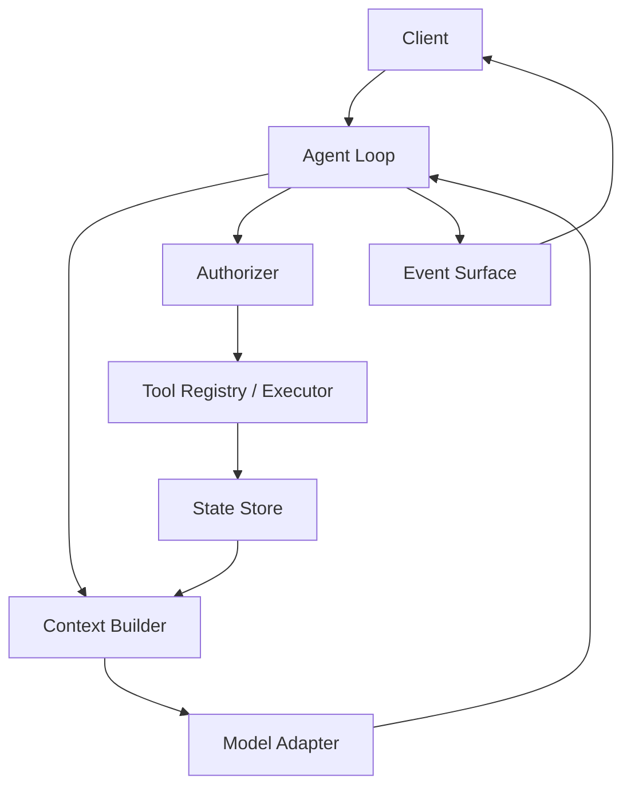
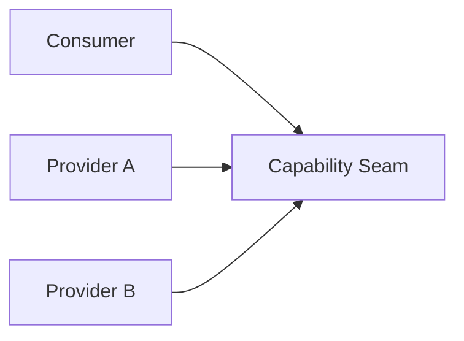
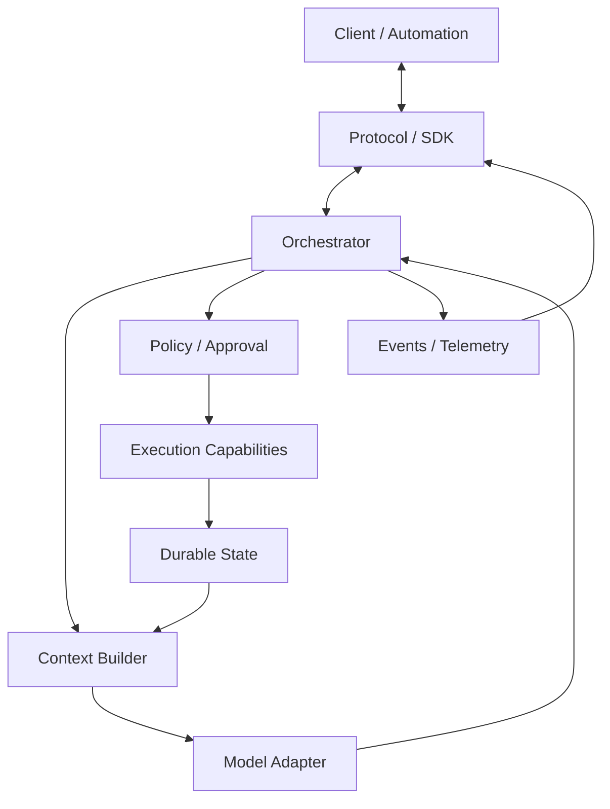

# 從零設計自己的 Agent Harness

如果已經理解 Codex、DeepSeek Harness 與 Pi，設計自己的 Harness 時最重要的不是複製其中一套，而是知道：

> **哪些責任要固定成 core、哪些要做 seam、哪些最好留在 core 外。**

三套剛好提供三種不同教材：

```text
Codex    → Productized / Opinionated Runtime
DeepSeek → Composable Runtime Framework
Pi       → Minimal / Self-extensible Harness
```

## Level 0：先確認你真的需要自己造

如果你的需求只是：

- coding automation；
- CI agent；
- 自製 UI；
- 少量 custom tools；
- repository workflow；

先評估能否直接消費現成 Harness 的 CLI、SDK、RPC/App Server、Plugin/Extension surfaces。

不要因為想要「自有 Agent」就重新實作 sandbox、tool loop、session persistence、approval、streaming protocol。

## Level 1：最小 Agent Loop

```ts
while (true) {
  const response = await model({context, tools});
  if (response.finalMessage) return response.finalMessage;

  for (const call of response.toolCalls) {
    const result = await tools.execute(call);
    history.push(call, result);
  }
}
```

這只是一個 demo。它沒有 cancellation、authorization、state model、replay、context budget，也沒有 client protocol。

## Level 2：把責任拆成 contracts

至少先拆：

```text
Model Adapter
Context Builder
Agent Loop
Tool Registry
Executor
Authorizer
State Store
Event / Client Boundary
```



這裡最重要的問題是 dependency direction，而不是 class 名稱。

## 從 Codex 學什麼：Product Semantics 要清楚

Codex 顯示一個 production Harness 的價值不只在 loop，而在於替產品定義清楚 domain semantics：

```text
Thread / Turn / Item
Approvals
Client events
Skill / MCP / Hook / Rule
App Server
```

教訓是：

> **如果你希望大量 client 與使用者共享同一套行為，穩定、opinionated 的產品語意本身就是資產。**

不要把所有東西都做成可替換介面，否則 client contract 會失去中心。

## 從 DeepSeek 學什麼：Capability Seam 要真的可替換

DeepSeek 的核心教訓是：

```text
Service Definition
→ Provider
→ Consumer
→ Composition
```

如果 Model、Filesystem、Sandbox、Subprocess、Storage、Subagent 都可能換 backend，就讓 consumer 依賴 capability contract，而不是 concrete implementation。



但 seam 越多，composition / lifecycle / debugging 成本也越高。

## 從 Pi 學什麼：不是所有 Feature 都要進 Core

Pi 的教訓是：

> **Minimal 不等於功能少；它可能代表把高階行為移到 extension runtime 或 execution environment。**

例如：

```text
Core
→ Agent / Model / Tool primitives

Extension
→ custom tools / UI / lifecycle behavior / policy UX

External Environment
→ container / sandbox / process isolation
```

如果一個需求可以在高層安全地表達，就不一定要增加新的 core primitive。

## 一個實用的 Core 判斷法

某個能力要不要進 core，可以問五題：

1. 幾乎所有 use case 都需要嗎？
2. 它需要定義 durable protocol / state semantics 嗎？
3. 它若由 extension 實作，會破壞 correctness 或 security 嗎？
4. 多個 provider 是否真的需要共享同一 contract？
5. Upstream 是否願意長期承擔 compatibility cost？

如果多數答案都是否，優先放高層。

## State Model 要先選哲學，再選資料庫

三套示範了三種不同答案：

```text
Codex
→ Product activity objects

DeepSeek
→ Event-sourced durable trajectory

Pi
→ Branch-native JSONL entry tree
```

自製 Harness 前先回答：

- resume 是第一級能力嗎？
- fork 是否重要？
- replay / audit 是否重要？
- UI 是否需要 granular activity objects？
- state 是否要能被 extension 自訂？

先決定 semantics，再選 SQLite / JSONL / DB。

## Context Builder 必須是一級元件

不要在 `runTurn()` 裡 concat strings。

Context Builder 應負責：

- stable instructions；
- tool registry snapshot；
- history projection；
- compaction；
- budget；
- deterministic ordering；
- secret redaction；
- provider/model-specific adaptation。

State Store 保存的是 durable facts；Context Builder 投影的是這一輪 model 真正需要看到的 snapshot。

## Tool Contract

```ts
interface Tool<I, O> {
  name: string;
  schema: JsonSchema;
  sideEffect: 'read' | 'local-write' | 'process' | 'network' | 'external-write' | 'destructive';
  execute(input: I, ctx: ExecutionContext): Promise<O>;
}
```

至少把 schema、side effect、timeout/cancel、structured result 分開。

## Authorization 不要藏在 Tool 裡

```ts
interface Authorizer {
  decide(action: ProposedAction, ctx: PolicyContext): Promise<
    | {kind: 'allow'}
    | {kind: 'deny'; reason: string}
    | {kind: 'approval'; request: ApprovalRequest}
  >;
}
```

原因是 Tool 的業務邏輯與「這次是否可以執行」是兩個不同責任。

## Execution World 是一級設計

Local process、container、microVM、remote workspace 不應只被當成一個 `shell()` 實作差異。

如果 execution world 改變，常一起影響：

```text
Filesystem
Subprocess
Terminal
Network
Credentials
LSP
Artifacts
```

這是 DeepSeek capability-family 思維和 Pi external-isolation 思維都值得吸收的地方。

## Client Protocol 不要從 Terminal Text 反推 State

如果 Harness 要被 IDE / Web / automation 使用，提供 machine-readable event/state protocol：

```text
request / response correlation
streaming events
approval requests
state identifiers
resume / reconnect
capability negotiation
```

Codex App Server、DeepSeek SDK/JSON-RPC、Pi RPC 都在提醒同一件事：**terminal UI 不是 domain protocol。**

## Production Reference Architecture



## 不要自己實作的 Security Primitives

除非你真的在做該領域產品，優先使用成熟系統：

- OS sandbox / container / microVM；
- Git worktree / isolated checkout；
- OAuth / IAM / secret manager；
- JSON Schema validator；
- durable queue；
- OpenTelemetry；
- database transaction / idempotency primitives。

Harness 應協調它們，不應因為「Agent」而重新發明基礎安全機制。

## 最後的設計檢查

如果你的架構只能回答「怎麼 call model」，還不是 production Harness。

至少要能回答：

```text
誰組 Context？
誰定義 Tools？
誰執行？
誰能阻止？
誰保存 State？
誰投影下一輪 Context？
誰處理 Cancel / Retry？
誰對 Client 發事件？
誰負責 Upgrade Compatibility？
哪些能力在 Core，哪些是 Seam，哪些在外部？
```

## 本章只要記住

1. **不要先複製某套 Harness；先定義 responsibility boundaries。**
2. **Codex 教你 product semantics，DeepSeek 教你 composability，Pi 教你 minimal core。**
3. **State、Context、Execution、Authorization、Client Protocol 都應是獨立設計問題。**
4. **可替換不是免費的；每個 seam 都會增加 lifecycle 與 compatibility 成本。**
5. **能安全留在高層的能力，不要無故下沉 core。**
