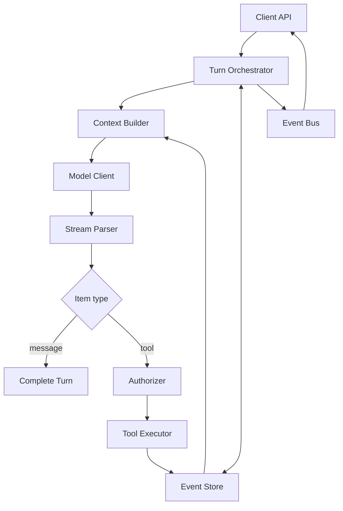

# 從零設計自己的 Agent Harness

學 Codex harness 最好的目的之一，是知道哪些部分值得重用、哪些情況才需要自己造。

## Level 0：不要造 Harness

如果只是要 coding automation，先評估：

- Codex CLI；
- `codex exec`；
- SDK；
- App Server。

能消費現成 harness，就不要為了「agent 很酷」重新實作 sandbox、tool loop、history、approvals。

## Level 1：最小 Agent Loop

```ts
while (true) {
  const response = await model({context, tools});

  if (response.finalMessage) return response.finalMessage;

  for (const call of response.toolCalls) {
    const result = await tools.execute(call);
    context.push(call, result);
  }
}
```

這只適合 demo。

## Level 2：加入 Deterministic Runtime

至少補：

```text
Tool registry + schemas
Input validation
Timeout/cancellation
Output truncation
Working directory
Structured errors
Tool side-effect classes
```

## Level 3：加入 Security

```text
Filesystem sandbox
Network policy
Credentials scope
Approval flow
Command rules
Audit log
Project trust
```

此時才開始像真實 harness。

## Level 4：加入 State

```text
Thread / turn / item
Persistence
Resume / fork
Compaction snapshots
Usage accounting
Artifact references
```

## Level 5：加入 Product Integration

```text
Bidirectional event protocol
Streaming deltas
Rich item types
Client request correlation
Reconnect
Backpressure
Version negotiation
```

## Reference Architecture



## 核心 Interface 建議

### ModelClient

```ts
interface ModelClient {
  stream(request: ModelRequest): AsyncIterable<ModelEvent>;
}
```

### Tool

```ts
interface Tool<I, O> {
  name: string;
  schema: JsonSchema;
  sideEffect: 'read' | 'write' | 'external';
  execute(input: I, ctx: ExecutionContext): Promise<O>;
}
```

### Authorizer

```ts
interface Authorizer {
  decide(action: ProposedAction, ctx: PolicyContext): Promise<
    | {kind: 'allow'}
    | {kind: 'deny'; reason: string}
    | {kind: 'approval'; request: ApprovalRequest}
  >;
}
```

### Event Store

```ts
interface ThreadStore {
  append(threadId: string, items: ThreadItem[]): Promise<void>;
  load(threadId: string): Promise<ThreadSnapshot>;
}
```

把這些 interface 分開，你才可能換 model/provider/tool/backend 而不改 agent loop。

## Context Builder 是一級元件

不要在 `runTurn()` 裡隨手 concat strings。Context Builder 應負責：

- stable instructions；
- instruction hierarchy；
- tool registry snapshot；
- history projection；
- compaction；
- budget；
- deterministic ordering；
- secret redaction。

對長任務，這常比 prompt 文案本身更影響品質與成本。

## Side-effect Taxonomy

建議所有 tool 標記：

```text
Pure read
Local write
Process execution
Network read
External write
Destructive / irreversible
```

Policy 才能做有意義的 default，而不是所有 tool 都同一個 allow boolean。

## 不要自己實作的東西

除非有特殊需求，盡量用成熟系統：

- OS sandbox/container；
- Git isolation/worktree；
- OAuth/IAM；
- JSON Schema validator；
- durable queue；
- OpenTelemetry；
- database transactions。

Harness 應協調它們，不要重造 security primitive。
