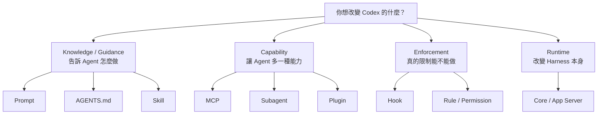
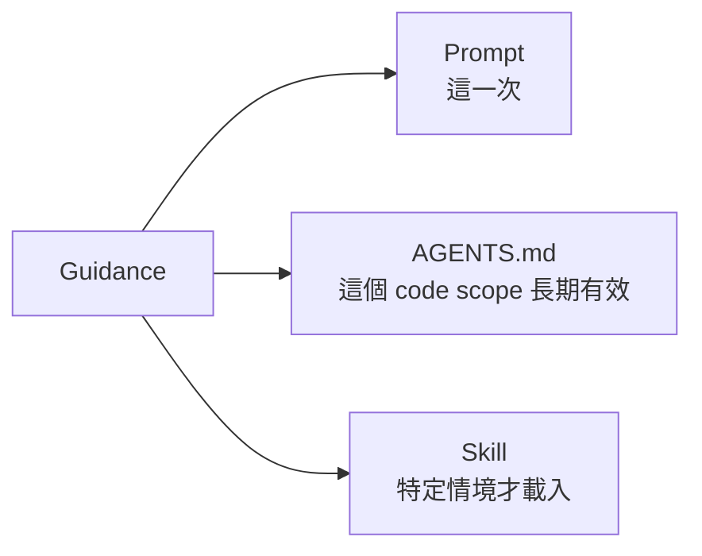
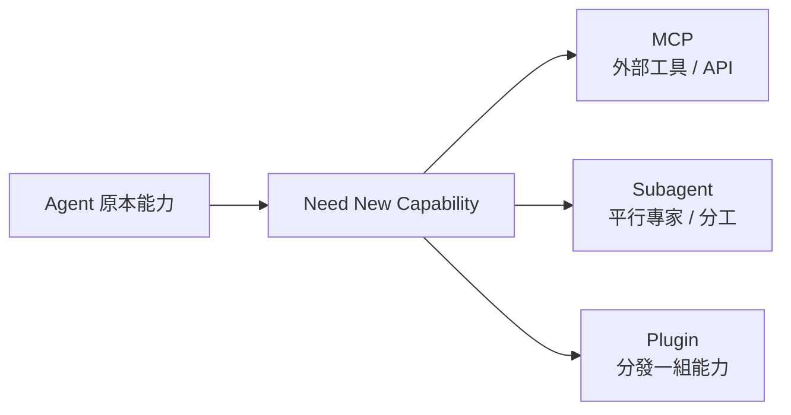
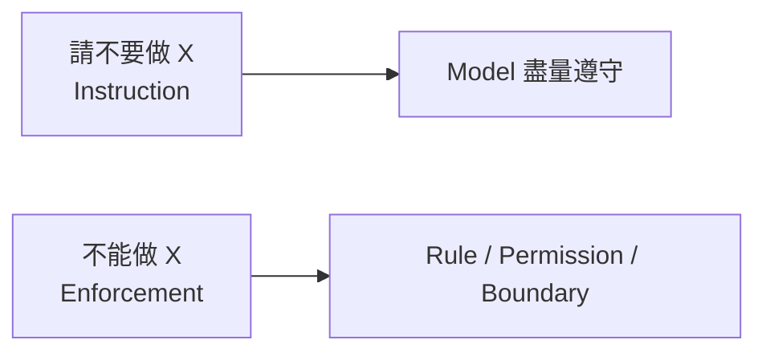
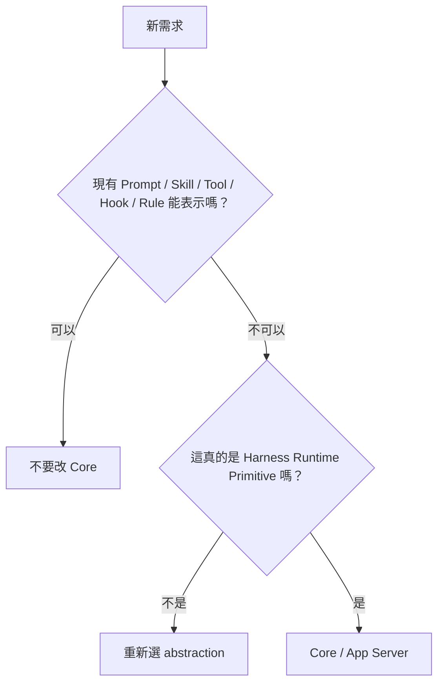
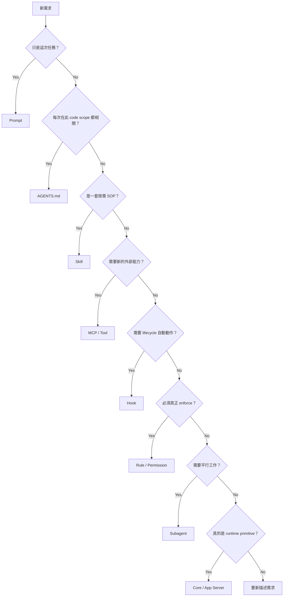
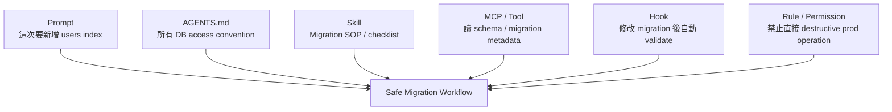

# 行為到底該放哪裡？

當你開始客製 Codex，最容易犯的錯誤不是「功能做不出來」，而是**把功能放錯層**。

例如：

- 什麼都塞進 AGENTS.md；
- 把 SOP 寫成 MCP；
- 用 Prompt 假裝做 security enforcement；
- 為了一個 project workflow 去 fork Codex core。

先用一張圖把所有擴充方式分成四類。

## 先分清楚：你到底在增加什麼？



這張圖先建立一個重要觀念：

> **Instruction、Capability、Enforcement、Runtime 是四種不同問題。**

不要用同一種工具解所有問題。

## 第一層：只是「告訴 Agent 怎麼做」嗎？

如果答案是是，通常在下面三者選擇：



### Prompt：這一次任務的要求

適合：

- 本次 outcome；
- 本次 constraints；
- success criteria。

例如：

```text
修掉 bug，但不要改 public API；完成後跑 auth integration tests。
```

它的生命週期就是這次任務。

### AGENTS.md：在這個範圍工作就永遠要知道

適合 repository invariant：

```text
所有 DB access 必須經 repository layer。
```

只要在這個 code scope 工作，就應該一直成立。

### Skill：有明確 trigger 的專門 SOP

例如：

```text
Preparing a production database migration
```

只有 migration 工作才需要完整載入，所以不應把數十行 SOP 永久塞在 AGENTS.md。

## 第二層：你是在增加「新的能力」嗎？

如果 Agent 原本根本做不到這件事，就不是多寫 instruction 可以解決。



### MCP：新增外部工具

適合：

```text
GitHub
Jira
Slack
Database metadata
Cloud deploy
Observability
```

Skill 可以告訴 Agent「怎麼部署」，但如果 Harness 根本沒有 deploy API，還是需要 Tool / MCP。

所以：

```text
Skill = know how
MCP   = can do
```

### Subagent：新增並行工作能力

適合可以拆成相對獨立 work packet 的任務。

例如：

- Agent A 查 auth code；
- Agent B 查 test coverage；
- Agent C 查 migration impact。

不要為了「有 multi-agent」就把一個五分鐘 sequential task 拆成八個 agents。

### Plugin：分發一組能力

可以把 Skill、Tool、設定等能力組成一個可安裝的 package / capability bundle。

重點是 distribution，而不是單一工作流程。

## 第三層：你是真的要「禁止或強制」嗎？

這時不能只靠 instruction。



### Hook：在 lifecycle 發生時 deterministic 地做事

例如：

```text
每次 migration file 被修改後，自動執行 validator。
```

Hook 很適合：

- before / after tool；
- session lifecycle；
- deterministic validation；
- logging / instrumentation。

如果「下一步怎麼做」需要模型判斷，通常 Skill 更合適。

### Rule / Permission：真正的執行政策

適合：

```text
git push --force → forbidden
production deploy → approval required
workspace read → allowed
```

這層回答的是：

> **即使 Model 想做，系統到底讓不讓它做？**

所以文字 instruction 永遠不能取代真正的 enforcement。

## 第四層：什麼時候才真的改 Core / App Server？

只有需求是新的 **runtime primitive** 時才應該下沉。

例如：

- 新的 Item / Event semantics；
- persistence lifecycle；
- transport capability；
- execution scheduling；
- fundamental context behavior；
- 新的 thread / turn runtime primitive。



如果每個 project 的公司 SOP 都要 fork Codex core，通常代表 abstraction 選錯了。

## 決策表

| 需求 | 最適合 | 核心理由 |
|---|---|---|
| 這次任務的目標 | User Prompt | 一次性 intent |
| Repo 永久 coding convention | AGENTS.md | scope-aware、常駐 |
| 特定工作 SOP | Skill | 按需載入 |
| 新增外部 API / 資料能力 | MCP | capability surface |
| Tool 前後 deterministic 檢查 | Hook | lifecycle interception |
| 命令必須 allow / prompt / deny | Rule / Permission | enforcement |
| 需要平行專家 | Subagent | task decomposition |
| 多能力可安裝套件 | Plugin | distribution |
| Agent loop 本身的新 primitive | Core / App Server | runtime responsibility |

## 一條實用的決策路徑



## 用一個 Production Migration 例子全部串起來

假設需求是：

> 讓 Codex 能安全協助 production database migration。

不要只做一個超大的 prompt。

可以拆成：



每個 layer 都只做自己最擅長的事。

## 最常見的四種錯放

### 1. 把所有 SOP 都塞 AGENTS.md

結果：context 永久膨脹。

應考慮拆成 Skill。

### 2. 用 Prompt 寫安全政策

結果：只有 guidance，沒有 enforcement。

應搭配 Rule / Permission / Sandbox。

### 3. 用 MCP 存放操作手冊

MCP 是 capability，不是 SOP 文件系統。

操作流程應放 Skill，外部 action 才放 MCP。

### 4. 太早改 Core

如果 project-level customization 能用現有 extension point 解決，就不應 fork runtime。

## 本章只要記住

先問你在增加哪一種東西：

```text
Knowledge     → Prompt / AGENTS.md / Skill
Capability    → MCP / Subagent / Plugin
Enforcement   → Hook / Rule / Permission
Runtime       → Core / App Server
```

再記一句：

> **能放在較高層解決，就不要無故下沉到較低層。**

這會讓 Codex customization 更容易維護，也比較不會把 context、security 和 runtime responsibility 混在一起。
