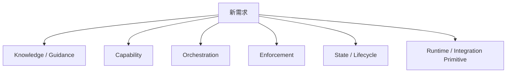
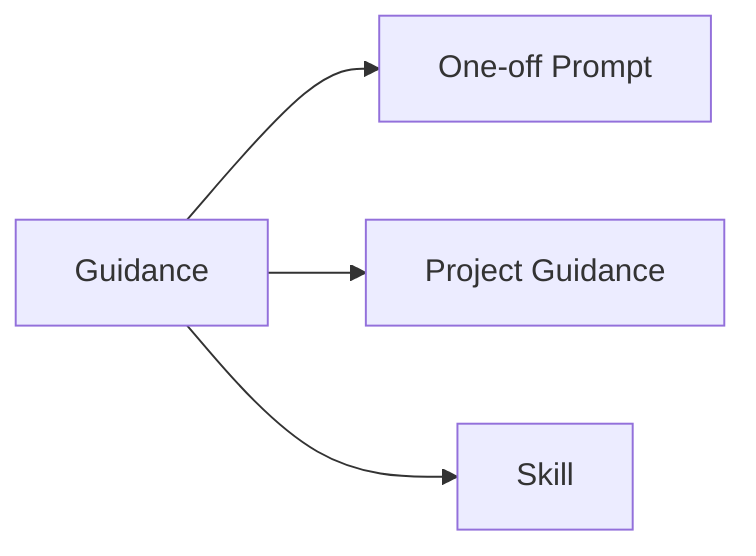
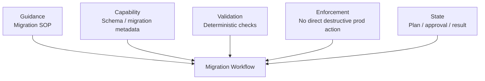
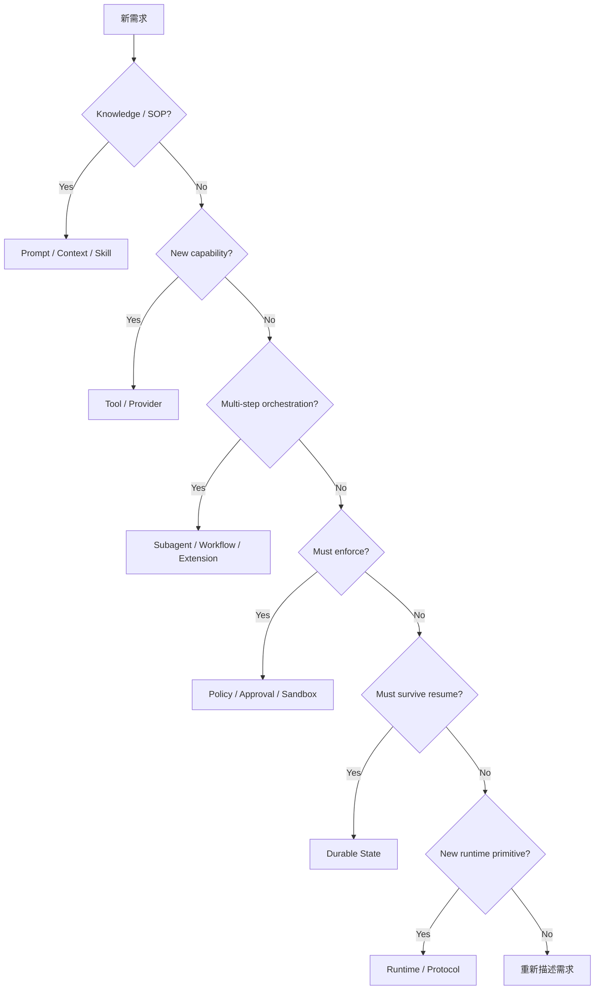

# 行為到底該放在哪一層？

客製 Agent Harness 最常見的錯誤，不是功能做不出來，而是**把 behavior 放錯責任層**。

同一個需求在 Codex、DeepSeek Harness、Pi 裡的 API 名稱不同，但判斷順序應該一致：

> **先判斷你在增加 Knowledge、Capability、Orchestration、Enforcement、State，還是 Runtime Primitive；最後才選產品 API。**

## 六種 Behavior Responsibility



### Knowledge / Guidance

告訴 Model：

```text
應該怎麼做
有哪些 SOP
repo 有哪些 convention
這次任務的 constraints
```

### Capability

讓 Agent 原本做不到的事情變得可做：

```text
新 Tool
外部 API
新 Model Provider
filesystem / execution provider
```

### Orchestration

決定多步工作如何被組合：

```text
subagent
workflow
background job
plan / task model
```

### Enforcement

不是「建議不要」，而是真的控制 side effect：

```text
allow / deny
approval
sandbox
credential boundary
network / process policy
```

### State / Lifecycle

新增需要跨時間保存的事實或工作 primitive：

```text
checkpoint
custom session entry
new event
resume state
branch metadata
```

### Runtime / Integration Primitive

現有 extension surface 無法表示的新底層能力：

```text
new protocol primitive
new client lifecycle
fundamental scheduling
new persistence semantics
new execution world
```

## 三套 Harness 的映射

| Responsibility | Codex | DeepSeek Harness | Pi |
|---|---|---|---|
| 一次性要求 | User Prompt | User Input / Prompt | User Prompt / Template |
| Repo Guidance | AGENTS.md | System Prompt / Context contribution / Skill | Context Files / AGENTS.md |
| 按需 SOP | Skill | Skill | Skill |
| 新 Tool / API | MCP / Tool / Plugin | Tool Provider / MCP Plugin | Extension `registerTool()` / SDK Tool |
| Model Provider | `model_providers` | LLM Adapter Provider | `pi-ai` / custom provider |
| Delegation | Subagent | Subagent Provider | Extension / SDK / multiple Pi processes |
| 固定流程 | Skill / external workflow / orchestration | Workflow / Jobs | Extension / external workflow |
| Lifecycle interception | Hook | Typed Event / Hook | Extension Events |
| Deterministic policy | Rule / Permission | Guard / Approval / Sandbox | Extension Gate + external policy |
| Strong isolation | Sandbox / execution policy | Sandbox / execution providers | OS / container / microVM / external sandbox |
| Durable custom state | runtime / Thread integration | SessionEvent / plugin state | Custom Session Entry |
| Client integration | App Server / SDK | SDK / JSON-RPC / ACP / Host | SDK / RPC |

這張表不是說三套功能完全等價，而是把**相同責任映射到不同 extension philosophy**。

## 第一題：這只是「告訴 Agent 怎麼做」嗎？

如果是，不要太早寫 runtime code。



### Codex

```text
Prompt
AGENTS.md
Skill
```

### DeepSeek Harness

```text
Prompt / System Prompt contribution
Skill provider
Profile / agent persona
```

### Pi

```text
Prompt Template
Context files
Skill
```

共同原則：**能用 Knowledge 解決，就不要先新增 executable capability。**

## 第二題：Agent 原本「不能做」這件事嗎？

那就需要 Capability。

例如要查 Jira：

```text
寫一段「請記得查 Jira」的 prompt
≠
Agent 真的有 Jira API
```

三套可能是：

```text
Codex    → MCP / Tool integration
DeepSeek → Tool Provider Plugin / MCP discovery
Pi       → Extension Tool / SDK custom tool
```

Capability 的核心問題是：

```text
input contract
side-effect class
auth
execution backend
output bound
policy
```

不是套件名稱。

## 第三題：你是在增加「工作編排」嗎？

不要把所有 multi-step behavior 都塞 Agent Loop。

### Codex

可利用 Skill、Subagent、Hooks、外層 orchestrator / App Server workflow。

### DeepSeek

有明確 Subagent Provider、Workflow、Jobs 等 subsystem。

### Pi

刻意沒有 canonical built-in subagent / plan mode；可以用 Extension、SDK child session、多 process、tmux 或外部 orchestrator 定義自己的語意。

這裡的選擇本身就是三套設計哲學差異。

## 第四題：這是 Guidance 還是 Enforcement？

這句話：

```text
不要執行 production destructive command
```

若只放在 prompt / AGENTS / Skill，就是 guidance。

真正 enforcement 需要：

```text
authorization
sandbox
credential / environment boundary
```

### Codex

Rule / Permission / Approval / Sandbox。

### DeepSeek

Guard / Approval Service / Sandbox Provider / Credentials。

### Pi

Extension Gate 可以做 authorization；真正 isolation 通常在 external container / sandbox。

**文字 instruction 永遠不能取代技術 boundary。**

## 第五題：這個狀態 Resume 後還要存在嗎？

如果要，就必須有 durable representation。

例如：

```text
migration checkpoint
external ticket id
approval decision
workflow cursor
branch knowledge
```

### Codex

應放在適合的 Thread / runtime / external durable system。

### DeepSeek

若是 model-visible durable fact，應能由 Session Event / projection 重建。

### Pi

Extension 可以 append custom Session Entry，或使用外部 store；一旦寫入 session，就要考慮 schema migration。

## 第六題：什麼時候才改 Runtime Core？

只有需求真的是新的 primitive：

```text
現有 Tool / Skill / Hook / Event / Extension 無法表示
且
它是所有上層 behavior 都需要依賴的新底層 contract
```

例如：

```text
new persistence primitive
new transport semantic
new execution scheduler
new session lifecycle primitive
```

不要為公司 SOP fork runtime core。

## Production Migration：同一需求三套怎麼拆？

需求：

> 讓 Agent 安全協助 production database migration。

先拆 responsibility：



### Codex Mapping

```text
AGENTS / Skill
+ MCP
+ Hook
+ Rule / Permission / Sandbox
+ Thread / external deployment state
```

### DeepSeek Mapping

```text
Skill
+ Tool Provider
+ Workflow / Tool events
+ Approval / Sandbox / Credentials
+ SessionEvents / Job state
```

### Pi Mapping

```text
Context / Skill
+ Extension Tool
+ Extension validator / command
+ Extension gate + external sandbox
+ Session custom entry / external deploy state
```

三套 API 不同，但 responsibility decomposition 幾乎相同。

## 最常見的五種錯放

1. **把所有 SOP 塞常駐 Context** → 應考慮 Skill / progressive disclosure。
2. **用 Prompt 做安全政策** → 沒有真正 enforcement。
3. **為了流程新增一堆高權限 Tools** → orchestration 與 capability 混在一起。
4. **把 UI state 當 source of truth** → resume / replay 容易 drift。
5. **太早改 Core** → extension boundary 選錯。

## 一條通用決策路徑



## 本章只要記住

> **先選 Responsibility，再選 Harness Surface。**

這比背「哪個產品用哪個檔案」更能跨 Harness 重用，也能讓第六章的三方選型真正落到 implementation。
