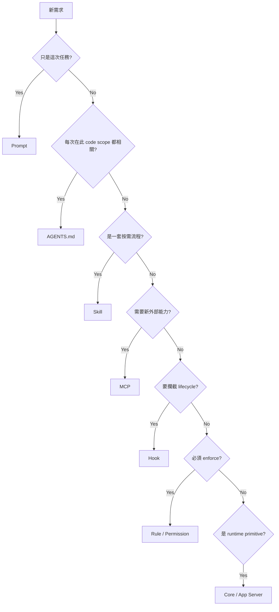

# 行為到底該放哪裡？

Codex 擴充方式很多，最常見的架構錯誤是「什麼都塞 AGENTS.md」或「什麼都做 MCP」。

## 決策表

| 需求 | 最適合 | 為什麼 |
|---|---|---|
| 這次任務的目標 | User prompt | 一次性 intent |
| Repo 永久 coding convention | AGENTS.md | scope-aware、常駐 |
| 特定工作 SOP | Skill | 按需載入 |
| 新增外部 API/資料能力 | MCP | tool interoperability |
| Tool 前後 deterministic 檢查 | Hook | lifecycle interception |
| 命令必須 allow/prompt/deny | Rule / Permission | enforcement |
| 需要平行專家 | Subagent | task decomposition |
| 多能力可安裝套件 | Plugin | distribution |
| Agent loop 本身的新 primitive | Core/App Server | runtime responsibility |

## Prompt

**用於：** 本次 outcome、constraints、success criteria。

```text
修掉 bug，但不要改 public API；完成後跑 auth integration tests。
```

不要把多年有效的 repo rule 每次手打 prompt。

## AGENTS.md

**用於：** 只要在這個 code scope 工作就應知道的 invariant。

```text
所有 DB access 必須經 repository layer。
```

如果一段內容只有 release 時需要，不要常駐。

## Skill

**用於：** 有 trigger 的專門 workflow。

```text
When preparing a production database migration...
```

可以附 scripts/references，避免常駐 context。

## MCP

**用於：** Harness 本來碰不到的外部能力。

```text
GitHub / Jira / Slack / DB metadata / cloud deploy / observability
```

不要用 MCP 來放一篇 SOP；它是 capability surface。

## Hook

**用於：** 每當某 lifecycle 事件發生就 deterministic 地做某件事。

例如：所有 migration file edit 後自動跑 validator。

如果流程需要模型判斷下一步，通常 Skill 更合適。

## Rule / Permission

**用於：** 必須真的限制 action 的政策。

```text
git push --force → forbidden
production deploy → prompt/reviewer
```

文字 instruction 不等於 enforcement。

## Subagent

**用於：** 問題可被切成近乎獨立的 work packets。

不要因為「有多 agent 功能」就把一個 5 分鐘 sequential task 拆成 8 個 agent。

## Core / App Server

只有當需求是**新的 runtime primitive** 才應下沉，例如：

- 新 item/event semantics；
- persistence lifecycle；
- transport feature；
- execution scheduling；
- fundamental context behavior。

如果每個 project 都得 fork Codex core 才能加公司 SOP，代表 abstraction 選錯了。

## 一個判斷流程



這張圖是整套教材最值得帶回實務的一張。
