# 實務工作流：Harness 能拿來做什麼

真正有效的 Codex 應用，不是把需求換句話說成：

> 請 AI 幫我寫 Code。

而是把一個 Engineering Outcome 拆成：

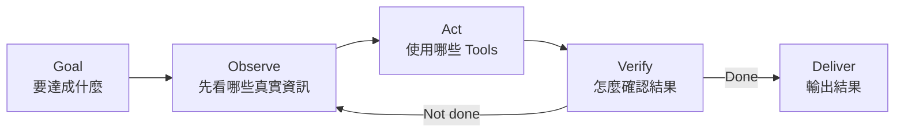

這就是把 Agent Loop 變成真實工作流。

## 任何 Agent Workflow 都先問六題

先不要急著選 Model、Skill 或 MCP。

先回答：

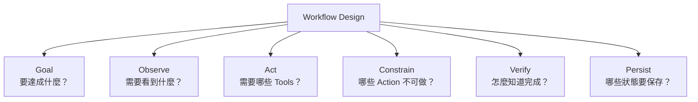

這六題幾乎可以拿來設計任何 Harness Workflow。

## 從風險角度看 Workflow

並不是所有任務都應給 Agent 一樣的權限。

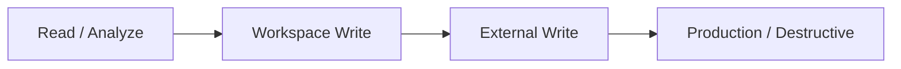

越往右，越需要：

- 更窄的 Permission；
- 更明確的 Verification；
- Approval / Review Gate；
- Audit Trail；
- Rollback Plan。

下面的案例可以用這個風險階梯理解。

## 1. Repository Comprehension

### Goal

快速建立陌生 Codebase 的心智模型。

### Loop

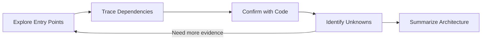

### Harness Design

適合：

- read-only sandbox；
- search / file tools；
- 必要時 explorer subagents。

Prompt 例：

```text
理解 checkout 流程。
從 route / API entry point 開始，追到 payment provider、DB write、
webhook reconciliation。不要修改檔案。
最後輸出 sequence、核心檔案、失敗補償機制與仍不確定的地方。
```

這類任務不需要 write permission。

## 2. Bug Fix

Bug Fix 最典型地展現 Agent Loop。

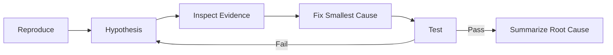

真正重要的 Harness 能力不是「生成 Patch」，而是：

> **能不能用真實 Test / Shell / File Result 閉環驗證？**

沒有 Verify 的 Coding Agent，很容易只是產生「看起來合理」的修改。

## 3. Code Review

Code Review 的主要動作是 Observe，不是 Write。

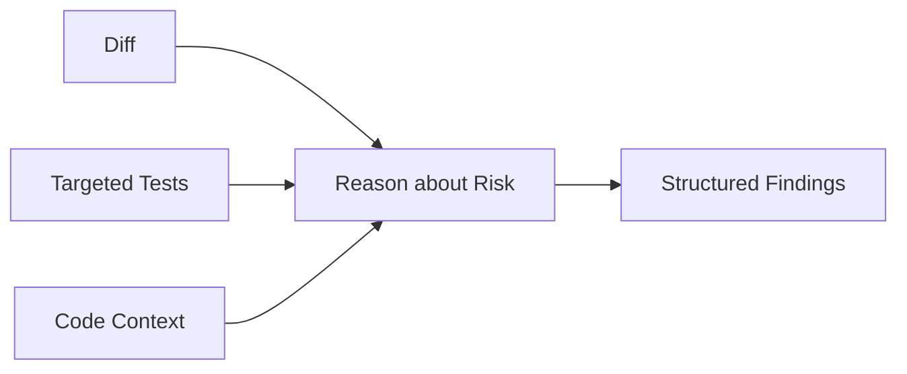

適合：

- read-only；
- current diff；
- targeted tests；
- structured output。

例如輸出：

```text
severity
file / line
risk
supporting evidence
suggestion
```

Final Gate 仍由 CI / Human Review 決定。

## 4. Database / Migration Work

這類工作風險比一般 Code Edit 高，應把「產生 Migration」和「執行 Production Migration」拆開。

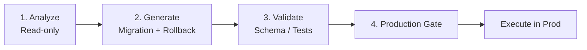

關鍵原則：

```text
能寫 migration file
≠
能連 production DB
```

Harness 應把這兩種 capability 分離。

## 5. Refactor

Large Refactor 很適合 Agent，但要先定義 Invariants。

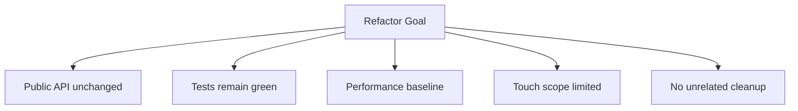

沒有 invariants 時，Agent 很容易順手做很多「看起來更漂亮」但其實無關的修改。

推薦流程：

```text
Inventory → establish invariants → small batch → test → next batch
```

而不是一次重寫整個模組。

## 6. Dependency Upgrade

Dependency Upgrade 是很適合 Agent 的「Observe + Modify + Verify」工作。

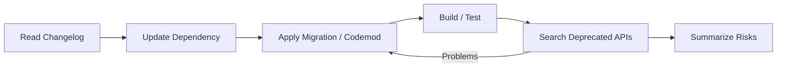

可能需要 Network，但不代表需要 unrestricted internet。

可以只開：

```text
registry
official docs
upstream source
```

## 7. Incident Triage

Incident Workflow 通常先大量 Read，再決定是否要 Write。

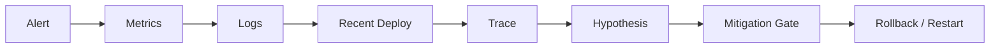

此時：

- **Skill** 很適合封裝 Incident SOP；
- **MCP** 提供 Metrics / Logs / Deploy capability；
- **Permission** 限制 Production Write。

這正好展示「Knowledge / Capability / Enforcement」三層分工。

## 8. Documentation Drift

這類工作通常風險低、可驗證性高，非常適合 Automation。

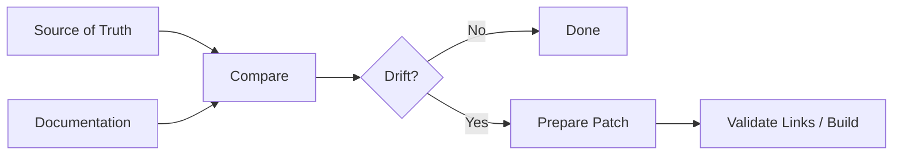

可以比較：

- Public API vs Docs；
- Config Schema vs Examples；
- CLI `--help` vs Reference；
- Generated Client vs Spec。

## 9. Multi-agent Architecture Review

大問題可以拆成專門 reviewer：

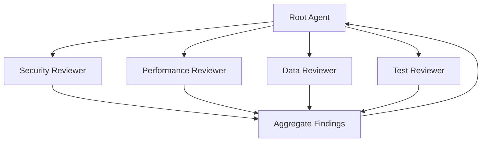

但 Multi-agent 不是免費午餐。

每個 Subagent Output 最好：

- 短；
- 結構化；
- 有證據；
- 不重複全文 Context。

否則只是在製造更多 Context Pollution。

## 10. 自動 PR，而不是一開始就自動 Merge

很多團隊最容易建立信任的起點是：

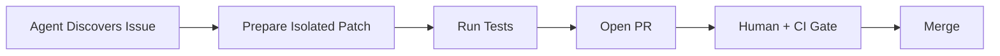

這個模式的好處：

- Agent 可以真正做事；
- 改動仍有 review boundary；
- 有 audit trail；
- rollback / diff 容易理解。

比直接讓 Agent 操作 Production 更容易逐步建立信任。

## Workflow 不應只是「Prompt 模板」

一個成熟 Workflow 其實跨越 Harness 的多個層次。

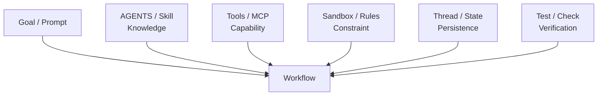

所以真正的 Agent Workflow Design，不是只寫一句好 Prompt。

## 一個通用的 Workflow Template

設計新任務時，可以直接填這六格：

| 問題 | 你要填什麼 |
|---|---|
| Goal | 最終 Outcome |
| Observe | Agent 必須讀到哪些 evidence |
| Act | 需要哪些 Tools / MCP |
| Constrain | 哪些 action 禁止或需 approval |
| Verify | Test / Check / Human Gate |
| Persist | 哪些狀態要跨 Turn 保存 |

例如「自動修 Security Dependency」：

```text
Goal      修掉指定 CVE
Observe   package lock、usage、upstream advisory
Act       edit dependency、run tests
Constrain 不改 unrelated packages、不 deploy
Verify    build + security scan + targeted tests
Persist   修改理由、測試結果、未解風險
```

## 本章只要記住

1. **Workflow = Goal → Observe → Act → Verify 的閉環。**
2. **高風險任務要拆 capability，不要一次給滿權限。**
3. **Verify 是 Agent Coding Workflow 的核心，不是最後附加步驟。**
4. **Skill、MCP、Permission 分別處理 Knowledge、Capability、Enforcement。**
5. **任何 Workflow 都可以用 Goal / Observe / Act / Constrain / Verify / Persist 六題設計。**
