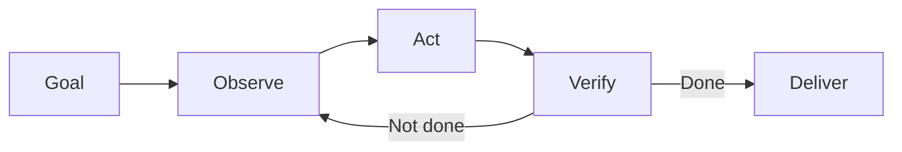
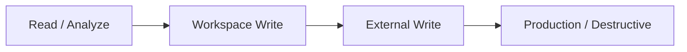
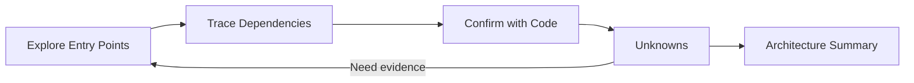
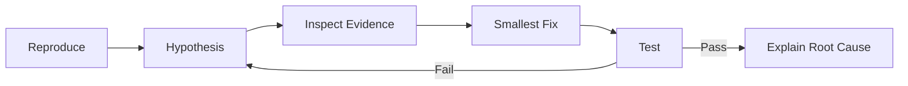
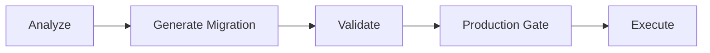
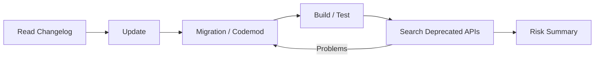
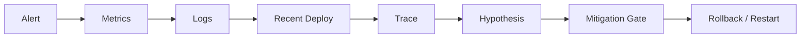
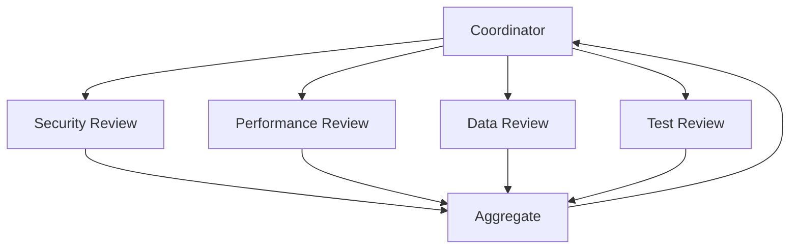
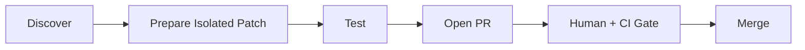
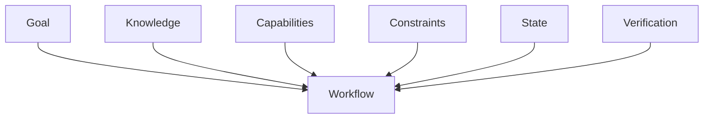

# 實務工作流：把 Agent Loop 變成可驗證工程流程

真正有效的 Agent Harness 應用，不是把需求改寫成「請 AI 幫我做」，而是把工程目標拆成可觀察、可執行、可限制、可驗證的閉環。



這套方法不屬於 Codex、DeepSeek Harness 或 Pi 任一產品；三套只是把同一組責任放在不同 extension / runtime boundary。

## 六題 Workflow Template

設計任何 Agent Workflow 前，先回答：

| 問題 | 要定義什麼 |
|---|---|
| Goal | 最終 outcome |
| Observe | 決策前需要哪些 evidence |
| Act | 需要哪些 capabilities |
| Constrain | 哪些 action 禁止、限縮或需 approval |
| Verify | 怎麼證明結果真的完成 |
| Persist | 哪些狀態必須跨步驟保存 |

## 三套 Harness 怎麼承接這六題？

| Responsibility | Codex | DeepSeek Harness | Pi |
|---|---|---|---|
| Guidance | Prompt / AGENTS.md / Skill | Prompt sections / Skills / Plugins | Prompt / Skills / Resources |
| Capability | Built-in Tool / MCP | `ctx.tools` providers / Plugins | Built-in Tools / Extension tools |
| Orchestration | Agent Loop / Skill / Subagent | Agent Loop / Workflow / Jobs / Subagent Providers | AgentSession / Extensions / external orchestrator |
| Enforcement | Rules / Approval / Sandbox | Guards / Approval / Sandbox providers | Extension gates + OS/container isolation |
| State | Thread / Turn / Item | SessionEvent log | JSONL Session Tree |
| Integration | CLI / SDK / App Server | Web / SDK / JSON-RPC / ACP | CLI / JSON / RPC / SDK |

所以真正通用的問題不是「這件事要不要寫成 Skill」，而是：

> **它屬於 Knowledge、Capability、Orchestration、Enforcement、State 還是 Integration？**

## 風險階梯



越往右，越需要更窄的 capability、更明確的 verification、audit trail、approval 與 rollback。

## 1. Repository Comprehension

目標是快速建立陌生 codebase 的心智模型。



建議：read-only、search/file capability、必要時才平行探索。三套 Harness 都能做到，但 delegation boundary 不同：Codex 可用 Subagent，DeepSeek 可用 Subagent Provider，Pi 常由外部 process / SDK / Extension 組合。

## 2. Bug Fix



重點不是 Patch 生成，而是 **Test / Shell / File Result 是否真的回到 loop，形成可驗證閉環**。

## 3. Code Review

主要行為是 Observe，不是 Write。

```text
Diff + Code Context + Targeted Tests
→ Structured Findings
→ Human / CI Gate
```

適合 read-only 或極窄 write capability。輸出最好固定包含 severity、location、risk、evidence、suggestion。

## 4. Database / Migration

把「產生 migration」與「執行 production migration」拆成不同 capability。



能修改 migration file，不代表能連 production DB。這個 separation 應由 runtime / environment enforcement 實現，不只是 prompt 說明。

## 5. Large Refactor

先定 invariants，再小批修改。

```text
Inventory
→ establish invariants
→ small batch
→ verify
→ next batch
```

常見 invariants：public API 不變、tests 維持、performance baseline、touch scope 有界、不做 unrelated cleanup。

## 6. Dependency Upgrade



需要 network 不代表要 unrestricted network；可以只開 registry、官方 docs、upstream source。

## 7. Incident Triage

先大量讀，再把 mitigation 放在獨立 gate 後。



Knowledge 可以來自 Skill / Resource；Observability capability 可以來自 MCP / Tool Provider / Extension；Production write 則必須由真正 enforcement 控制。

## 8. Documentation Drift

低風險、可驗證，特別適合 unattended automation。

```text
Source of Truth
+ Documentation
→ Compare
→ Patch
→ Link / Build Validation
```

## 9. Multi-agent / Multi-runtime Review



三套對 delegation 的 canonical answer 不同，因此設計時應先問：

- child work 是否真的可獨立？
- 是否需要 shared state？
- output 是否足夠短、結構化、有 evidence？
- 多 runtime protocol 是否值得引入？

不要為了「multi-agent」而製造更多 context pollution。

## 10. 自動 PR，而不是直接自動 Merge



這是建立 automation trust 的好起點：Agent 真正做事，但 destructive boundary 仍由 review / CI 控制。

## Workflow 不只是 Prompt Template



## 一個跨 Harness 的例子：自動修 CVE

```text
Goal      修掉指定 CVE
Observe   lockfile、usage、upstream advisory
Act       edit dependency、run tests
Constrain 不 deploy、不改 unrelated packages
Verify    build + security scan + targeted tests
Persist   修改理由、測試結果、未解風險
```

在 Codex、DeepSeek、Pi 裡，具體 surface 不同，但 workflow responsibility 完全相同。

## 本章只要記住

1. **Workflow = Goal → Observe → Act → Verify 的閉環。**
2. **先分類 responsibility，再選某套 Harness 的 extension surface。**
3. **高風險能力要拆開，不要一次給滿權限。**
4. **Verification 是 workflow 核心，不是最後附加步驟。**
5. **Harness 差異主要影響 capability / state / enforcement 被放在哪一層，不改變工程閉環本身。**
