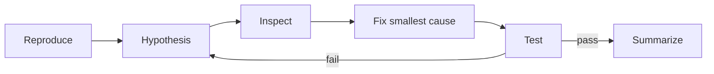

# 實務工作流：Harness 能拿來做什麼

真正有效的 Codex 應用不是「請 AI 幫我寫 code」，而是把一個 engineering outcome 拆成 agent 能觀察、執行、驗證的 loop。

## 1. Repository Comprehension

目標：快速建立陌生 codebase 心智模型。

```text
Explore → identify entry points → trace dependencies → validate with code → summarize
```

適合 read-only sandbox + explorer subagents。

Prompt：

```text
理解 checkout 流程。請從 route/API entry point 開始，追到 payment provider、
DB write、webhook reconciliation。不要修改檔案。最後輸出 sequence、核心檔案、
失敗補償機制與你仍不確定的地方。
```

## 2. Bug Fix



最重要的 harness 能力不是生成 patch，而是 shell/test/file tools 讓模型能**閉環驗證**。

## 3. Code Review

使用 read-only + current diff + targeted tests。讓模型找 semantic risk，但 final gate 由 deterministic CI/人類控制。

適合 structured output：severity、file、line、evidence、suggestion。

## 4. Database / Migration Work

高風險，建議三段：

1. Analyze schema/query plans read-only。
2. Generate migration + rollback plan in workspace。
3. Production execute 交給獨立 deployment gate。

不要讓「能寫 migration file」自動等於「能連 prod DB」。

## 5. Refactor

Large refactor 很適合 agent，但需要 explicit invariants：

- public API 不變；
- performance baseline；
- tests required；
- staged commits；
- max touched areas。

否則模型常順便做「看起來更乾淨」的 unrelated change。

## 6. Dependency Upgrade

Harness 可以：

- read changelog；
- update dependency；
- run codemod；
- compile/test；
- search deprecated APIs；
- summarize migration risks。

Network access 只需 registry/docs/source hosts，不代表 unrestricted internet。

## 7. Incident Triage

配合 observability MCP：

```text
alert → metrics → logs → recent deploy → trace → hypothesis → mitigation
```

此時 Skill 非常適合封裝 incident SOP，而 MCP 提供 metrics/log/deploy tools。

Production write（rollback/restart）應另外 permission gate。

## 8. Documentation Drift

Agent 定期比較：

- public API vs docs；
- config schema vs examples；
- CLI `--help` vs reference；
- generated clients vs spec。

這類 read-heavy、deterministic validation 多的任務，特別適合 automation。

## 9. Multi-agent Architecture Review

可以把一個大問題拆成：

- security reviewer；
- performance reviewer；
- data reviewer；
- test reviewer；

最後由 root agent 聚合，但每個 subagent output 必須短而結構化，否則只是在 context 中製造噪音。

## 10. 自動 PR 而非自動 Merge

很多團隊的最佳起點是：

```text
Agent discovers issue
→ prepares isolated patch
→ runs tests
→ opens PR
→ human/CI review
```

這比「Agent 直接操作 production」更容易建立信任與 audit trail。

## Workflow Design Formula

每個 agent workflow 都可以問六題：

```text
Goal      要達成什麼？
Observe   需要看到什麼？
Act       需要哪些 tools？
Constrain 哪些 action 不可做？
Verify    怎麼知道完成？
Persist   哪些狀態要保存？
```

這六題比「該用哪個模型」更接近 harness architecture 的核心。
