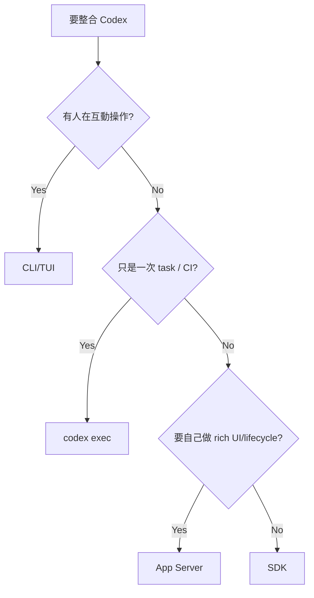

# Client Surfaces：CLI、Exec、SDK、App Server 怎麼選

Codex 的不同「使用方式」其實代表不同 integration depth。選錯 surface，常會讓架構過重或能力不足。

## 快速比較

| Surface | 最適合 | Harness 控制力 | 整合成本 |
|---|---|---:|---:|
| Interactive CLI/TUI | 人與 agent 協作 | 中 | 低 |
| `codex exec` | script / CI / one-shot | 中 | 低 |
| Codex SDK | 應用程式內啟動 Codex 工作 | 中高 | 中 |
| App Server | 自製 rich client / product integration | 高 | 高 |
| Codex as MCP server | 讓其他 MCP host 使用 Codex 能力 | 特定 | 中 |

## Interactive CLI

適合 developer-in-the-loop：你希望看進度、批准命令、steer 任務、互動式除錯。

優勢：零整合成本，最接近官方 UX。

缺點：難當成穩定 machine interface；不要用 terminal scraping 當 API。

## `codex exec`

非互動模式提供 machine-friendly execution：

```bash
codex exec --json "檢查這個專案並找出 race condition"
```

適合 CI、pre-commit、scheduled task、release pipeline。它可以輸出 JSONL events，也能要求 structured final output。

如果需求只是「在 pipeline 跑一個 agent task」，先用 exec，不必一開始就自己寫 App Server client。

## SDK

SDK 適合你希望在 TypeScript/Python 程式裡控制 thread，而不想自己處理完整 JSON-RPC protocol 的場景。

它提供較小、較 ergonomic 的 surface，但不保證暴露 App Server 的全部 product primitives。

## App Server

當你需要：

- rich event UI；
- persistent threads；
- approvals；
- thread fork/resume；
- model/config/auth UI；
- 多種 item 類型；
- 自製 IDE/product；

就應該直接面對 App Server。

## MCP Server

MCP 解的是「工具互通」而不是「完整 Codex client」。把 Codex 暴露成 MCP server 可以讓其他 agent host 呼叫它，但你拿到的 product lifecycle 不等同 App Server。

## Selection heuristic



## 一個架構原則

越靠近 App Server/core，能力越完整，但你也越要自己處理：

- lifecycle；
- version compatibility；
- error/retry；
- event ordering；
- approvals UX；
- persistence / reconnect；
- security boundaries。

「更多控制」不等於「更簡單」。

## 來源

- [Codex CLI](https://learn.chatgpt.com/docs/codex/cli)
- [Non-interactive mode](https://learn.chatgpt.com/docs/non-interactive-mode)
- [Codex SDK](https://learn.chatgpt.com/docs/codex-sdk)
- [App Server](https://learn.chatgpt.com/docs/app-server)
