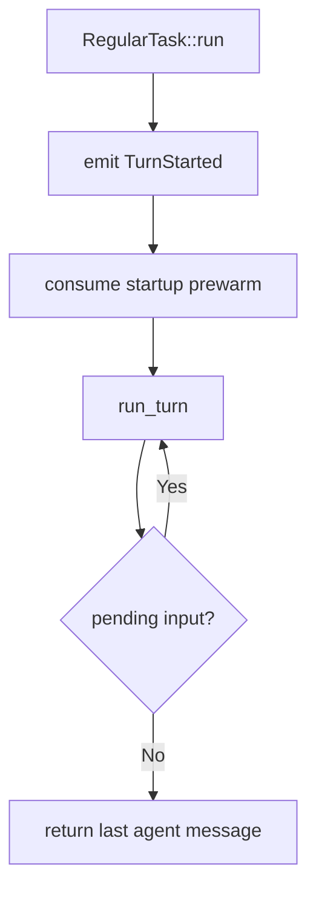

# codex-core：Agent Runtime 的中心

`codex-core` 是理解 harness runtime 最值得看的 crate。它不是 UI，也不是 protocol schema；它負責「一個 Codex thread 如何真正活起來」。

## 先從 `lib.rs` 看版圖

目前 `core/src/lib.rs` 可看到幾類重要模組：

```text
session / codex_thread / thread_manager
client / client_common
context / context_manager
agent / agent_communication
exec / unified_exec / exec_policy
mcp / mcp_tool_call / mcp_tool_exposure
skills / plugins / agents_md
hook_runtime
guardian / safety / sandboxing
rollout / state / tasks
compact / compact_* / compact_token_budget
tools
```

這個分法本身就說明：**agent runtime = lifecycle + model + context + tools + execution + policy + state**。

## ThreadManager、CodexThread、Session

可以用三層概念理解：

### ThreadManager

負責建立、取得、fork、管理 thread 級 runtime，是上層 client 與 session instance 之間的管理層。

### CodexThread

`CodexThread` 是「一條雙向訊息流的 conduit」。目前 source 中它包住 session、I/O、session source、configuration event、rollout path 等，並提供 submit 等操作。

它的 `ThreadConfigSnapshot` 很值得閱讀，因為一次列出 thread runtime 真正在乎的東西：

- model / provider；
- approval policy；
- permission profile；
- environments / workspace roots；
- reasoning effort / summary；
- personality / collaboration mode；
- persistence/history/fork/parent metadata。

也就是說，thread 不是只有 message list，而是一個**有執行能力與權限狀態的 session container**。

### Session

Session 承擔 turn execution 所需的 services、active turn、input queue、event emission 等內部狀態。多數 agent loop 的細節最後會落在 session/turn/task 周邊。

## Task abstraction

Core 不把所有工作都當成完全相同的 turn。`tasks` 讓 runtime 可以表示不同 task kind。

以 `RegularTask` 為例，流程大致是：



這裡有兩個值得借鏡的 production 細節：

1. **prewarm**：agent loop 不必把所有 provider/session 初始化延遲都留到第一個 user-visible action。
2. **pending input loop**：user steering/queue 是 runtime lifecycle 的一部分，不是 UI 外掛。

## Core 為什麼不能直接 print？

目前 `core` root 禁止 library code 直接 `stdout/stderr` print，要求 user-visible output 經過 TUI 或 tracing abstraction。

這看似小細節，其實代表正確的 layering：

- core 產生 domain events；
- client 決定怎麼 render；
- telemetry/logging 走 instrumentation；
- library 不綁死 terminal。

如果你在做自己的 harness，這條原則極度重要。否則將來從 CLI 搬到 IDE/Web 時，所有執行邏輯都會被 presentation code 卡住。

## Core 的 extension mindset

目前 source tree 出現許多 `ext/*` crate 與 plugin/skill/MCP abstraction，方向很明確：核心維持 agent loop 與權限/狀態一致性，把可選能力外掛化。

理想的 core API 應該讓「新增能力」不需要改寫 agent loop：

```text
register tool / capability
      ↓
expose schema to model
      ↓
model chooses it
      ↓
common authorization + execution path
      ↓
common item/event/state path
```

這就是 harness 從 demo 走向平台的分水嶺。

## 讀原始碼建議順序

1. `core/src/lib.rs`：先看模組。
2. `core/src/codex_thread.rs`：理解 thread abstraction。
3. `core/src/thread_manager.rs`：理解 lifecycle。
4. `core/src/tasks/regular.rs`：看 regular turn task。
5. `core/src/session/turn.rs`：深入 agent loop。
6. `core/src/client*.rs`：看 model interaction。
7. `core/src/tools/*`：看 action routing。
8. 再進 sandbox/MCP/hooks/skills。

不要一開始從最大的 `turn.rs` 逐行讀，會失去架構視角。

## 來源

- [`core/src/lib.rs`](https://github.com/openai/codex/blob/main/codex-rs/core/src/lib.rs)
- [`core/src/codex_thread.rs`](https://github.com/openai/codex/blob/main/codex-rs/core/src/codex_thread.rs)
- [`core/src/tasks/regular.rs`](https://github.com/openai/codex/blob/main/codex-rs/core/src/tasks/regular.rs)
