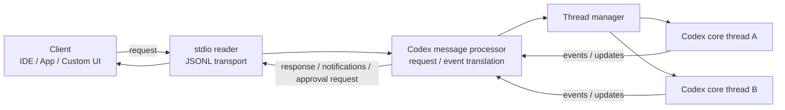

# 官方視角：Codex 介面與 App Server

本頁刻意把教材自己的抽象圖，和 **OpenAI 官方 repo / 官方工程文章**放在一起看。目的不是用官方素材取代教材，而是讓你能確認：前面談到的 Client、Runtime、Thread、App Server，確實對應到 Codex 官方公開的產品與架構語彙。

## 官方 Codex CLI 介面


*官方原始素材：[`openai/codex` README](https://github.com/openai/codex/blob/2df67054232090af8d2fa197c46b994bc2b0dda1/README.md) 引用的 Codex CLI splash；來源 repo 為 [Apache-2.0](https://github.com/openai/codex/blob/2df67054232090af8d2fa197c46b994bc2b0dda1/LICENSE)。此教材以固定 revision `2df6705…` 顯示，避免 upstream 圖片日後變更。*

這張圖最值得觀察的不是配色，而是它證明了一件事：**CLI 是 Codex 的一個 Client Surface，不是 Harness 本身。** 同一套 Codex harness 也能被 IDE、App Server、SDK 與 Web surface 驅動。

## OpenAI 官方 App Server 架構怎麼描述？

OpenAI 在工程文章 [Unlocking the Codex harness: how we built the App Server](https://openai.com/index/unlocking-the-codex-harness/) 中，明確把 App Server 描述成：

- client-friendly 的雙向 JSON-RPC 介面；
- long-lived process；
- 內部包含 stdio reader、Codex message processor、thread manager 與 core threads；
- 一個 client request 可以產生多個 event updates；
- server 也能反向要求 client 回覆 approval。

下面不是 OpenAI 原圖，而是**依官方工程文章重繪的教材版責任圖**：



*教材重繪來源：OpenAI 官方工程文章 [Inside the Codex harness](https://openai.com/index/unlocking-the-codex-harness/#inside-the-codex-harness)。這張 Mermaid 是本教材整理，不是 OpenAI 官方原圖。*

## 把官方描述映射回教材

| 官方語彙 | 教材中的位置 |
|---|---|
| Codex CLI / IDE / App | Client Surface |
| App Server | Integration Boundary |
| Thread Manager | 多 Thread lifecycle / runtime hosting |
| Core Thread | 一個 Codex Thread 對應的 agent runtime |
| JSON-RPC notifications | UI-ready event stream |
| Server-initiated approval request | Human-in-the-loop / Approval boundary |

因此前面看到的：

```text
Client
→ App Server
→ Codex Runtime
→ Model / Tools / State / Policy
```

不是為了方便教學而任意創造的分層，而是對 OpenAI 已公開架構做的責任抽象。

## Thread / Turn / Item 也來自官方公開模型

同一篇 App Server 工程文章把 conversation primitives 明確拆成：

```text
Thread
└─ Turn
   └─ Item
```

其中 Item 是 client 可以渲染的原子單位，例如 user message、agent message、tool execution、approval request、diff。這也是為什麼本教材在談 State 與 UI 時，會一直把 Thread / Turn / Item 當成 Codex 最重要的 product-facing domain model。

進一步可直接讀：

- [OpenAI：Unlocking the Codex harness](https://openai.com/index/unlocking-the-codex-harness/)
- [`codex-rs/app-server/README.md`](https://github.com/openai/codex/blob/main/codex-rs/app-server/README.md)
- [`openai/codex`](https://github.com/openai/codex)

## 閱讀原則

官方素材最適合回答：

> **OpenAI 自己把哪些東西視為 Codex 的穩定產品與整合邊界？**

而本教材的圖則進一步回答：

> **這些 boundary 在一般 Agent Harness 架構裡代表什麼責任？**

兩者應該並讀，而不是二選一。

下一步可回到 [系統架構總覽](./system-map.md)，或繼續讀 [App Server 與 Protocol](./app-server-and-protocol.md)。
