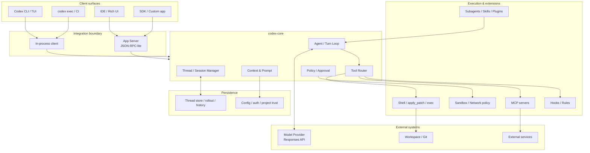

# 系統架構總覽

要理解目前 Codex，最有效的方法不是從 CLI 指令往下猜，而是把整套系統拆成 **Client surface → App/runtime boundary → Core → Providers/Tools/State** 四層。

> 這是教學用 responsibility map，不代表每個箭頭都對應單一 Rust function。現行 `openai/codex` 是持續重構中的大型 workspace。

## 第一層：Client surfaces

Codex 不只有 TUI。相同 harness 能力需要被不同介面消費：

- Interactive terminal/TUI；
- `codex exec` 的非互動/CI 模式；
- IDE extension；
- 透過 App Server 的自製 UI；
- SDK 或其他自動化整合。

這就是為什麼把 agent runtime 寫死在 TUI 事件處理器會成為架構瓶頸。

## 第二層：Integration boundary

OpenAI 將 App Server 定位成完整 Codex harness 的 integration surface。它使用類 JSON-RPC 的雙向 protocol，把 thread/turn/item、config、auth、model discovery、approvals、events 等行為變成可由其他 client 驅動的 API。

目前 source tree 還可以看到 `app-server-client`、`app-server-transport`、`app-server-daemon` 等 crate，顯示 App Server 已不是單一 binary 的附屬功能，而是重要架構邊界。

## 第三層：codex-core

`codex-core` 承擔真正 agent runtime 的 material logic，包括：

- Thread/session lifecycle；
- turn context；
- prompt/context assembly；
- model client；
- tool exposure/call handling；
- MCP coordination；
- sandboxing / exec policy；
- hooks；
- skills/plugins；
- rollout/state；
- compaction；
- agents/subagents 等。

`protocol` crate 則刻意保持「types」角色，避免塞入 material business logic。

## 第四層：Model、Execution、State

Agent harness 其實同時碰三個不同世界：

1. **Model world**：tokens、tool schemas、stream events、reasoning。
2. **Machine world**：process、filesystem、network、credentials、OS sandbox。
3. **Product world**：thread persistence、UI progress、auth、project trust、resume/fork。

Production agent 的難度，主要就是在三個世界的交界，而不是 `await model.generate()` 那一行。

## 讀 source tree 時先抓「責任」

Rust workspace 現在有非常多 crate。不要硬背所有名稱，先按責任分類：

| 責任 | 代表模組 / crate |
|---|---|
| Agent runtime | `core`, `core-api` |
| Client/API boundary | `app-server*`, `protocol`, `cli`, `tui` |
| Execution | `exec`, `exec-server`, `apply-patch`, `shell-command` |
| Security | `sandboxing`, `linux-sandbox`, `network-proxy`, `execpolicy`, `guardian` |
| Extension | `mcp-server`, `codex-mcp`, `skills`, `hooks`, `plugin`, `ext/*` |
| State | `thread-store`, `rollout`, `history`, `state` |
| Model/provider | `codex-client`, `model-provider`, `models-manager`, `responses-api-proxy` |

後面的章節會逐一拆開。

## 來源

- [`codex-rs/Cargo.toml`](https://github.com/openai/codex/blob/main/codex-rs/Cargo.toml)
- [`codex-core`](https://github.com/openai/codex/tree/main/codex-rs/core)
- [App Server architecture](https://openai.com/index/unlocking-the-codex-harness/)
