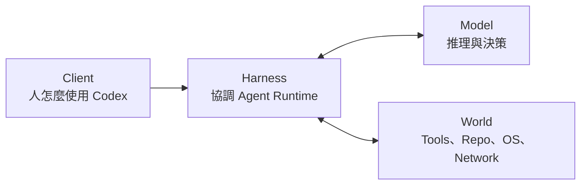
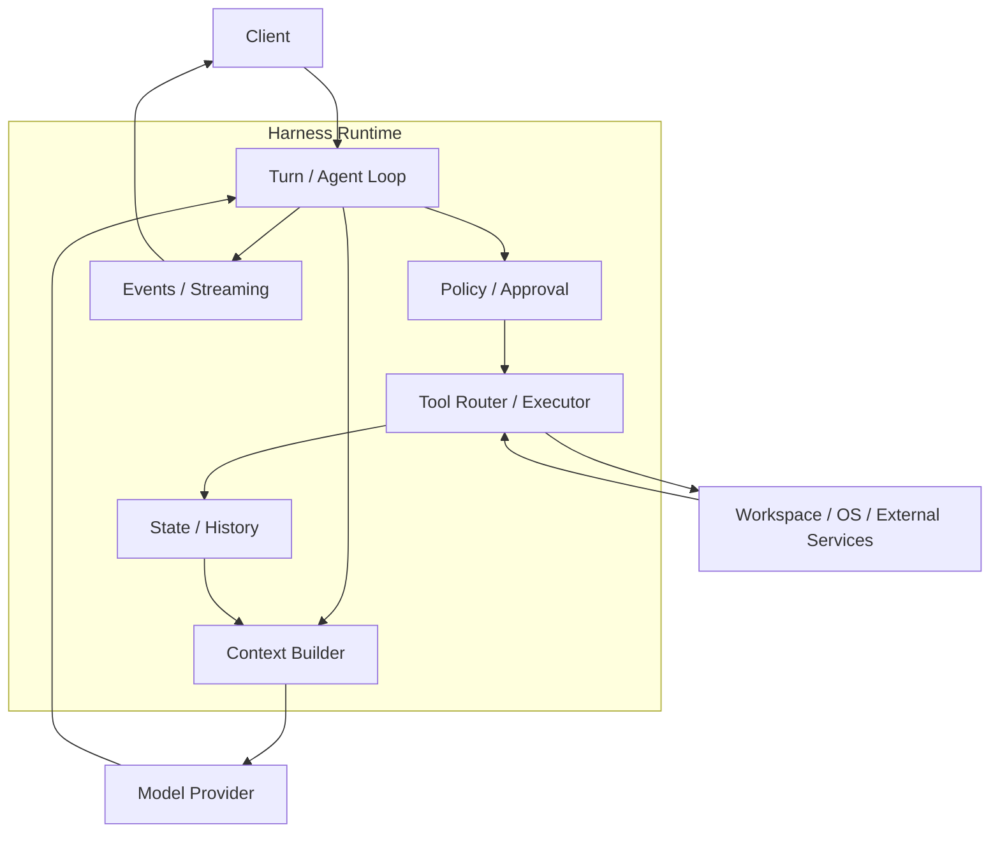
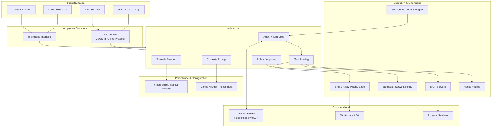
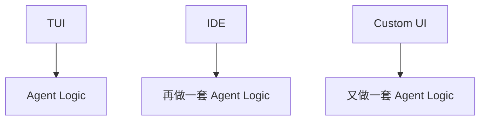
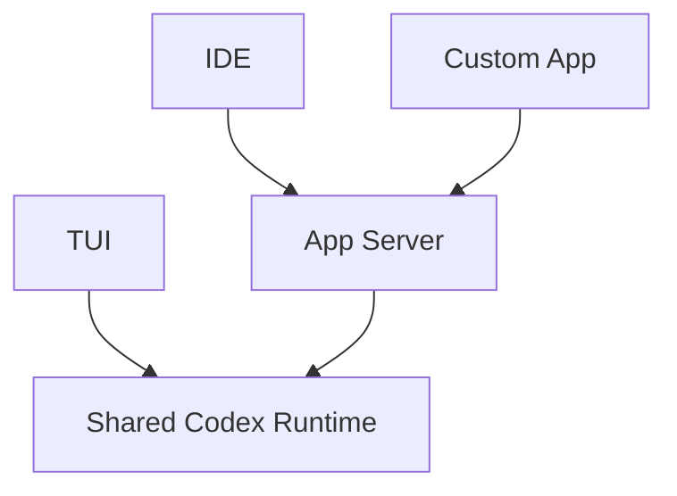
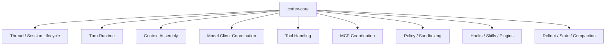
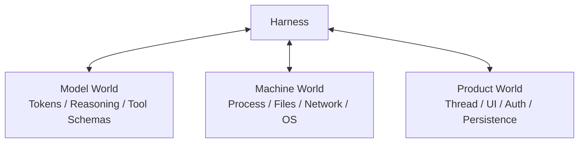
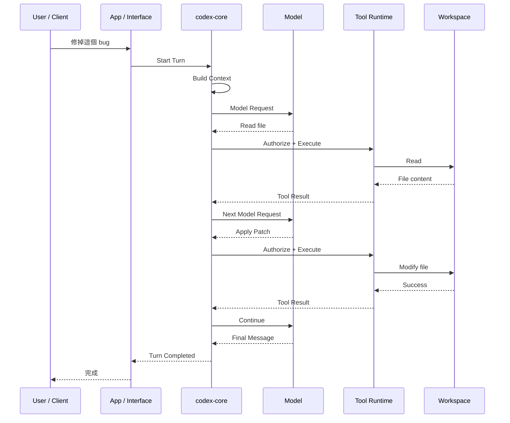

# 系統架構總覽

前面已經知道：

```text
Model = 做判斷
Harness = 協調與執行
Tools = 接觸真實世界
```

現在才開始把「Codex Harness」本身拆開。

這一章會用三張圖，從最簡單一路放大到接近實際架構。

## 第一張圖：先只看四個世界

如果完全不管 crate 名稱，Codex 可以先拆成四塊：



### Client

人或其他系統怎麼和 Codex 互動，例如：

- CLI / TUI；
- IDE；
- `codex exec`；
- SDK；
- 自製 UI。

### Harness

控制整個工作流程：

- context；
- agent loop；
- tools；
- permissions；
- state；
- events。

### Model

負責：

- 理解；
- 推理；
- 選擇 action；
- 產生回答。

### World

真正的執行現場：

- files；
- shell；
- Git；
- network；
- MCP / external services。

如果你是初學者，到這一層已經足夠。

## 第二張圖：Harness 裡面到底有什麼？

再把中間放大：



這張圖其實已經解釋大部分 Codex 行為：

1. Client 開始一個 Turn。
2. Context Builder 準備 Model 所需資訊。
3. Model 提出下一步。
4. Policy 判斷能不能做。
5. Tool 真正執行。
6. Result 被保存並送進下一輪 context。
7. Events 把進度傳回 Client。

## 第三張圖：對應到 Codex 的實際架構

接著才把實際模組概念放進來。



> 這是 responsibility map，不代表每個箭頭都等於一個 Rust function。`openai/codex` 是持續演進中的大型 workspace。

## 為什麼會有 App Server？

先想像沒有 App Server 的世界：



每個 Client 都自己實作 runtime，會快速失控。

更好的方式是：



App Server 的價值是把完整 Codex Harness 變成一個可被其他 Client 驅動的 integration surface。

## Client Surface 和 Harness 不應該綁死

這個架構原則非常重要。

TUI 只應該是「一種操作介面」，而不是 agent business logic 本身。

否則：

- IDE 要重寫一次；
- SDK 要重寫一次；
- Web UI 又重寫一次；
- 行為會逐漸不一致。

所以 Harness Runtime 應該能被不同 Client 共用。

## `codex-core` 在哪裡？

可以把 `codex-core` 想成主要 runtime 大腦幹：



它不是全部 Codex，但承擔大量 material agent logic。

`protocol` 則更偏向「資料型別與溝通契約」，而不是把主要 business logic 塞進 protocol types。

## Agent Harness 同時連接三個世界

這是理解 production agent 難度最重要的一張圖之一。



### Model World

關心：

- context window；
- streaming；
- reasoning；
- tool schema；
- model provider。

### Machine World

關心：

- process；
- filesystem；
- network；
- environment variables；
- credentials；
- sandbox。

### Product World

關心：

- thread persistence；
- UI progress；
- resume / fork；
- auth；
- project trust；
- user approvals。

真正複雜的地方通常在**三個世界的交界**，而不是單純呼叫 Model API。

## Source Tree 不要用背的

目前 Rust workspace 有很多 crates。

不要第一天就試圖記住所有名稱。先用「責任分類」閱讀。

| 責任 | 代表模組 / crate |
|---|---|
| Agent Runtime | `core`, `core-api` |
| Client / API Boundary | `app-server*`, `protocol`, `cli`, `tui` |
| Execution | `exec`, `exec-server`, `apply-patch`, `shell-command` |
| Security | `sandboxing`, `linux-sandbox`, `network-proxy`, `execpolicy`, `guardian` |
| Extensions | `mcp-server`, `codex-mcp`, `skills`, `hooks`, `plugin`, `ext/*` |
| State | `thread-store`, `rollout`, `history`, `state` |
| Model / Provider | `codex-client`, `model-provider`, `models-manager`, `responses-api-proxy` |

讀 source 時先問：

> **這個 crate 是在決策、執行、限制、保存，還是對外溝通？**

通常比背名稱有效得多。

## 從 User Request 走一次完整路徑

最後把所有層串起來：



後面的架構章節，只是在把這條路徑上的每個節點逐一放大。

## 常見誤解

### 誤解 1：App Server 就是 Codex Core

不是。App Server 是重要 integration boundary；Core 是 agent runtime 的核心邏輯。

### 誤解 2：CLI 就等於 Harness

不是。CLI 是 Client Surface。

### 誤解 3：MCP 就是所有 Tools

不是。MCP 是一種擴充外部工具能力的方式；Harness 也有自己的內建 execution tools。

### 誤解 4：State Store 就是 Context

不是。State 可以保存完整歷史，Context Builder 再投影出本輪 Model 需要的部分。

## 本章只要記住

1. **Client 是入口，Harness 是 runtime。**
2. **App Server 讓不同 Client 可以共用 Codex Harness 能力。**
3. **`codex-core` 承擔主要 agent runtime 邏輯。**
4. **Harness 同時橋接 Model World、Machine World、Product World。**
5. **讀原始碼時先看責任，不要先背 crate 名稱。**

下一章開始進一步拆 `codex-core`。

## 來源

- [`codex-rs/Cargo.toml`](https://github.com/openai/codex/blob/main/codex-rs/Cargo.toml)
- [`codex-core`](https://github.com/openai/codex/tree/main/codex-rs/core)
- [App Server architecture](https://openai.com/index/unlocking-the-codex-harness/)
