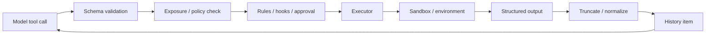

# Tool Execution：從模型意圖到真實副作用

Model 只會產生「我要呼叫某工具」的結構化意圖。真正的副作用發生在 harness。

## Tool 的三個世界

### Harness-native tools

例如 shell、file edit / apply patch、process control。Harness 最清楚它們的行為，因此可以直接套 sandbox、cwd、timeout、output truncation。

### Hosted tools

由上游平台提供的能力，例如某些 web/search 類 hosted tool。它們未必經過本地 shell sandbox。

### MCP tools

由外部 MCP server 宣告的工具。Harness 管理 discovery/call，但真正執行環境可能在另一個 process、container 或 remote service。

## Execution pipeline



每一格都是不同責任，不應全部塞進 `executeTool()`。

## Shell 是特殊工具

Shell 幾乎可以間接做任何事，因此需要更多 runtime 能力：

- working directory；
- environment variables；
- PTY / interactive command；
- process lifecycle；
- timeout/cancellation；
- stdout/stderr streaming；
- background terminal；
- OS sandbox；
- network policy。

對 agent 安全而言，`shell("curl ...")` 與 `readFile()` 的 risk profile 完全不同。

## Apply Patch 為什麼常獨立

專用 patch tool 有幾個好處：

- 修改意圖結構化；
- diff 容易展示與 audit；
- 避免 model 用複雜 shell one-liner 改檔；
- 更容易做 path policy；
- 可以產生 file-edit item。

這是「把常見高價值 action 從 general-purpose shell 拆成窄工具」的典型設計。

## Output normalization

Tool output 不應等同「stdout 字串」。好的 result model 可能包含：

```ts
type ToolResult = {
  ok: boolean
  exitCode?: number
  stdout?: string
  stderr?: string
  structured?: unknown
  truncated?: boolean
  durationMs?: number
  artifacts?: ArtifactRef[]
}
```

這讓 model、UI、telemetry 都能使用同一份 execution outcome。

## Parallelism

讀取型 tools 通常較容易平行，例如多檔搜尋、獨立資料查詢。寫入型 tools 的平行執行則可能互相踩檔、破壞 test assumptions。

因此不要把「模型一次提出多個 tool call」直接等價成「全部 Promise.all」。Harness 應依 tool side-effect class 決定是否可平行。

## Tool contract 要比 Prompt 穩定

如果模型常常呼錯工具，優先檢查：

- tool name 是否清楚；
- description 是否區分相似工具；
- schema 是否過度複雜；
- required fields 是否合理；
- error 是否可供模型自我修正；
- tool exposure 是否過多。

降低工具選擇的 entropy，通常比再寫一段「請正確使用工具」有效。

## 來源

- [Agent loop article](https://openai.com/index/unrolling-the-codex-agent-loop/)
- [`codex-rs/core/src/tools`](https://github.com/openai/codex/tree/main/codex-rs/core/src/tools)
- [`codex-rs/exec`](https://github.com/openai/codex/tree/main/codex-rs/exec)
- [`codex-rs/apply-patch`](https://github.com/openai/codex/tree/main/codex-rs/apply-patch)
