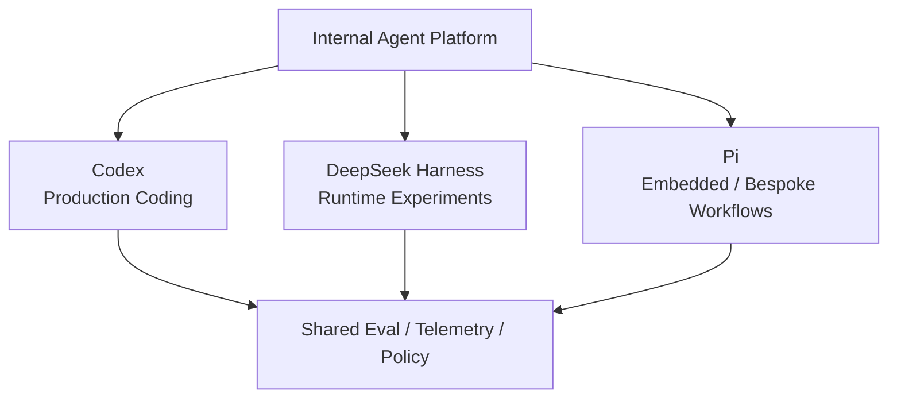

# PoC、採用與混用策略

做到這裡，選型不應再停在「我覺得哪套比較適合」。真正要做的是把判斷變成可驗證的 PoC。

這一頁的核心問題是：

> **我要怎麼證明這套 Harness 適合我的系統，而不是只因為架構看起來漂亮？**

## 先定義 PoC 的驗證目標

不要一開始就測「能不能修 bug」。三套都能做到，這個測試區分度很低。

應該驗證的是你真正關心的責任：

```text
Integration
State
Tool execution
Security
Provider
Extension
Observability
Upgrade / Compatibility
```

## 建議用同一個任務測三套

例如準備一個中型 repo，要求 Agent：

```text
1. 找出一個跨 3～5 個檔案的 bug
2. 修改程式
3. 執行測試
4. 遇到一個需要 approval / policy 的動作
5. 中途追加 steering
6. 中斷後 resume
7. 輸出 structured result
```

如果要測 branch / replay，再加：

```text
8. 從中途節點走第二條解法
9. 回放或重建一次 session state
```

## PoC 不是 Benchmark Model Quality

要固定：

```text
同一 repository
相近 prompt
相近 model tier
相同 acceptance criteria
```

然後比較 Harness 本身：

```text
integration friction
state semantics
tool reliability
policy boundary
traceability
extension cost
recovery behavior
```

否則很容易把 Model 差異誤判成 Harness 差異。

## 1. Integration PoC

### Codex

驗證：

```text
CLI / exec 是否已足夠？
App Server 是否能直接支撐你的 UI？
Thread / Turn / Item 是否和前端資料模型相容？
```

### DeepSeek Harness

驗證：

```text
你需要 SDK、JSON-RPC、ACP 還是 Host？
Profile / Bundle 是否讓 runtime 組合更容易，還是反而增加理解成本？
```

### Pi

驗證：

```text
AgentSession SDK 是否可以直接嵌入？
JSONL RPC 是否足夠跨語言？
你是否真的需要自己擁有更多 lifecycle？
```

## 2. State PoC

不要只看「聊天記錄有沒有存」。

要實際測：

```text
resume
crash recovery
branch / fork
compaction
state migration
query / debug
```

### Codex

觀察 Thread / Turn / Item 是否和你的 product activity model 契合。

### DeepSeek Harness

觀察 SessionEvent / projection / replay 是否真的降低 audit 與 debugging 成本。

### Pi

觀察 JSONL Entry Tree 是否真的讓 branch / fork / resume 比較自然。

## 3. Tool / Execution PoC

準備至少三種 Tool：

```text
read-only tool
workspace write tool
external network / API tool
```

驗證：

- Tool schema 如何註冊？
- Tool lifecycle 能否 interception？
- timeout / cancellation 怎麼處理？
- error 是否會正確回到 Model？
- Tool output 是否進 durable state？

不要只測 happy path。

## 4. Security PoC

這一項一定要實際做危險操作測試。

例如：

```text
寫 workspace 外檔案
執行高風險 shell
讀敏感檔案
發外部 network request
嘗試 bypass policy
```

### Codex

確認：

```text
sandbox boundary
approval UX
network / exec policy
client event flow
```

### DeepSeek Harness

確認：

```text
Sandbox Provider
Approval Provider
fail-closed behavior
full / partial enforcement
remote execution integration
```

### Pi

確認：

```text
Project Trust 實際管的是什麼
Extension gate 能攔到什麼
真正 OS isolation 由誰負責
container / microVM boundary 是否已建立
```

如果 Pi 的 external isolation 還沒有答案，就不能把安全需求標成「之後再補」。

## 5. Extension PoC

不要只看 API 文件，要真的新增一個 team-specific behavior。

例如：

```text
所有 migration 前必須產生 rollback plan
```

### Codex

試著判斷它應該是：

```text
AGENTS.md
Skill
Hook
Rule
```

如果可以很自然地落在某一層，表示 semantic surface 有價值。

### DeepSeek Harness

試著做成 Plugin / Consumer / Provider / Event interception，觀察 framework ceremony 是否符合團隊習慣。

### Pi

用 TypeScript Extension 做 gate / command / custom UI，觀察 `/reload` workflow 是否真的提升 iteration speed。

## 6. Provider / Multi-model PoC

如果 multi-provider 是需求，至少實測：

```text
兩家 provider
model switching
credential handling
stream behavior
tool-call compatibility
fallback / failure
```

不要只確認「config 可以填另一個 base URL」。

真正風險通常在：

```text
stream delta 差異
tool schema 差異
reasoning semantics
model catalog
provider auth
```

## 7. Observability / Debug PoC

刻意製造一次失敗：

```text
Tool timeout
invalid tool result
model provider error
process crash
approval rejected
```

然後問：

> **工程師能不能在 10 分鐘內看懂到底是哪一層失敗？**

三套應分別觀察：

```text
Codex
→ Thread / Item / runtime events

DeepSeek
→ SessionEvent / projection / relationship trace

Pi
→ AgentSession / SessionManager / extension / JSONL
```

架構可讀性只有在故障時才真正有價值。

## 8. Upgrade / Compatibility PoC

選型最容易漏掉的是 upgrade cost。

至少做一次：

```text
pin version A
→ 建立 sample extension / integration
→ 升到 version B
→ 跑 regression test
```

記錄：

```text
config migration
protocol change
extension API change
session migration
plugin compatibility
```

尤其 DeepSeek Harness 仍處於 Developer Preview，這個測試非常重要。

Pi 也要測第三方 package / extension compatibility；Codex 則要測 App Server / config / product surface compatibility。

## 建議建立 Selection Scorecard

不要用「喜歡程度」評分。

建議每項先設定權重：

| 維度 | 權重 1～5 | PoC 結果 |
|---|---:|---|
| Coding UX | | |
| Integration cost | | |
| State / Resume | | |
| Security enforcement | | |
| Extension DX | | |
| Multi-provider | | |
| Runtime replaceability | | |
| Observability | | |
| Upgrade risk | | |
| Team familiarity | | |
| Long-term ownership cost | | |

最後才比較三套。

## 不要只算開發成本，也要算 Ownership Cost

一套系統可以「很容易客製」，但不代表長期便宜。

要問：

```text
誰維護 Sandbox？
誰維護 Approval policy？
誰維護 Provider compatibility？
誰維護 Session migration？
誰維護 Extension governance？
誰維護 Client protocol？
```

這也是三套最核心的採用差異。

## 什麼情況適合混用？

不要假設公司只能有一套 Harness。

例如：



混用適合：

- workload 差異很大；
- 已有統一 telemetry / eval；
- policy 可以放在更上層；
- 團隊能承擔多 runtime upgrade。

不適合：

- 團隊很小；
- operational budget 很低；
- session / policy / credential 都還沒有統一 abstraction；
- 只是因為三套都覺得有趣。

## Adoption Gate：正式導入前至少過這五關

### Gate 1：功能

核心 task success rate 達標。

### Gate 2：安全

危險操作與 fail-closed behavior 有清楚驗證。

### Gate 3：可觀察性

失敗能被 trace，不能只靠重跑。

### Gate 4：升級

有 version pinning、regression test、migration strategy。

### Gate 5：Ownership

每個自建 responsibility 都有明確 owner。

如果其中一項答案是：

> 「之後再說。」

那它還不是 production adoption，只是 prototype。

## 三套各自最容易被低估的成本

### Codex

容易低估：

```text
如果需求偏離 first-party semantics，外層 orchestration / integration 仍可能變複雜
```

### DeepSeek Harness

容易低估：

```text
composition freedom 會增加 compatibility、debugging、governance 成本
```

### Pi

容易低估：

```text
minimal core 會把 policy、sandbox、workflow convention 的 ownership 交回自己
```

## 最後的採用原則

不要問：

> **哪套 Harness 功能最多？**

應該問：

> **哪套 Harness 的 responsibility boundary，最接近我們願意長期維護的 ownership boundary？**

這才是第九章真正要建立的選型能力。

## 第九章總結

```text
9.1 比較框架
→ 先學會怎麼比較

9.2 架構維度
→ 看三套 responsibility 放在哪裡

9.3 情境式選型
→ 把產品需求映射到架構

9.4 PoC / Adoption
→ 用實驗驗證，最後才導入
```

下一章會把視角從「選哪套 Harness」轉成「如何把 Harness 用進真實系統」。

[繼續：Harness Workflows](../applications/workflows.md)
