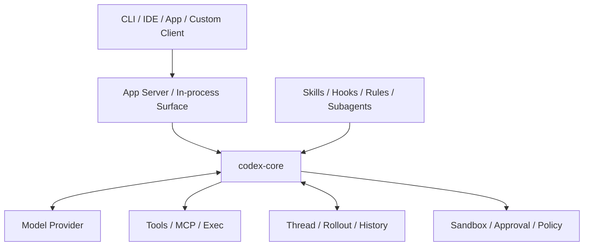
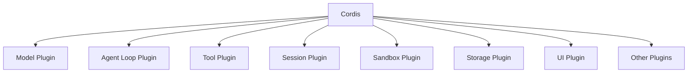
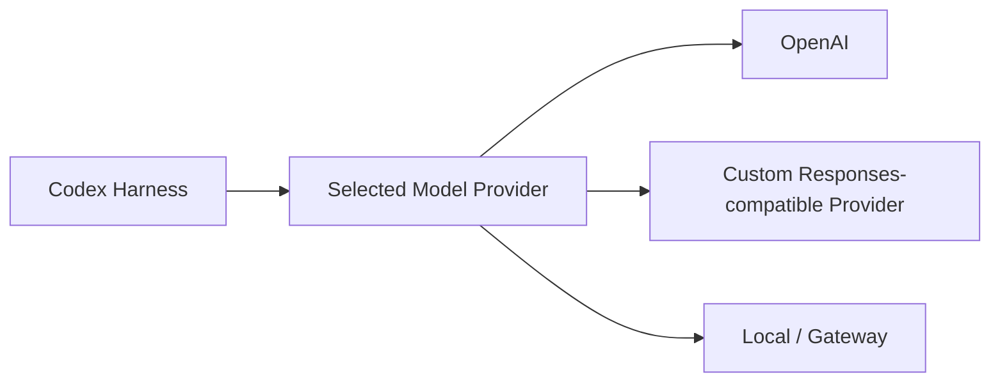
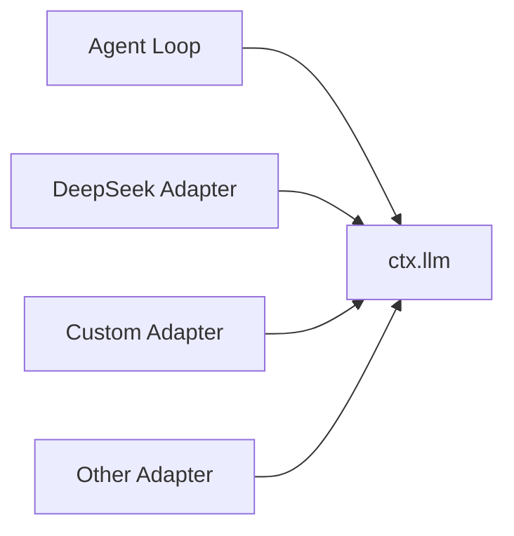
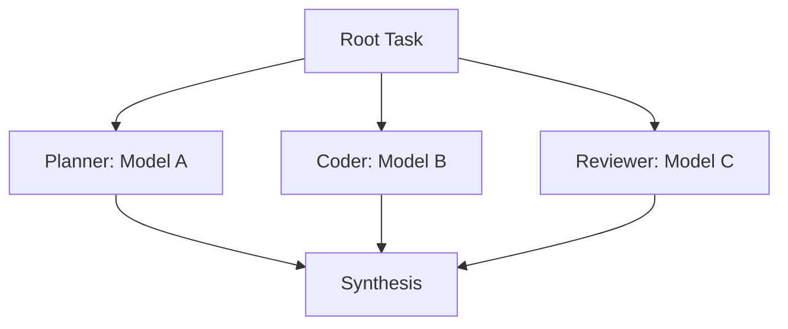
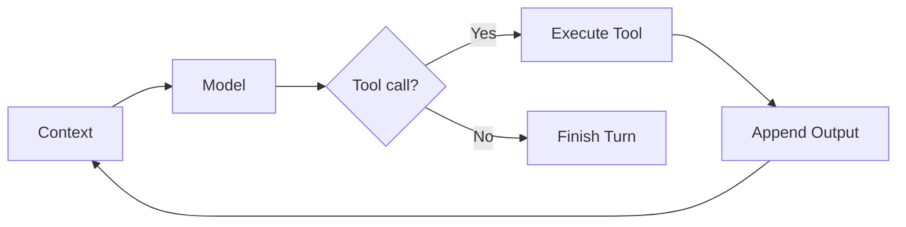
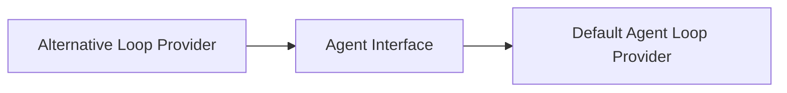
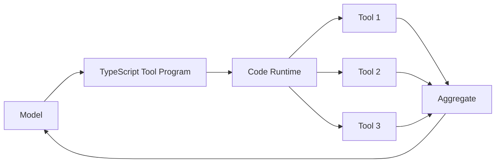
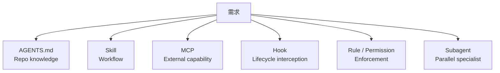
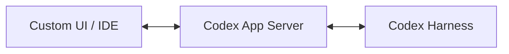

# Codex vs DeepSeek Harness：架構逐項比較

> 最後核對：2026-08-23。本章比較的是 **Harness architecture**，不是 GPT 與 DeepSeek 模型能力。DeepSeek Harness 目前仍是 developer preview；Codex 的 custom provider / App Server 能力也仍快速演進。

如果只記一句話：

> **Codex 是「一個完整、opinionated 的 Agent Runtime 可以被擴充」；DeepSeek Harness 是「Agent Runtime 本身就是 Plugin Composition」。**

兩者都能做 Coding Agent，也都不是單純的 function-calling demo，但它們把「哪一層應該穩定、哪一層應該可替換」畫在不同位置。

## 先看兩張圖

### Codex



Codex 有很清楚的 runtime center：`codex-core` 承擔 agent loop 與大量 material logic；外部產品透過 App Server 等 surface 消費這套 runtime。

### DeepSeek Harness



DeepSeek 的中心比較像 **composition kernel**；Agent Runtime 的主要能力本身都由 plugins 提供。

## 1. 核心設計哲學

| 問題 | Codex | DeepSeek Harness |
|---|---|---|
| 穩定中心 | `codex-core` + protocol / App Server | Cordis composition kernel |
| 擴充方式 | 高階、有語意的 extension surfaces | Everything is a Plugin |
| Runtime 本身可否重組 | 有限度 | 核心設計目標 |
| Agent Loop | core runtime 的核心邏輯 | concrete plugin，背後有 interface seam |
| 適合的心智模型 | 完整產品 Runtime | Agent Runtime Framework |

這代表 Codex 比較 **opinionated**，DeepSeek 比較 **composable**。

## 2. Model Provider：兩者都不是只能用自家模型

這是最容易誤解的一點。

### Codex

Codex source 有正式的 model provider registry：

```text
built-in providers
+
user-defined model_providers in config.toml
```

因此 Core / CLI 可以接 custom provider、local / compatible gateway 等。



所以：

> **Codex Harness 並不是只能用 OpenAI Model。**

但目前不同 product surface 的 provider 支援成熟度不完全一致。CLI / TUI 對 custom provider 已較實用；App / App Server 的 model discovery、provider-aware model list 等仍有正在討論與修正的地方。

### DeepSeek Harness

DeepSeek 從架構上把 model adapter 本身視為 plugin / `ctx.llm` seam。



這讓「Model 是 Runtime composition 的其中一塊」這件事更徹底。

### 真正差別

不是：

```text
Codex 只能 OpenAI
DeepSeek 可以多模型
```

而比較像：

```text
Codex
→ 一個 Thread / Runtime 選定 Model + Provider 後運行

DeepSeek
→ Model Adapter 從一開始就是 Plugin Composition 的一部分
```

## 3. Multi-model Orchestration

假設你想做：



Codex 可以透過外層 orchestrator、多個 threads / App Server runtimes、custom integrations 做到，但**「每個 Agent 任意指定不同 provider」目前不是 Codex 最自然的一級 abstraction**。

DeepSeek 因為 Agent、LLM seam、Profile / Plugin composition 都比較通用，所以做 multi-model runtime routing 的架構阻力較小。

這也是「model agnostic」最好拆成兩題看的原因：

| 能力 | Codex | DeepSeek Harness |
|---|---|---|
| 換單一 Model Provider | 支援 | 支援 |
| Local / Custom Provider | 支援，surface 成熟度有差異 | 架構原生 |
| 不同 Profile 用不同模型 | 可行 | 自然 |
| Runtime 內多模型組合 | 可自行 orchestration | composition 較自然 |
| Model routing 是核心設計嗎 | 不是主要中心 | 更接近其 plugin philosophy |

## 4. Agent Loop

### Codex

Codex 官方描述的中心就是 Agent Loop：



Skills、MCP、sandbox、approvals、hooks 等都圍繞這個 production-grade loop 工作。

### DeepSeek

DeepSeek 預設 loop 也做相似的事情，但 concrete agent loop 本身位於可替換 service boundary：



所以如果你的研究題目是：

```text
ReAct vs Plan/Execute
不同 continuation policy
不同 scheduler
不同 request interception
```

DeepSeek 比較適合把「Loop 本身」當實驗變因。

## 5. Tool Orchestration

### Codex：Iterative Tool Loop 為中心

Codex 的強項是把：

```text
shell
file edits
MCP
approvals
sandbox
process lifecycle
```

整合成成熟的 Coding Agent execution loop。

### DeepSeek：額外提供 Code Mode

DeepSeek 除了 native tool calling，還能讓 Model 產生 TypeScript program，透過 generated SDK 組合多個 Tool operation。



這對大量 map / filter / batch / aggregate 類 operation 很有吸引力。

但需要新語意決策的步驟，傳統 iterative model loop 仍可能更合理。

## 6. State Model

### Codex：Thread / Turn / Item

這套 abstraction 很適合產品開發：

```text
Thread
└─ Turn
   └─ Items
```

UI 可以直接理解：目前是哪個 thread、哪個 turn、哪個 shell/file/MCP item。

### DeepSeek：Session Event Log

DeepSeek 更明確採 event-sourced trajectory：

```text
Session
→ append-only SessionEvents
→ derive Context / UI / Resume / Fork / Replay
```

因此：

| | Codex | DeepSeek |
|---|---|---|
| 對產品 UI | 非常自然 | 可由 event view derive |
| Replay / trajectory 研究 | 有 state / rollout 能力 | 架構核心特別強調 |
| Durable fact 模型 | Thread / item lifecycle + internal state | SessionEvent log |
| Debug runtime source | events / protocol / state | single event stream 思維更強 |

## 7. Extension Surface

Codex 提供很多「用途已定義」的 abstraction：



優點是：**比較容易知道行為應放哪裡。**

DeepSeek 則更一般化：

```text
Service
Provider
Consumer
Typed Event
Plugin
Profile / Bundle
```

優點是：**可重新組合更多 Runtime responsibility。**

代價是你需要更懂 Framework 本身。

## 8. Sandbox 與 Security

Codex 的 coding-agent security 已高度產品化：sandbox、approval、workspace boundary、network policy、rules、exec policy 與 client approval UX 都是完整 Runtime 的重要部分。

DeepSeek 則把 Sandbox / FS / subprocess 等視為 capability seam，適合替換 local / remote backend，也能掛 policy event。

因此可以粗略分成：

```text
Codex
→ 強在「完整 Coding Agent security product」

DeepSeek
→ 強在「Security / Execution backend 可組合性」
```

不要把「更可替換」自動等同「目前 production 安全能力更成熟」。

## 9. UI / Integration Boundary

Codex 的 App Server 是很強的優勢。



它提供 client-friendly、雙向 JSON-RPC 式 protocol，把 Thread / Turn / Item、approvals、auth、config、events 等變成可消費的產品 API。

DeepSeek 也有 Web UI / Remote API / UI Plugins，但目前整體仍是 developer preview，官方明確保留 breaking changes 的空間。

如果今天目標是穩定地嵌入一個成熟 Coding Agent experience，Codex 現階段通常比較低風險。

## 10. 語言與開發體驗

| | Codex | DeepSeek Harness |
|---|---|---|
| 主要核心語言 | Rust | TypeScript / Node.js 生態 |
| 系統 execution / process control | 非常適合 | 透過 capability providers 組合 |
| 修改核心門檻 | 較高 | TS 開發者較容易進入 |
| Plugin experiment | 有多種 extension surface | Cordis plugin-first 是主路徑 |
| Build / type complexity | Rust workspace 大型專案 | Plugin graph / framework abstraction 複雜 |

不能單純說 TypeScript 一定比較簡單：DeepSeek 的抽象概念本身相當多。

## 11. 成熟度

這是 2026-08-23 做選擇時不可忽略的因素。

### Codex

已經支撐：

- CLI / TUI；
- IDE；
- App；
- App Server integrations；
- production coding workflows。

仍快速演進，但已有明確 product surfaces 與較強 compatibility 壓力。

### DeepSeek Harness

官方目前仍直接標示：

```text
Developer Preview
Compatibility-breaking changes will happen
```

這代表它很適合：

- 研究；
- 試驗；
- 建立自己的 Harness；
- 提前探索 plugin ecosystem。

但 production 長期維護時要把 API churn 算進成本。

## 綜合比較表

星號只表示「目前這個架構目標下的相對優勢」，不是產品品質總分。

| 面向 | Codex | DeepSeek Harness |
|---|---:|---:|
| 完整 Coding Agent Runtime | ★★★★★ | ★★★★ |
| Production integration maturity | ★★★★★ | ★★～★★★ |
| App / IDE protocol surface | ★★★★★ | ★★★ |
| Custom Model Provider | ★★★★ | ★★★★★ |
| Multi-model composition | ★★★ | ★★★★★ |
| 可替換 Agent Loop | ★★～★★★ | ★★★★★ |
| Runtime composability | ★★★★ | ★★★★★ |
| Event-sourced traceability | ★★★★ | ★★★★★ |
| Coding security productization | ★★★★★ | ★★★ |
| Execution backend replaceability | ★★★★ | ★★★★★ |
| 清楚的高階 extension semantics | ★★★★★ | ★★★★ |
| Harness research / experimentation | ★★★★ | ★★★★★ |
| API stability（目前） | ★★★★～★★★★★ | ★★ |

## 哪一個「比較好」其實取決於問題

如果問題是：

> 我要一套今天就很完整的 Coding Agent Runtime。

Codex 通常比較自然。

如果問題是：

> 我要把 Model、Loop、Sandbox、Storage、UI 當成可組合零件研究或重做。

DeepSeek Harness 的 abstraction 更有吸引力。

如果問題是：

> 我要接 DeepSeek / Qwen / Local Model，所以 Codex 不適合？

這個推論不成立。Codex 已有 custom model provider abstraction；真正該比較的是**provider support 在你要使用的 client surface 是否成熟，以及你需不需要 multi-model / loop-level composability**。

## 下一章

若你不是只想理解架構，而是真的要選技術路線，接著看：

[如何選擇 Codex 或 DeepSeek Harness？](./selection-guide.md)

## 主要來源

### Codex

- [Unrolling the Codex agent loop](https://openai.com/index/unrolling-the-codex-agent-loop/)
- [Unlocking the Codex harness / App Server](https://openai.com/index/unlocking-the-codex-harness/)
- [Codex model provider registry](https://github.com/openai/codex/blob/main/codex-rs/model-provider-info/src/lib.rs)

### DeepSeek Harness

- [DeepSeek Harness](https://deepseek.com/harness/en/)
- [DeepSeek Harness Architecture](https://github.com/deepseek-ai/deepseek-harness/blob/master/docs/architecture.md)
- [Core subsystem](https://github.com/deepseek-ai/deepseek-harness/blob/master/docs/subsystems/core.md)
- [Code Mode design](https://github.com/deepseek-ai/deepseek-harness/blob/master/.agents/notes/implemented/feature/2026-06-15-code-mode.md)
