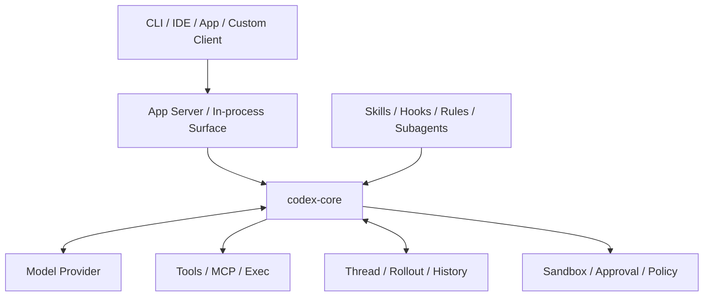
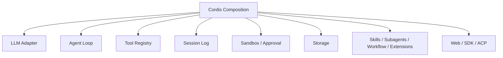
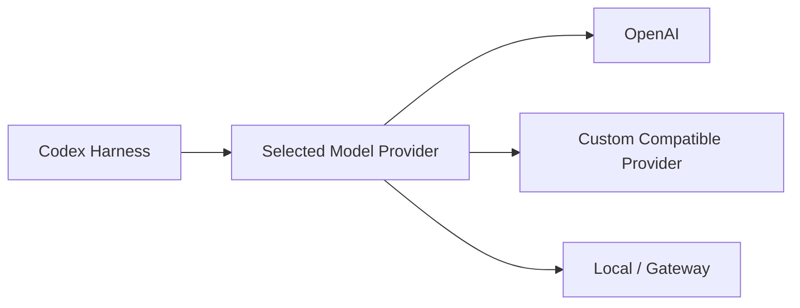
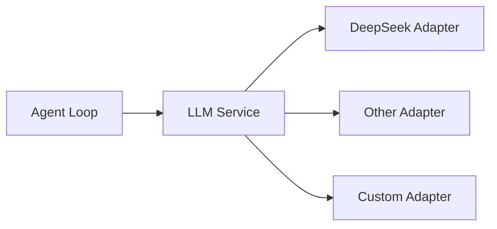
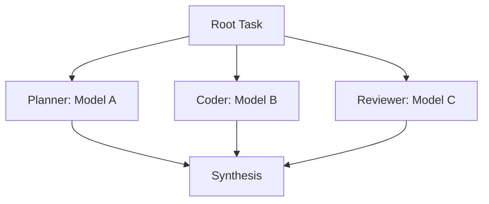
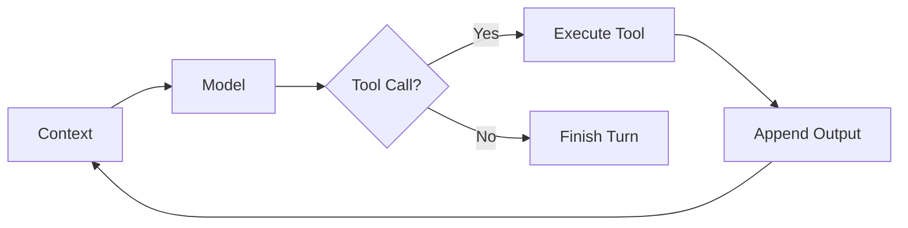
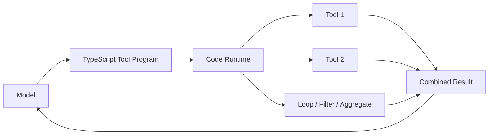
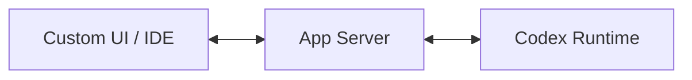
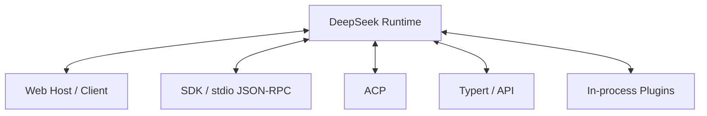

# Codex vs DeepSeek Harness：架構逐項比較

> 最後核對：2026-08-23。本章比較的是 **Harness architecture**，不是 GPT 與 DeepSeek 模型能力。DeepSeek Harness 整體仍是 developer preview，但其 package map 已把許多核心 packages 標為 Product / stable API；Codex 的 custom provider、App Server 與其他 surfaces 也持續快速演進。

如果只記一句話：

> **Codex 是「完整、opinionated 的 Agent Runtime 提供高階擴充點」；DeepSeek Harness 是「Agent Runtime 本身由 Plugin / Service Composition 組成」。**

兩者都已經是完整 Harness，而不是 function-calling demo。真正差異是：**哪些責任應該固定，哪些責任應該成為可替換 seam。**

## 先看兩張圖

### Codex



### DeepSeek Harness



Codex 有明確 runtime center；DeepSeek 的中心更像 composition kernel。

## 1. 核心設計哲學

| 問題 | Codex | DeepSeek Harness |
|---|---|---|
| 穩定中心 | `codex-core` + protocol / App Server | Cordis composition kernel + service contracts |
| 擴充方式 | 高階、有語意的 extension surfaces | Plugin + Service / Provider / Consumer |
| Runtime 本身可否重組 | 有限度 | 核心設計目標 |
| Agent Loop | core runtime material logic | concrete plugin / service seam |
| 適合心智模型 | 完整產品 Runtime | Agent Runtime Framework / Platform |

Codex 比較 **opinionated**；DeepSeek 比較 **composable**。

這不代表「彈性越高就越好」。Opinionated runtime 可以降低 integration complexity；composable runtime 則適合需要重做底層責任的團隊。

## 2. Model Provider：兩者都不是只能用自家模型

### Codex

Codex source 有 model provider registry：

```text
built-in providers
+
user-defined model_providers
```

所以 Codex Harness 本身不是只能用 OpenAI Model。



真正限制是：不同 product surface 的 provider discovery / model catalog / first-party feature 支援成熟度可能不同。

### DeepSeek Harness

DeepSeek 把 LLM adapter 定義成 capability family：



因此 Model 從架構第一層就是 composition component。

### 公平結論

不是：

```text
Codex 只能 OpenAI
DeepSeek 才能換模型
```

而是：

```text
Codex    → Runtime 選定 Provider / Model 後運行
DeepSeek → Model Adapter 本來就是 Plugin Composition 的一部分
```

## 3. Multi-model / Multi-runtime Orchestration

如果你要：



Codex 可以用多個 Threads / Runtimes / App Server instances 或外層 orchestrator 做到，但每個 child role 任意替換 Provider 不是目前最自然的一級 abstraction。

DeepSeek 的 LLM seam、Subagent Provider Registry、ACP / SDK delegation 等設計讓 multi-model / multi-runtime 組合較自然。

| 能力 | Codex | DeepSeek Harness |
|---|---|---|
| 換單一 Model Provider | 支援 | 支援 |
| Local / Custom Provider | 支援，surface 成熟度有差 | 架構原生 |
| 不同 Profile / Runtime 用不同模型 | 可行 | 自然 |
| Runtime 內多模型組合 | 外層 orchestration 較常見 | composition / delegation 較自然 |
| Model routing 是核心設計嗎 | 不是主要中心 | 更接近 plugin philosophy |

## 4. Agent Loop

### Codex

核心是 production-grade iterative loop：



Skills、MCP、sandbox、approvals、hooks、state 都圍繞這個 loop 工作。

### DeepSeek

預設 loop 也做類似事情，但 Agent Loop 本身位於可替換 service boundary。

DeepSeek 還明確定義：

```text
Step = 一次 Model Request + 這次產生的 Tool Calls
Turn = 0 個或多個 Steps
```

而 request / tool lifecycle 可以透過 `agent/*`、`tools/*` events interception。

如果研究題目是「換 Agent Loop 會怎樣」，DeepSeek 的架構阻力較小。

## 5. Tool Orchestration

### Codex：成熟 iterative Tool Runtime

Codex 強項是把：

```text
shell
file edits
MCP
approvals
sandbox
process lifecycle
```

整合成完整 Coding Agent execution experience。

### DeepSeek：Native Tool Calling + Code Mode + Workflow

DeepSeek 不只一種 orchestration 路徑。

#### Native Tool Calling

和一般 agent loop 類似。

#### Code Mode



適合 batch / map / filter / aggregate，降低中間 Model round trip。

#### Workflow / Jobs

固定或長生命週期流程可以交給 workflow / jobs subsystem，而不是全部塞回 Agent Loop。

所以這一項不能只比較「Codex Tool Calling vs DeepSeek Code Mode」；DeepSeek 其實同時保留 iterative、programmatic 與 workflow-style orchestration。

## 6. State Model

### Codex：Thread / Turn / Item

```text
Thread
└─ Turn
   └─ Items
```

優點是產品 UI 很容易直接表達進度、Shell、File Edit、MCP invocation 等 activity。

### DeepSeek：Session / Turn / Step / SessionEvent

```text
Session
→ append-only SessionEvents
→ derive Context / UI / Resume / Fork / Replay
```

核心 invariant 是：

```text
Model-visible means logged
```

Durable fact 必須可由 event stream 重建。

| 問題 | Codex | DeepSeek |
|---|---|---|
| UI domain model | Thread / Turn / Item 很直接 | 由 Events / Projections derive |
| Replay / trajectory | 有 rollout / state | Event sourcing 是核心哲學 |
| Persistence | Thread Store / rollout / history | JSONL / SQLite seam + projections |
| Query / tracing | App Server / state APIs | session-query / relationship trace / FTS |
| Fork / resume | 支援 | 由 Session lineage / event boundary 衍生 |

## 7. Extension System

### Codex

Codex 的優點是「用途先分類好」：

```text
AGENTS.md → Repo knowledge
Skill     → Workflow / SOP
MCP       → External capability
Hook      → Lifecycle interception
Rule      → Enforcement
Subagent  → Delegation / parallel work
```

使用者比較容易知道需求應放哪裡。

### DeepSeek

DeepSeek 也不是「只有 Plugin」這麼簡單。它目前有正式的：

```text
Skills
Subagents
Workflow
Jobs
Hooks
Extensions
MCP integration pattern
LLM adapters
Capability seams
```

差別在底層都更一致地落到：

```text
Plugin
Service Definition
Provider
Consumer
Typed Event
Profile / Bundle
```

所以：

> Codex 強在 extension semantics 清楚；DeepSeek 強在 extension mechanism 的底層一致性與可重組性。

## 8. Sandbox、Approval 與 Security

原本很容易把這一項寫成「Codex 完整、DeepSeek 可替換」，但這太簡化。

### Codex

已把 sandbox、approval、workspace boundary、network policy、rules、exec policy 與 client UX 深度整合成 Coding Agent product。

### DeepSeek

目前也有相當完整的安全分層：

```text
SandboxMode
Sandbox Provider
Sandbox Enforcement: full / partial
Approval Policy: ask / never
Approval Outcome: allowed-once / rejected / cancelled / unavailable
Permission Presets
Credentials seam
Tool Guards / Invariants
```

Sandbox local providers 目前包含 Linux bwrap / Landlock、macOS Seatbelt、Windows ACL restricted-token backend。

而 `unavailable` approval 會 fail closed，不會默認放行。

### 真正差別

```text
Codex
→ 強在 Coding Agent security productization 與整體 UX

DeepSeek
→ 同樣有正式 security subsystem
→ 強在 sandbox / interaction / credential capability 的 provider seam
```

另外 DeepSeek 的 `SandboxMode` 官方定義主要是 filesystem effects；network / process visibility 是其他安全邊界。不能把模式名稱解讀得過度寬泛。

## 9. UI / Integration Boundary

### Codex：App Server 是很明確的中心



它把 Thread / Turn / Item、approvals、auth、config、events、skills 等產品能力集中成 client-friendly protocol。

### DeepSeek：不是只有 Web UI

目前有多條 integration surface：

```text
Web Host / Browser Client
TypeScript SDK
stdio JSON-RPC Server
ACP automation server
Typert / Remote API gateway
In-process Cordis services
```



所以更公平的比較是：

| | Codex | DeepSeek Harness |
|---|---|---|
| 統一 Rich Client boundary | App Server 很強 | surfaces 較分散 |
| TypeScript out-of-process SDK | 有 SDK / App Server clients | 有 SDK client + server |
| Automation protocol | exec / SDK / App Server | ACP / SDK / headless |
| Web UI architecture | first-party product surfaces | Host / Client plugin system |
| Event rendering | Thread / Turn / Item | Session Events + live Agent Events |

Codex 優點是**一個主入口很好理解**；DeepSeek 優點是**不同 transport / UI 也可以被 composition**。

## 10. 語言與開發體驗

| | Codex | DeepSeek Harness |
|---|---|---|
| 主要核心語言 | Rust | TypeScript / Node.js |
| OS process / sandbox implementation | Rust 很適合 system work | capability provider 將 platform work 封裝 |
| 修改 runtime core | 門檻較高 | TS 開發者較容易進入 |
| Extension DX | 多個產品化 extension surfaces | Cordis plugin-first |
| 主要複雜度 | 大型 Rust workspace | Plugin graph / service / realm / lifecycle abstraction |

TypeScript 不代表 DeepSeek 一定比較簡單；它的 framework abstraction 本身很深。

## 11. Production、Testing 與成熟度

### Codex

已承受 CLI、IDE、App、App Server、production coding workflows 等大量產品使用壓力，因此整體 compatibility / UX maturity 目前較高。

### DeepSeek Harness

Top-level 官方狀態仍是：

```text
Developer Preview
Compatibility-breaking changes will happen
```

但同一時間，官方 `packages/README.md` 已把許多核心 package group 標記成：

```text
Product — stable API
```

而且已有：

```text
runtime invariants
replay / test-support
loader smoke tests
session query / projection
telemetry seam
generated docs / type-equivalence checks
JSONL / SQLite persistence
```

因此正確結論不是「DeepSeek 只有研究用途」，而是：

> **它已有很多 production-oriented subsystem；目前主要風險是 project-level compatibility churn 與較新的 ecosystem。**

## 綜合比較表

星號表示目前架構與產品狀態下的相對優勢，不是品牌總分。

| 面向 | Codex | DeepSeek Harness |
|---|---:|---:|
| 完整 Coding Agent Runtime | ★★★★★ | ★★★★ |
| Top-level production maturity | ★★★★★ | ★★★ |
| Rich Client integration | ★★★★★ | ★★★★ |
| Custom Model Provider | ★★★★ | ★★★★★ |
| Multi-model / multi-runtime composition | ★★★ | ★★★★★ |
| 可替換 Agent Loop | ★★～★★★ | ★★★★★ |
| Runtime composability | ★★★★ | ★★★★★ |
| Event-sourced traceability | ★★★★ | ★★★★★ |
| Coding security productization | ★★★★★ | ★★★★ |
| Execution backend replaceability | ★★★★ | ★★★★★ |
| 清楚的高階 extension semantics | ★★★★★ | ★★★★ |
| Harness research / experimentation | ★★★★ | ★★★★★ |
| Runtime correctness / replay tooling | ★★★★ | ★★★★★ |
| Project-level API stability（目前） | ★★★★～★★★★★ | ★★★ |

## 哪一個比較適合你？

如果問題是：

> 我要今天就使用成熟 Coding Agent Runtime。

Codex 通常比較自然。

如果問題是：

> 我要把 Model、Loop、Sandbox、Storage、UI、Protocol、Subagent backend 都當成可組合零件。

DeepSeek Harness 的 abstraction 更有吸引力。

如果問題是：

> 我要接 DeepSeek / Qwen / Local Model，所以 Codex 一定不適合？

這個推論不成立。應比較的是 custom provider 在你需要的 client surface 是否成熟，以及你需不需要 multi-model / loop-level composability。

## 下一章

實際選型請看：

[如何選擇 Codex 或 DeepSeek Harness？](./selection-guide.md)

原始碼並讀則從：

[雙 Harness 原始碼導讀入口](../reference/source-reading.md)

開始。

## 主要來源

### Codex

- [Unrolling the Codex agent loop](https://openai.com/index/unrolling-the-codex-agent-loop/)
- [Unlocking the Codex harness / App Server](https://openai.com/index/unlocking-the-codex-harness/)
- [Codex model provider registry](https://github.com/openai/codex/blob/main/codex-rs/model-provider-info/src/lib.rs)

### DeepSeek Harness

- [Top-level README](https://github.com/deepseek-ai/deepseek-harness/blob/master/README.md)
- [Architecture](https://github.com/deepseek-ai/deepseek-harness/blob/master/docs/architecture.md)
- [`packages/README.md`](https://github.com/deepseek-ai/deepseek-harness/blob/master/packages/README.md)
- [Subsystem index](https://github.com/deepseek-ai/deepseek-harness/blob/master/docs/subsystems/README.md)
- [Sandbox](https://github.com/deepseek-ai/deepseek-harness/blob/master/docs/subsystems/sandbox.md)
- [Approval](https://github.com/deepseek-ai/deepseek-harness/blob/master/docs/subsystems/approval.md)
- [SDK](https://github.com/deepseek-ai/deepseek-harness/blob/master/packages/sdk/README.md)
