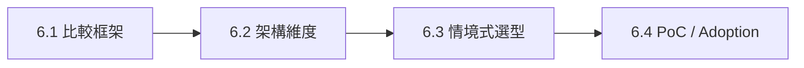

# 比較框架：如何比較 Agent Harness

> 最後核對：2026-08-24。本章比較的是 Harness architecture 與 adoption trade-off，不是 GPT、DeepSeek 或其他模型本身的能力。

前面已經把 Codex、DeepSeek Harness、Pi 各自當成完整 case study。到了比較章，最容易犯的錯是直接問：

> **哪一套最好？**

更好的順序是：

```text
先定義要比較的 responsibility
→ 看三套把 boundary 放在哪
→ 看 ownership / governance cost
→ 再做情境選型
→ 最後用 PoC 驗證
```

## 本章閱讀順序



| 頁面 | 只回答一件事 |
|---|---|
| 本頁 | **比較 Harness 時應該看哪些問題？** |
| [架構維度逐項比較](./architecture-comparison.md) | **三套在 Runtime / State / Tool / Security / Integration 上怎麼不同？** |
| [情境式選型](./scenario-selection.md) | **放進具體產品情境時，哪種架構比較自然？** |
| [PoC、採用與混用策略](./adoption-playbook.md) | **真正導入前怎麼驗證、治理與控制風險？** |

## 三個 Archetype

### Codex：Productized / Opinionated Runtime

```text
Runtime 已經替你固定較多 Coding Agent semantics
→ 再提供清楚的高階 extension surfaces
```

核心問題：

> **如果大多數 Coding Agent 問題 upstream 已經產品化，能降低多少整合與治理成本？**

### DeepSeek Harness：Composable Runtime Framework

```text
Runtime responsibility 本身就是 composition unit
→ Service / Provider / Consumer 可被替換
```

核心問題：

> **如果 Model、Loop、FS、Sandbox、Storage、UI 都可能換，怎麼避免 runtime 變成 monolith？**

### Pi：Minimal / Self-extensible Harness

```text
Core 刻意保持小
→ workflow / UI / policy UX 大量移到 Extension / Resource / Environment
```

核心問題：

> **哪些能力其實不需要進 core？採用者願意自己承擔多少 governance？**

## 比較 Harness 的九個核心問題

| 維度 | 真正要問什麼 |
|---|---|
| Runtime Center | 哪一層是最穩定、最難替換的中心？ |
| Model / Loop | Provider、request、loop、retry 可以替換到什麼程度？ |
| Context | 誰組 system prompt、tool schemas、history、compaction？ |
| State | 怎麼表示工作、resume、fork、replay、audit？ |
| Tools | Tool call 到 side effect 中間有哪些 pipeline / policy boundary？ |
| Extensions | 新能力要進 core、plugin、extension、skill 還是外部系統？ |
| Security | sandbox、approval、trust、credentials、execution world 誰負責？ |
| Integration | CLI、SDK、RPC、IDE、自製 UI 從哪個 contract 接入？ |
| Ownership Cost | 哪些 responsibility upstream 維護，哪些會變成你的 platform burden？ |

## 不要先比較 Feature Checklist

如果只列：

```text
有沒有 Subagent？
有沒有 MCP？
有沒有 Sandbox？
有沒有 SDK？
```

很容易得到錯誤結論。

例如 Pi 沒有 canonical built-in subagent workflow，不代表它不能 multi-agent；它只是把 delegation 留給 Extension、SDK 或 external process。

又例如 DeepSeek 的 integration 不叫 App Server，不代表它缺少 client boundary；它有 SDK / JSON-RPC / ACP / Host / Typert 等不同 surfaces。

所以 feature existence 只是第一層，更重要的是：

> **這個 capability 在哪個 architectural layer？誰負責 lifecycle、security、compatibility？**

## State 是最好的第一個比較軸

```text
Codex
Thread → Turn → Item

DeepSeek
Session → SessionEvent → Projection / Replay

Pi
JSONL Session → Entry(id,parentId) → Tree / Branch
```

這三套 state model 已經透露很多產品哲學：

- Codex 對 Rich Client / product activity 很友善；
- DeepSeek 對 replay / invariant / derived projections 很自然；
- Pi 對 branch-native exploration 很直接。

## Extension 是第二個好比較軸

```text
Codex
→ 語意化 extension surfaces

DeepSeek
→ 一致的 Plugin / Service composition

Pi
→ 深度 ExtensionAPI + Resource ecosystem
```

沒有一種絕對比較好；你要比較的是 team 是否需要：

```text
clear product conventions
vs
infrastructure replaceability
vs
rapid self-extension
```

## Security 是第三個好比較軸

不要只比 sandbox mode 名稱。

應該追：

```text
untrusted input
→ policy decision
→ approval
→ execution backend
→ credentials
→ side effect
→ audit trail
```

三套最大的不同往往是 **security ownership**，不是有沒有一個 `sandbox=true`。

## Ownership Cost 常比 Feature 更重要

技術上「可以自己做」不等於「值得自己維護」。

例如：

- 自己寫 approval UX；
- 自己治理 third-party extensions；
- 自己維護 remote sandbox provider；
- 自己做 session migration；
- 自己維護 RPC compatibility。

這些都是 adoption cost。

## 比較時的證據優先順序

```text
1. 官方 public docs / contracts
2. package / source boundaries
3. tests / protocol schema / generated docs
4. current implementation details
5. 社群慣例 / third-party packages
```

不要用某個 release 的 internal class name 推導永久 architecture。

## 本章只要記住

1. **先比較 responsibility boundary，再比較功能。**
2. **State、Extension、Security、Integration 是最能看出 Harness 哲學的四個軸。**
3. **「可替換」會增加 ownership / compatibility cost。**
4. **「內建很多」會降低組合自由，但可能大幅降低產品整合成本。**
5. **選型不是找最高分，而是找 responsibility distribution 最符合你的團隊與產品。**

下一篇：[架構維度逐項比較](./architecture-comparison.md)。
