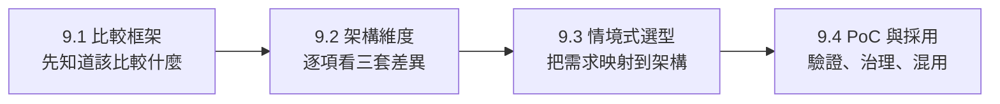
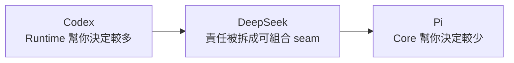

# 第九章導讀：如何比較 Agent Harness

> 最後核對：2026-08-24。本章比較的是 **Harness architecture 與 adoption trade-off**，不是 GPT、DeepSeek 或其他模型本身的能力。

前面八章分別建立了 Codex、DeepSeek Harness、Pi 的心智模型。到了第九章，最容易犯的錯是直接問：

> **哪一套最好？**

這個問題太早了。

更好的順序是：

```text
先定義要比較的責任
→ 再看三套把責任放在哪一層
→ 再看誰負責維護與治理
→ 最後才做選型與 PoC
```

因此第九章不做排行榜，而是把三套 Harness 放進同一個比較框架。

## 第九章的閱讀順序



四篇的分工很明確：

| 頁面 | 只回答一件事 |
|---|---|
| 本頁 | **比較 Harness 時，應該看哪些問題？** |
| [架構維度逐項比較](./architecture-comparison.md) | **三套在 Runtime / State / Tool / Security / Integration 上到底哪裡不同？** |
| [情境式選型](./scenario-selection.md) | **放進具體產品情境時，哪種架構比較自然？** |
| [PoC、採用與混用策略](./adoption-playbook.md) | **真正導入之前要怎麼驗證？怎麼控制 adoption risk？** |

## 先把三套 Harness 壓成三個 archetype

這不是完整描述，而是最有用的第一層抽象。

### Codex：Productized / Opinionated Runtime

```text
Codex
→ 已經替你固定較多 Coding Agent semantics
→ 再提供明確的高階 extension surfaces
```

它最值得問的是：

> **如果大多數 Coding Agent 問題都由 Runtime 先解好，產品與整合成本能降低多少？**

### DeepSeek Harness：Composable Runtime Framework

```text
DeepSeek Harness
→ Runtime responsibility 本身就是 composition unit
→ Service / Provider / Consumer 可以被替換
```

它最值得問的是：

> **如果 Model、Loop、Sandbox、Storage、UI 都可能換，Runtime 要怎麼避免變成一整塊？**

### Pi：Minimal / Self-extensible Harness

```text
Pi
→ core 刻意保持小
→ 大量 workflow / policy / UI 行為推到 extension 或外部 environment
```

它最值得問的是：

> **哪些能力其實不需要進 core？如果 core 少做決策，使用者能不能更快塑形自己的 Agent？**

## 比較前，先看三套官方畫面

比較架構不應只停留在抽象圖。三套官方 UI 本身就透露了各自的產品哲學：

- [Codex 官方介面與 App Server](../architecture/official-visuals.md)
- [DeepSeek Harness 官方 Lifecycle / Web UI](../deepseek/official-visuals.md)
- [Pi 官方 TUI 與 Session Tree](../pi/official-visuals.md)

建議先快速看過，再回來讀比較框架。這樣更容易把「架構差異」和「實際產品表現」連在一起。

## 比較 Harness 的七個核心問題

| 維度 | 真正要問的問題 |
|---|---|
| 1. Runtime Center | **哪一層是不能輕易被替換的穩定中心？** |
| 2. Change Surface | **Model、Loop、Tool、State、Sandbox 哪些是一級可替換能力？** |
| 3. State Semantics | **系統如何表示一次工作、保存歷史、resume、fork、replay？** |
| 4. Execution & Security | **Tool call 到真正 OS effect 中間有哪些 enforcement boundary？** |
| 5. Extension Boundary | **新增 workflow / tool / policy 時，要進 core、plugin、extension，還是外部系統？** |
| 6. Integration Boundary | **CLI、IDE、自製 UI、SDK、RPC 要從哪個穩定介面接入？** |
| 7. Ownership Cost | **哪些責任由 upstream 維護，哪些會變成自己的 platform burden？** |

注意第七題最容易被忽略。

技術上「可以替換」不等於組織上「值得自己維護」。

## 不要先比較 Feature Checklist

如果只列功能，很容易得到錯誤結論：

```text
有沒有 Subagent？
有沒有 Sandbox？
有沒有 SDK？
有沒有 Multi-model？
```

真正差異常常不是「有沒有」，而是：

```text
這項能力是不是 core contract？
是不是可替換 provider？
是不是 extension 實作？
是不是外部 execution environment 的責任？
```

例如 Sandbox：

```text
Codex
→ productized runtime security 的核心能力

DeepSeek
→ formal / replaceable capability seam

Pi
→ 預設不把 strong isolation 放進 core
→ 通常交給外部 container / microVM / sandbox
```

三套都可以在安全環境工作，但 ownership model 完全不同。

## 「誰比較彈性」也不是好問題

彈性至少要拆成三種。

### 產品行為彈性

能不能快速加新的 workflow、command、tool、UI？

Pi 很強；Codex 也有多種語意明確的 extension surface。

### Runtime infrastructure 彈性

能不能直接換 Agent Loop、Sandbox Provider、Storage、Execution World？

DeepSeek 最直接。

### Integration 彈性

能不能用 CLI、SDK、RPC、App Server、Web Host 等不同方式嵌入？

三套都有，但 boundary 形狀不同。

所以不要把「彈性」壓成一個分數。

## State 是最好的第一個比較入口

### Codex

```text
Thread
└─ Turn
   └─ Item
```

偏向 product / UI-friendly activity model。

### DeepSeek Harness

```text
Session
→ SessionEvent
→ Projection / Context / Replay
```

偏向 event-sourced runtime facts。

### Pi

```text
Session JSONL
→ Entry(id, parentId)
→ Tree / Branch
```

偏向 branch-native conversation history。

同樣是「保存 Agent 歷史」，三套回答的是不同產品需求。

## 第二個比較入口：誰擁有 Runtime responsibility？

可以把三套放在一條責任光譜上：



這不是成熟度排序，而是**責任配置方式**。

採用者越需要自行塑形 Runtime，通常也要自己擁有更多：

```text
policy design
extension governance
execution isolation
integration conventions
testing / compatibility
```

## 第三個比較入口：失敗時你希望追哪一層？

### Codex

```text
Client / Thread
→ Runtime state
→ Model / Tool
→ Approval / Sandbox
```

### DeepSeek

```text
Profile / Plugin Tree
→ Service
→ Provider
→ Consumer
→ Event / Session
```

### Pi

```text
AgentSession
→ Agent / SessionManager
→ Extension / ResourceLoader
→ Tool / Provider / OS environment
```

如果團隊已經有熟悉的 observability 與 ownership 模型，哪一套比較自然會很不一樣。

## 第九章不做星等排行榜

像這種表：

```text
Security ★★★★★
Extensibility ★★★★
Production ★★★
```

看起來簡單，但會把很多重要差異壓平。

例如「Security」至少應拆成：

```text
built-in enforcement
approval UX
backend replaceability
network policy
credential handling
external isolation ownership
```

因此後面的比較採用**責任、boundary、ownership**三層來寫，而不是單一分數。

## 一張最短比較表

| 問題 | Codex | DeepSeek Harness | Pi |
|---|---|---|---|
| Runtime 幫你決定多少 | 多 | 中等，且可重新 composition | 少 |
| 最主要穩定中心 | `codex-core` / protocol | Cordis + service contracts | `Agent` + `AgentSession` |
| Infrastructure 可替換性 | 有明確 extension，但 core 較 opinionated | 很高 | core 小，但很多責任直接移到外層 |
| State 心智模型 | Thread / Turn / Item | Event-sourced Session | JSONL Entry Tree |
| Security ownership | Runtime / product | formal providers / seams | 採用者與外部 environment 比重高 |
| 最典型優勢 | 直接使用成熟 Coding Runtime | 設計 / 重組 Runtime | 快速塑形 minimal agent |

## 讀完本頁，下一步做什麼？

如果你要深入看三套在 Model、Loop、State、Tools、Extension、Security、Integration 上的差異：

[繼續：架構維度逐項比較](./architecture-comparison.md)

如果你已經有實際產品需求：

[直接看：情境式選型](./scenario-selection.md)

## 本頁只要記住

1. **不要從 Feature Checklist 開始比較 Harness。**
2. **先找 Runtime 的穩定中心，再看哪些 responsibility 可以替換。**
3. **State、Security、Integration 是最能暴露架構哲學的三個入口。**
4. **彈性不是單一維度；產品行為、Runtime infrastructure、Integration 要分開看。**
5. **選型最後一定會變成 ownership 問題：哪些責任你真的願意長期自己維護？**
