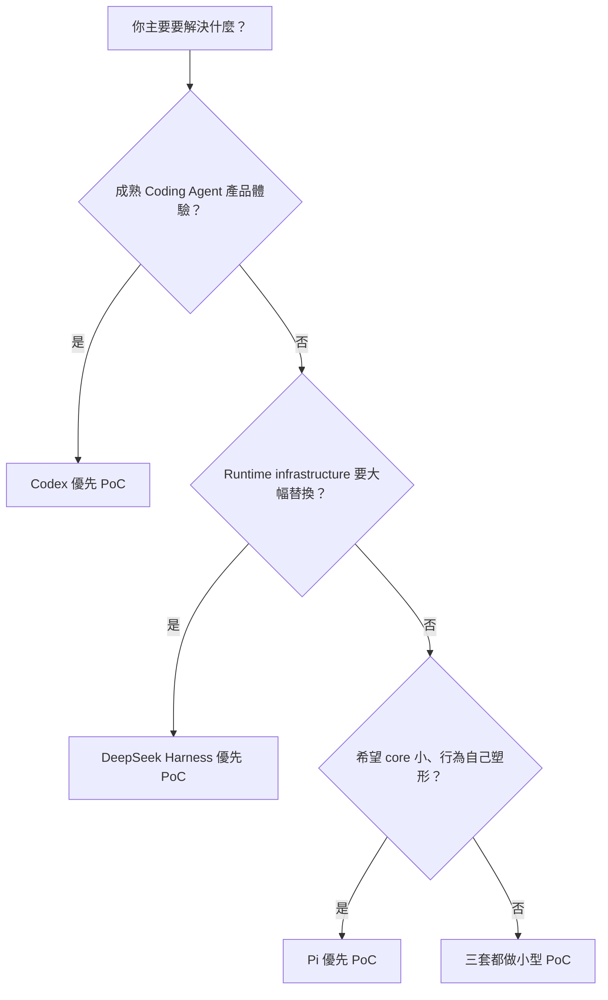
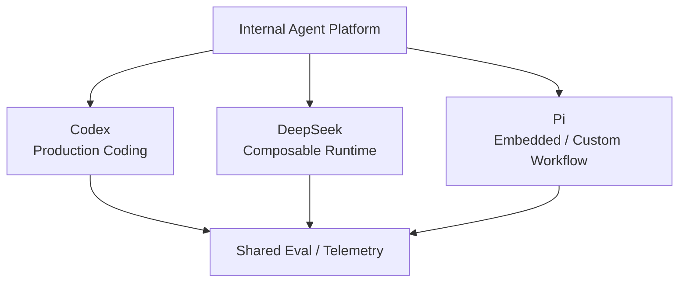

# 情境式選型：什麼時候選 Codex、DeepSeek Harness 或 Pi？

前一頁已經把三套 Harness 放進同一組架構維度；這一頁不再重複那些定義，而是把它們放進實際產品情境。

選型時最重要的不是品牌偏好，而是：

> **你的產品要把哪些責任交給 Harness upstream，哪些責任要留在自己的 Platform？**

## 一張決策圖



這只是入口。下面用情境看比較有意義。

## 情境 1：日常 Coding Agent

需求是：

```text
讀 repo
修改 code
跑 tests
看 diff
處理 approval
```

### 優先 Codex

原因不是其他兩套做不到，而是 Codex 已把：

```text
CLI / coding UX
Tool execution
Sandbox / Approval
Thread lifecycle
Repository workflow
```

整合成完整產品 Runtime。

### Pi 什麼時候也很適合？

如果你：

- 喜歡 terminal-first；
- 要快速自訂 workflow；
- 不需要 first-party sandbox / approval；
- 本來就有自己的 isolation 環境；

Pi 會很輕巧。

### DeepSeek 呢？

如果「日常 Coding Agent」只是更大 Agent Platform 的一個 profile，而你還要替換 loop / sandbox / storage，DeepSeek 才會開始顯示優勢。

## 情境 2：我要做自己的 Coding Assistant UI

### Codex

如果你想要明確的 Rich Client boundary：

```text
Your UI
↕
App Server
↕
Codex Runtime
```

Codex 很自然。

你少掉很多自己定義：

```text
thread lifecycle
approval events
runtime state protocol
client-side activity model
```

### DeepSeek Harness

如果 UI / protocol 本身也想參與 composition：

```text
Your UI
↕
SDK / JSON-RPC / Host / Typert
↕
Composable Runtime
```

DeepSeek 比較自然。

### Pi

如果你是 Node.js / TypeScript，而且想把 Agent 當 library：

```text
Your App
↕
AgentSession SDK
↕
Agent / ModelRuntime
```

Pi 很直接。

非 Node.js client 則可用 JSONL RPC。

## 情境 3：Multi-provider 是產品核心

例如：

```text
OpenAI
Anthropic
Gemini
DeepSeek
Local / Gateway
```

### Pi

`pi-ai` 本身就是 multi-provider runtime；切 provider / model 直接進產品 UX。

### DeepSeek Harness

如果 Model Adapter 只是更多可替換 Runtime capability 中的一項，DeepSeek 更完整。

### Codex

Custom provider 可行，但如果需求變成「大量 provider / role / runtime composition」，通常會需要更多外層 orchestration。

## 情境 4：我要做自己的 Agent Runtime / Platform

如果你列出：

```text
Model
Agent Loop
Sandbox
Storage
Scheduler
UI
Subagent
Execution World
```

其中很多都可能替換，優先研究 **DeepSeek Harness**。

原因不是它 feature 比較多，而是這些責任本來就被設計成 service / provider seam。

## 情境 5：我要一個小核心，Workflow 全部自己決定

如果你的偏好是：

```text
不要內建 canonical subagent
不要固定 plan mode
不要 built-in todo
不要 permission popup
不要把每個產品功能放進 core
```

Pi 很匹配。

它特別適合：

- 個人化 coding workflow；
- agent research；
- internal bespoke tools；
- embedding；
- TypeScript-heavy team；
- 對 framework ceremony 很敏感的團隊。

但要注意：這些被移出 core 的責任最後還是要有人擁有。

## 情境 6：Security 是第一優先

### Codex

適合希望直接得到成熟的：

```text
sandbox
approval UX
workspace policy
network / exec restrictions
```

### DeepSeek Harness

適合希望：

```text
sandbox provider 可替換
approval provider 可替換
credential seam
remote execution world
```

### Pi

要先確認你的 platform 已經有 isolation architecture。

Project Trust 不是 sandbox；如果你沒有：

```text
Docker
microVM
remote worker
OpenShell
其他 confinement
```

卻又把強安全隔離列為首要需求，Pi 不應該只是因為「core 小」就被優先選。

## 情境 7：Remote Sandbox / Cloud Execution

如果 execution world 在：

```text
container
microVM
remote worker
E2B-like environment
```

### DeepSeek Harness

Filesystem / subprocess / terminal / LSP 可以一起由 remote execution world 提供，capability seam 很自然。

### Codex

如果你希望使用成熟 Coding Agent runtime，再把 execution integration 接到既有安全環境，也很合理。

### Pi

如果你本來就有自己的 execution platform，Pi 不會和你爭 sandbox ownership，這反而可能是優勢。

## 情境 8：Replay / Audit / Branch 是核心

### DeepSeek Harness

如果你最在意：

```text
event sourcing
replay
projection
audit
runtime invariant
```

DeepSeek 很自然。

### Pi

如果你最在意：

```text
conversation branching
fork
回到舊節點
branch summary
```

JSONL Entry Tree 很直覺。

### Codex

如果你最在意產品 activity model：

```text
Thread
Turn
Item
```

Codex 對 Rich Client 最直接。

## 情境 9：Subagent / Multi-agent 是核心產品能力

### Codex

希望 upstream 提供 first-party delegation semantics：優先 Codex。

### DeepSeek Harness

希望 delegation provider / backend 可以替換：優先 DeepSeek。

### Pi

不希望被固定成某一種 subagent abstraction，願意自行用 SDK / extension / processes 定義：Pi 很合適。

## 情境 10：Extension 開發速度最重要

Pi 的典型迴圈：

```text
寫 TypeScript Extension
→ /reload
→ 立即測試
```

而 Extension 可以碰：

```text
tools
events
commands
UI
compaction
session entries
providers
```

如果你的主要目標是快速研究新 Agent behavior，這很有吸引力。

DeepSeek 同樣是 TypeScript plugin-first，但 framework abstraction 更深；Codex 則把不同需求拆成更明確的高階 extension surface。

## 情境 11：Production Stability 優先

如果 constraint 是：

```text
現在就上線
migration budget 低
client behavior 要穩
```

目前通常先 PoC Codex。

DeepSeek 整體仍是 Developer Preview，雖然多個 package 已標 stable API，仍要做 version pinning 與 compatibility testing。

Pi 的核心簡潔，但採用者要自己承擔更多 extension / sandbox / policy governance。

因此 Production risk 不只是 crash risk，而是：

```text
誰維護 policy？
誰維護 extension compatibility？
誰維護 sandbox？
誰維護 protocol？
```

## 情境 12：企業只想加自己的 SOP / Tool / Policy

如果只是：

```text
PR 前跑 validator
Production deploy 要 approval
查 Jira / Slack / DB metadata
Migration 先寫 rollback plan
```

通常不值得因為「想客製化」就直接換 Runtime。

Codex 的：

```text
AGENTS.md
Skill
MCP
Hook
Rule
```

常常已經足夠。

DeepSeek / Pi 的架構彈性只有在你真的需要碰更底層責任時才有價值。

## 情境 13：Harness Research / Benchmark

### DeepSeek Harness

很適合 controlled experiments：

```text
同一 Model 換 Agent Loop
同一 Loop 換 Tool Surface
Standard vs Code Mode
Minimal Mode benchmark
不同 Sandbox Provider
Replay / Invariant
```

### Pi

很適合研究：

```text
minimal agent runtime
extension-driven behavior
branch-native state
multi-provider UX
```

### Codex

很適合研究：

```text
production coding loop
context / caching
repository workflow
sandbox / approval product design
rich client integration
```

三套是互補 reference architecture。

## 快速選擇表

| 如果你最在意 | 優先 PoC |
|---|---|
| 成熟 Coding Agent product | Codex |
| App Server / Rich Client | Codex |
| Built-in security UX | Codex |
| Runtime infrastructure 全部可替換 | DeepSeek Harness |
| Event-sourced runtime | DeepSeek Harness |
| Capability composition | DeepSeek Harness |
| Minimal core | Pi |
| Multi-provider lightweight harness | Pi |
| TypeScript extension hot reload | Pi |
| 自己掌握 sandbox / workflow semantics | Pi |

## 不要只選一套也可以

一個 Internal Agent Platform 完全可能：



選型不一定是公司級唯一答案，也可能是 workload 級答案。

## 最後問自己三題

### 1.

> **我主要是在使用 Runtime，還是在設計 Runtime？**

越偏使用，Codex 越有優勢。

### 2.

> **我要替換的是高階 workflow，還是 runtime infrastructure？**

越偏 infrastructure，DeepSeek 越有優勢。

### 3.

> **我希望 core 幫我決定多少事情？**

越希望「少決定、由我自己塑形」，Pi 越有優勢。

## 下一步

情境選完之後，不要立刻全面導入。下一頁把選型轉成可驗證的 PoC：

[PoC、採用與混用策略](./adoption-playbook.md)
