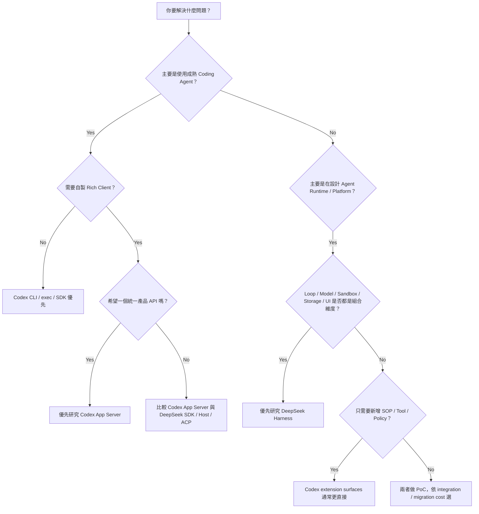
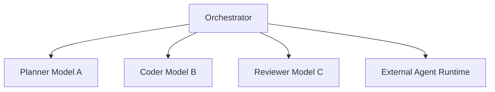
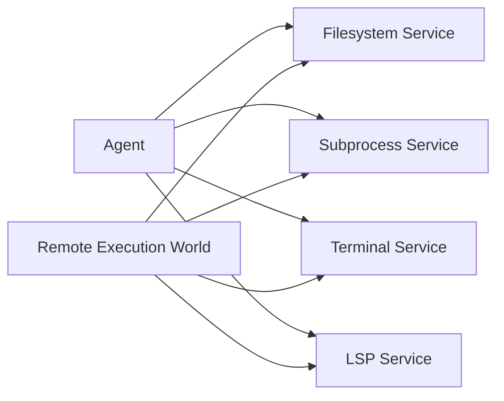
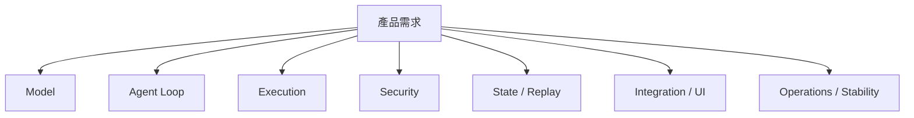
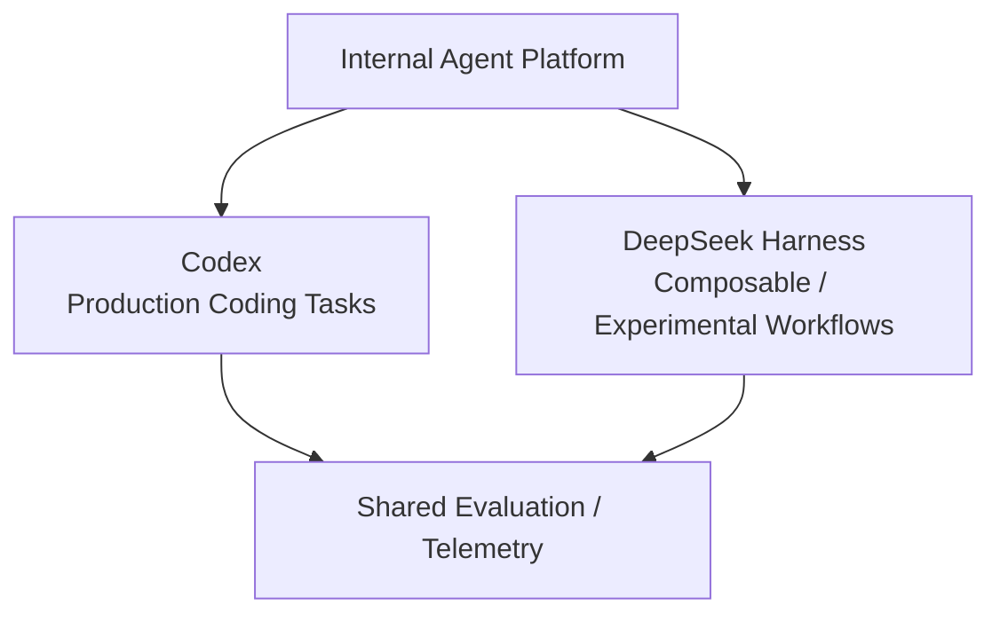

# 如何選擇 Codex 或 DeepSeek Harness？

比較完架構後，真正選型時不應問：

> 哪一個比較先進？

而應問：

> **我的系統需要哪一種穩定中心？哪些 responsibility 必須能被替換？**

## 一張決策圖



## 情境 1：日常 Coding Agent

需求：

```text
讀 repo
修改 code
跑 tests
看 diff
處理 approvals
```

目前更自然的選擇通常是 **Codex**。

原因不是 DeepSeek 做不到，而是 Codex 的 CLI / execution / sandbox / approval / repository workflow 已承受較多產品使用壓力。

## 情境 2：我要做自己的 Coding Assistant UI

這一題不應再直接寫成「一定選 Codex」。

### Codex 路線

```text
Your UI
↕
App Server
↕
Codex Runtime
```

適合你需要：

- 統一 Thread / Turn / Item API；
- approvals / auth / config / model discovery；
- 一個明確的 Rich Client integration boundary；
- 較低 protocol design 成本。

### DeepSeek 路線

```text
Your UI
↕
SDK / stdio JSON-RPC
或 Host / Client / Typert
↕
DeepSeek Runtime
```

適合你需要：

- UI 本身也成為 Plugin Composition；
- Runtime services 可自行替換；
- SDK / ACP / Web Host 各自分工；
- Session Event projection 成為主要 UI data model。

所以真正問題是：

> **你想嵌入既有 Runtime，還是連 UI / Protocol boundary 都希望是可組合架構的一部分？**

## 情境 3：Multi-model / Multi-runtime Agent Platform

例如：



如果不同 Model / Provider / Agent Runtime 是核心組合維度，DeepSeek 的：

```text
LLM Adapter Seam
Subagent Provider Registry
ACP
SDK
Plugin Composition
```

通常比較自然。

Codex 也能透過多 Threads / 多 Runtimes / 外層 Orchestrator / custom providers 完成，但較常需要你自己建立更上層 orchestration。

## 情境 4：企業有自己的 LLM Gateway

如果只是：

```text
Custom compatible model endpoint
```

Codex 的 custom `model_providers` 已值得先測，不必因為不是 OpenAI Model 就直接換 Harness。

但若企業需求同時是：

```text
自己的 Model Adapter
自己的 Sandbox
自己的 Filesystem / Subprocess
自己的 Storage
自己的 Scheduler
自己的 UI / Protocol
```

DeepSeek Harness 的 composability 優勢會快速放大。

## 情境 5：Remote Sandbox / Cloud Execution

假設 Agent 真正的 execution world 在：

```text
container
microVM
remote worker
E2B-like environment
```

DeepSeek 特別適合用 capability seam 思考：



官方 sandbox 文件也特別區分：「process confinement backend」和「整個 execution world 換掉」不是同一件事。

Codex 也有成熟 sandbox / environments / execution integration；差別在你是否希望 backend replacement 成為框架的一級 composition pattern。

## 情境 6：企業只想加自己的 SOP / Tool / Policy

例如：

```text
Migration 必須先寫 rollback plan
PR 前跑 company validator
查 Jira / Slack / DB metadata
Production deploy 必須 approval
```

這種需求通常不需要換整套 Harness。

Codex 已有：

```text
AGENTS.md → Repo invariant
Skill     → SOP / Workflow
MCP       → External Capability
Hook      → Lifecycle interception
Rule      → Enforcement
```

DeepSeek 當然也能用 Skill / Plugin / Tool / Hook 做，但若現有 Codex extension semantics 已足夠，導入整套 Plugin Framework 可能是額外成本。

## 情境 7：Harness Research / Benchmark

DeepSeek 特別適合 controlled experiments：

```text
同一 Model 換 Agent Loop
同一 Loop 換 Tool Surface
Standard vs Code Mode
Minimal Mode benchmark
不同 Sandbox Provider
Event Replay correctness
```

原因包括：

- Loop 可替換；
- Capability Seam；
- Minimal / Code / Creator modes；
- Event-sourced Session；
- Invariants / Replay / Test Support。

Codex 則很適合研究：

```text
production Coding Agent loop
Context / caching
repository workflow
sandbox / approval product design
App Server integration
```

兩者是互補 reference architecture。

## 情境 8：安全與權限是核心差異嗎？

不能再用：

```text
Codex 有完整 Security
DeepSeek 只是可替換 Sandbox
```

來選。

DeepSeek 目前也有：

```text
read-only / workspace-write / danger-full-access
full / partial enforcement reporting
ask / never Approval Policy
fail-closed Approval Outcomes
Permission Presets
Credentials seam
Guards / Invariants
```

因此選型更應問：

```text
我需要成熟 Coding Agent approval UX？
還是需要自行替換 enforcement / interaction provider？
Network policy 是不是必要？
Remote execution world 怎麼隔離？
```

Codex 的優勢仍是產品整合與既有安全 UX；DeepSeek 的優勢是 security capabilities 本身也更容易替換。

## 情境 9：Production Stability 優先

如果 constraint 是：

```text
現在就上線
長期 Client API 要穩
Migration budget 很低
```

目前通常仍偏 **Codex**。

但 DeepSeek 的狀態要精確理解：

```text
Project level   → Developer Preview
Many packages   → Product / stable API
```

所以它不是「所有 API 都不穩」，而是**整體 composition 與 product compatibility 仍有較高 churn risk**。

若用 DeepSeek 上 production，至少準備：

```text
version pinning
plugin compatibility tests
profile / bundle smoke tests
session migration strategy
SDK / protocol regression tests
replay tests
```

## 情境 10：我很重視 Replay / Audit / Debugging

如果你希望：

```text
每個 model-visible durable fact 都可重建
Session 可以 replay
UI 可以由 projection 重算
能 trace event relationship
```

DeepSeek 的 Event-sourced Session 很有優勢。

Codex 也有 Thread / Rollout / Item events / persistence，但產品 abstraction 更偏 Thread / Turn / Item，而不是把完整 event sourcing 當成最中心的公開心智模型。

## 選型不要只看 Model Quality



Codex 與 DeepSeek 都已有 Model abstraction，所以 Model benchmark 不應直接等於 Harness 選型。

## Selection Matrix

先替每項填 1～5 的重要程度：

| 需求 | 權重 |
|---|---:|
| 成熟 Coding Agent UX |  |
| 統一 Rich Client API |  |
| Web / SDK / ACP 多種 integration surface |  |
| Model provider replaceability |  |
| Multi-model / multi-runtime orchestration |  |
| Replaceable Agent Loop |  |
| Remote execution backend |  |
| Event sourcing / replay |  |
| Security product UX |  |
| Security backend replaceability |  |
| Plugin composability |  |
| Project-level API stability |  |
| Runtime invariant / replay testing |  |
| TypeScript extension DX |  |
| Rust system-runtime characteristics |  |

再比較，而不是先決定品牌。

## 我會怎麼選

### 選 Codex，若更在意

```text
成熟 Coding Agent
CLI / IDE UX
App Server 統一 integration boundary
成熟 Sandbox / Approval product integration
Skill / MCP / Hook / Rule 語意清楚
較低 project-level integration risk
```

### 選 DeepSeek Harness，若更在意

```text
Everything-is-a-Plugin
Model / Loop / Sandbox / Storage / UI 可重組
Multi-runtime delegation
Event-sourced Session
Code Mode / Workflow / Jobs
SDK / ACP / Web Host 多種 integration boundary
Runtime research / replay / invariants
```

### 兩個都用也合理



## 最後一個判斷法

問自己兩題：

> **我主要是在使用一個 Agent Runtime，還是在設計一個 Agent Runtime？**

以及：

> **我需要替換的是高階 Workflow，還是 Runtime 基礎設施本身？**

越靠近「直接使用成熟 Coding Runtime」，Codex 優勢越大。

越靠近「重新組合 Runtime responsibility」，DeepSeek Harness 優勢越大。

這不是永久答案；兩邊都在快速演進，production 決策仍應以當下版本做 PoC。

## 延伸

- [Codex vs DeepSeek Harness：架構逐項比較](./codex-vs-deepseek.md)
- [DeepSeek Production、測試與成熟度](../deepseek/production-and-testing.md)
- [雙 Harness 原始碼導讀](../reference/source-reading.md)
