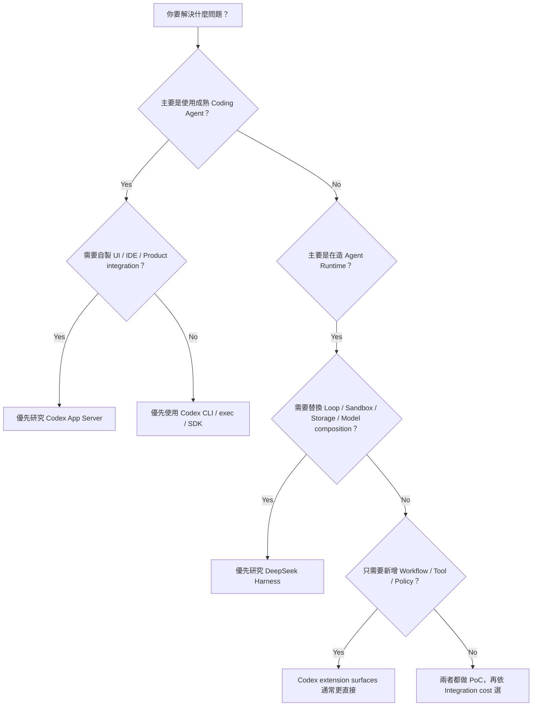
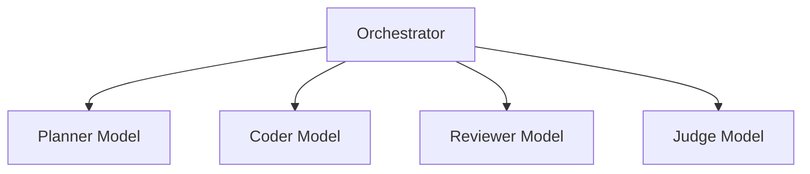
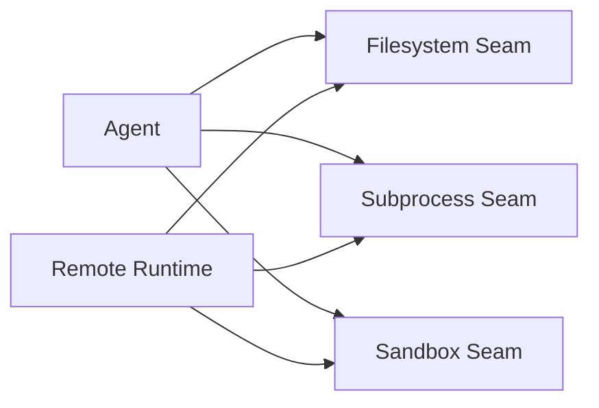
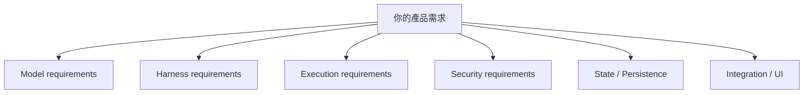
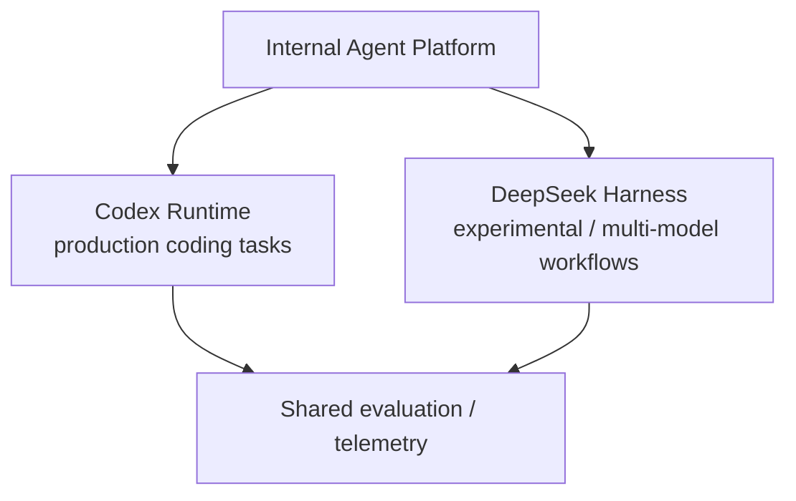

# 如何選擇 Codex 或 DeepSeek Harness？

比較完架構後，真正要做技術選型時，不應問：

> 哪一個比較先進？

而應問：

> **你的系統需要哪一種穩定中心？**

## 一張決策圖



## 情境 1：日常 Coding Agent

需求：

```text
讀 repo
修改 code
跑 tests
看 diff
處理 approvals
```

目前更自然的選擇通常是 **Codex**。

原因不是「DeepSeek 做不到」，而是 Codex 的 CLI / execution / sandbox / approval / repository workflow 已經高度產品化。

## 情境 2：我要做自己的 Coding Assistant UI

需求：

```text
自己的 Web / Desktop / IDE UI
但底層想直接使用成熟 Codex Runtime
```

優先研究：

```text
Codex App Server
```

它本來就是為「把完整 Codex Harness 暴露給其他 clients」而設計。

你需要承擔的是：

- JSON-RPC client binding；
- event rendering；
- approvals UX；
- auth / config integration；
- protocol version compatibility。

但不用從零打造 Agent Loop。

## 情境 3：我要做 Multi-model Agent Platform

例如：



如果「不同 model / provider 是 runtime 的核心組合維度」，DeepSeek Harness 的 plugin / LLM seam 通常比較自然。

Codex 也能透過：

```text
多個 Threads
多個 Runtime
外層 Orchestrator
custom model providers
```

完成，但你要自己多做一層 orchestration。

所以差別不是 capability impossible / possible，而是：

> **你的需求是否正好落在框架原生 abstraction 上。**

## 情境 4：企業內部有自己的 LLM Gateway

如果只需要：

```text
OpenAI-compatible / Responses-compatible gateway
```

Codex 的 custom `model_providers` 已值得先測。

但要注意：

- CLI / TUI 與 Desktop / App Server 的 provider UX 成熟度可能不同；
- model discovery / catalog 不一定和 first-party provider 一樣完整；
- provider-specific features 可能需要 adapter。

如果企業需求還包含：

```text
自己的 LLM
自己的 sandbox
自己的 filesystem
自己的 storage
自己的 scheduler
自己的 UI
```

這時 DeepSeek Harness 的整體 composability 優勢會快速放大。

## 情境 5：Remote Sandbox / Cloud Execution

假設本地工具最後都要跑在 container / VM / remote worker：



這類需求特別符合 DeepSeek Harness 的 capability-provider 心智模型。

Codex 本身也有成熟 sandbox / exec / remote integration 演進，但如果你要的是「所有 execution backend 都能重新抽換」，DeepSeek 的 abstraction 更直接。

## 情境 6：企業只想加自己的 SOP

例如：

```text
所有 migration 必須先產 rollback plan
PR 前要跑 company validator
需要查公司 Jira / Slack / DB metadata
production deploy 一定要 approval
```

這種需求不一定值得換整套 Harness。

Codex 已經有很明確的 extension surface：

```text
AGENTS.md → Repo invariant
Skill     → SOP / Workflow
MCP       → External Capability
Hook      → Lifecycle interception
Rule      → Enforcement
```

如果這些已經足夠，DeepSeek 的 plugin-level自由反而可能增加維護成本。

## 情境 7：Harness Research / Benchmark

如果你想研究：

```text
同一個 Model 換不同 Agent Loop 有什麼差？
Tool 數量對 benchmark 有什麼影響？
Code Mode 是否降低 round trip？
不同 Session policy 是否改變結果？
```

DeepSeek Harness 的 Minimal / Code / Creator Mode，加上 plugin composition，非常適合做 controlled experiments。

Codex 則比較適合研究：

```text
production coding-agent loop
prompt/context engineering
sandbox / approval design
App Server product integration
```

兩者其實是很好的互補教材。

## 情境 8：Production Stability 優先

如果你的主要 constraint 是：

```text
API churn 必須很低
client integration 要長期維護
現在就要上線
```

目前 Codex 的風險通常更低。

原因很簡單：DeepSeek Harness 官方現在仍直接標示 developer preview，並明確預告 breaking changes。

如果使用 DeepSeek Harness 上 production，應把下面列為正式成本：

```text
version pinning
migration budget
plugin compatibility tests
session format migration
integration regression suite
```

## 選型不該只看 Model Quality

Harness 選型常見錯誤：

```text
Model A benchmark 高
→ 所以一定選 Harness A
```

這是不成立的。

Model 與 Harness 應拆開：



尤其 Codex 與 DeepSeek Harness 都已具備一定程度的 model abstraction。

## 一份實際 Selection Matrix

先替每個項目填 1～5 的重要程度：

| 需求 | 權重 |
|---|---:|
| 成熟 Coding Agent UX |  |
| App / IDE integration |  |
| Model provider replaceability |  |
| Multi-model orchestration |  |
| Replaceable agent loop |  |
| Remote execution backend |  |
| Event sourcing / replay |  |
| Security product maturity |  |
| Plugin composability |  |
| API stability |  |
| TypeScript extension DX |  |
| Rust runtime performance / system control |  |

再比較，不要先決定品牌。

## 我會怎麼選

### 選 Codex，若你更在意

```text
成熟 Coding Agent
App Server
CLI / IDE UX
Sandbox / Approval
清楚的 Skill / MCP / Hook / Rule abstraction
較低的 integration risk
```

### 選 DeepSeek Harness，若你更在意

```text
Everything-is-a-Plugin
Multi-model composition
Replaceable loop
Replaceable sandbox / FS / storage
Event-sourced runtime
Code Mode
Harness research / custom runtime
```

### 兩個都用，也完全合理

例如：



成熟產品不一定要把所有工作壓在同一套 Harness。

## 最後一個判斷法

問自己：

> **我主要是在「使用一個 Agent Runtime」，還是在「設計一個 Agent Runtime」？**

前者通常更靠近 Codex 的優勢。

後者通常更靠近 DeepSeek Harness 的優勢。

這不是永遠不變的答案；兩邊都在快速演進，所以真正 production 選型仍應在當下版本做 PoC。

## 主要來源

- [Codex App Server architecture](https://openai.com/index/unlocking-the-codex-harness/)
- [Codex model provider registry](https://github.com/openai/codex/blob/main/codex-rs/model-provider-info/src/lib.rs)
- [DeepSeek Harness](https://deepseek.com/harness/en/)
- [DeepSeek Harness Architecture](https://github.com/deepseek-ai/deepseek-harness/blob/master/docs/architecture.md)
