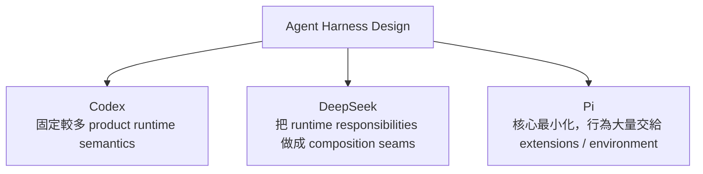
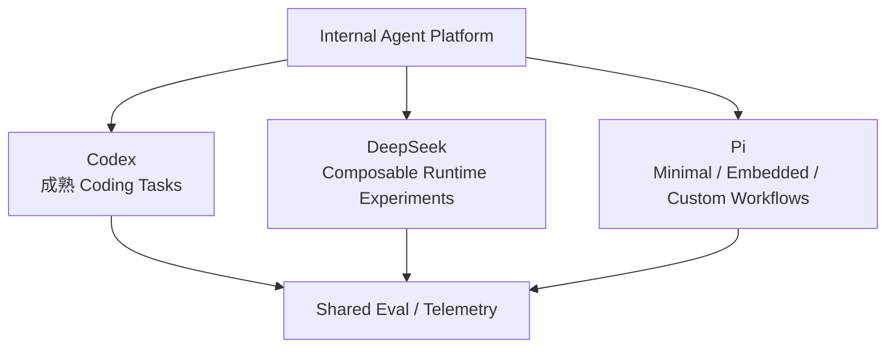

# 三種 Agent Harness：Codex、DeepSeek、Pi

> 最後核對：2026-08-24。本章比較的是 **Harness architecture**，不是 GPT、DeepSeek 或其他模型本身的能力。

現在可以用三套開源 Harness 看見三種很不一樣的答案：

```text
Codex
→ Productized / Opinionated Runtime

DeepSeek Harness
→ Composable Runtime Framework

Pi
→ Minimal / Self-extensible Harness
```

三者都能完成 Coding Agent 工作，但「哪些 responsibility 應該固定」的答案完全不同。

## 一張總覽圖



## 1. 核心定位

| 問題 | Codex | DeepSeek Harness | Pi |
|---|---|---|---|
| 主要定位 | 完整 Coding Agent Runtime | Agent Runtime Framework | Minimal Coding Harness |
| 穩定中心 | `codex-core` + App Server / protocol | Cordis + Service contracts | `pi-agent-core` + `AgentSession` |
| 主要擴充哲學 | 高階語意化 surfaces | Plugin / Provider / Consumer | TypeScript Extensions / Skills / Packages |
| Runtime 本身可否重組 | 有限度 | 核心目標 | core 不大，但 extension 可深入 lifecycle |
| 預設產品行為 | 多 | 中等、由 profile/bundle 組成 | 刻意少 |

## 2. Model / Provider

### Codex

Codex 有 model provider registry，也能設定 custom provider；但整體 product semantics 仍以 Codex runtime 為中心。

### DeepSeek

LLM adapter 從架構第一層就是 capability seam，可以隨 plugin composition 替換。

### Pi

`pi-ai` 把 multi-provider 當 first-class runtime capability；Provider 擁有 auth、model catalog 與 stream behavior，Coding Agent 可以直接切換多家 provider / model。

| | Codex | DeepSeek | Pi |
|---|---|---|---|
| Custom Provider | 支援 | 架構原生 | 架構原生 |
| Multi-provider 心智模型 | Runtime 選 provider | Adapter composition | Provider registry / Models runtime |
| Session 中切模型 | 支援程度依 surface | 可組合 | 產品核心能力之一 |

## 3. Agent Loop

### Codex

Agent loop 是 production runtime 的核心主幹：context → model → tool → output → next model request。

### DeepSeek

Agent Loop 本身是 replaceable service seam，適合研究不同 loop / mode。

### Pi

`pi-agent-core` 提供小型 stateful Agent + tool execution；`AgentSession` 再負責 coding lifecycle、session、extensions、compaction。

所以三者不是「有 loop / 沒 loop」的差異，而是：

```text
Codex
→ loop 是大型產品 runtime 的核心

DeepSeek
→ loop 是 composition capability

Pi
→ loop 在低階 agent-core；coding behavior 在 AgentSession / extension 層
```

## 4. State Model

三套最值得並讀的就是 state。

### Codex

```text
Thread
└─ Turn
   └─ Item
```

適合 Rich Client / product activity model。

### DeepSeek

```text
Session
→ append-only SessionEvents
→ derive projection / context / replay
```

適合 event sourcing、audit、replay。

### Pi

```text
Session JSONL
→ Entry
  ├─ id
  └─ parentId
→ Tree / Branch
```

適合直接把 branch / fork / resume 建進 persisted structure。

| 問題 | Codex | DeepSeek | Pi |
|---|---|---|---|
| UI domain model | 很強 | projection derive | TUI / session tree |
| Replay | rollout / history | 核心哲學 | 透過 entry lineage 重建 |
| Branch | Thread / fork semantics | Session lineage | JSONL tree 原生 |
| Compaction | runtime-managed | projection / context mechanism | durable compaction entry |

## 5. Tool Surface

### Codex

工具與 shell / patch / MCP / approval / sandbox 深度產品整合。

### DeepSeek

工具是 capability consumer / provider graph 的一部分，還有 Code Mode / Workflow。

### Pi

預設只保留最基本 coding primitives：

```text
read
write
edit
bash
```

再透過 SDK / Extension 註冊工具。

Pi 的問題是「最少要多少工具就能工作？」；Codex 更偏「如何把完整 coding workflow 做成熟」；DeepSeek 則問「tool / executor / runtime 要如何成為可替換 seam」。

## 6. Extension System

| | Codex | DeepSeek | Pi |
|---|---|---|---|
| Knowledge | AGENTS.md / Skills | Skills | Skills / context files |
| Tool extension | MCP / Plugin | Tool Plugin / MCP pattern | `registerTool()` |
| Lifecycle | Hooks | Typed Events / Hooks | `pi.on()` events |
| Policy | Rules / Permission | Approval / Guards / Provider | extension interception / external policy |
| Delegation | Subagents | Subagent provider | 不內建 canonical subagent |
| Distribution | skills / MCP servers / config | bundles / plugins | Pi Packages |

Pi 最大特色是 Extension API 很寬，可以直接改 lifecycle、tool call、UI、compaction、session state、provider。

## 7. Subagents / Plan Mode

這項特別能看出設計哲學。

### Codex

把 subagent / delegation 做成正式產品能力。

### DeepSeek

有正式 subagent provider seam，delegation 本身可以替換。

### Pi

官方刻意不內建 canonical subagent / plan mode。

可以自己：

```text
spawn pi instances
用 tmux
用 SDK 建 child AgentSession
寫 extension
安裝第三方 package
```

因此：

> Pi 不是缺少 multi-agent 能力，而是不承諾「唯一正確的 multi-agent abstraction」。

## 8. Security / Permission / Sandbox

這是三者差距最大的地方。

### Codex

```text
Sandbox
Approval
Workspace boundary
Network / Rules / Exec policy
Client UX
```

都屬於 productized runtime security。

### DeepSeek

```text
Sandbox Service
Approval Service
Permission Presets
Credentials
Guards / Invariants
Platform providers
```

屬於 formal、可替換的 capability architecture。

### Pi

```text
Project Trust
→ 控制是否載入 project-local resources

Execution
→ 預設沿用 OS user permissions

Strong isolation
→ container / microVM / sandbox 放在外層
```

Pi 官方明確說 Project Trust 不是 sandbox。

| 安全能力 | Codex | DeepSeek | Pi |
|---|---:|---:|---:|
| Built-in sandbox | 強 | 有 formal service | 無 |
| Built-in approval model | 強 | 有 | 無 canonical popup |
| Project resource trust | 有自己的 trust model | composition / policy | 明確 Project Trust |
| 外部 sandbox | 可搭配 | 很自然 | 官方主要建議之一 |
| Security backend replaceability | 中高 | 很高 | 主要靠外層 architecture |

## 9. Integration Surface

### Codex

```text
CLI / exec / SDK / App Server
```

App Server 是很明確的 Rich Client boundary。

### DeepSeek

```text
Web Host / Client
SDK
stdio JSON-RPC
ACP
Typert
in-process services
```

多條 integration surfaces 都參與 composition。

### Pi

```text
Interactive TUI
Print / JSON
RPC over stdin/stdout JSONL
SDK
```

Node.js 可以直接拿 `AgentSession`；其他語言可走 RPC。

## 10. Runtime / Client Boundary

```text
Codex
Your UI
↕
App Server
↕
Codex Runtime
```

```text
DeepSeek
Your UI / ACP / SDK / Host
↕
Cordis Composition
```

```text
Pi
Your Node App
↕
AgentSession / SDK
↕
pi-agent-core / pi-ai

或

Any Language Client
↕ JSONL RPC
pi process
```

## 11. Language / DX

| | Codex | DeepSeek | Pi |
|---|---|---|---|
| 核心語言 | Rust | TypeScript | TypeScript |
| 修改 runtime core | 較高門檻 | framework abstraction 較深 | core 小、較易追 |
| Extension DX | 多種 product surfaces | Cordis plugin | TS module + `/reload` |
| OS / sandbox work | Rust 內建很多 | providers 封裝 | 多交給外部 environment |

Pi 對想學「最小 Agent runtime」的 TypeScript 工程師特別友善。

## 12. Production Maturity 要怎麼看？

### Codex

有大量 first-party product / CLI / IDE / App 使用場景，整體 product integration 成熟度最高。

### DeepSeek

專案整體仍標 Developer Preview，但已有許多標 stable API 的 package 與 production-oriented subsystem。

### Pi

Pi 是高度活躍、被廣泛使用的開源 coding harness，但它的哲學本來就不是替你提供完整 enterprise governance。Production 使用時，extension governance、sandbox、policy、deployment architecture 要由採用者負責較多。

因此不能只做「成熟度星等」，應拆成：

```text
Runtime maturity
Product UX maturity
API stability
Security productization
Extension governance burden
```

## 13. 三種核心哲學

### Codex

> **把常見 Coding Agent 問題做成完整產品 Runtime。**

### DeepSeek

> **把 Runtime responsibility 變成可替換 service / plugin composition。**

### Pi

> **讓 core 保持小，把非必要的產品假設推出 core。**

## 14. 哪一套最值得學？

三套都值得，因為回答不同問題。

### 想學 production Coding Agent

先看 Codex。

### 想學 runtime framework / replaceable seams

看 DeepSeek。

### 想學 minimal agent architecture / self-extensible runtime

看 Pi。

## 15. 最有價值的並讀練習

### 一次 Model Call

```text
Codex
core → model provider → stream → items

DeepSeek
agent-loop → LLM service → adapter → events

Pi
AgentSession → Agent → ModelRuntime / pi-ai → Provider
```

### 一次 Tool Call

```text
Codex
model → tool router → policy → executor → item

DeepSeek
model → tool registry → pre/execute/post → SessionEvent

Pi
Agent → AgentTool → extension interception → tool result → Agent state
```

### 一次 Resume

```text
Codex
Thread Store / rollout / context rebuild

DeepSeek
SessionEvent persistence / projection

Pi
SessionManager → JSONL branch → buildSessionContext
```

### 一次危險 Bash

```text
Codex
built-in policy / approval / sandbox

DeepSeek
approval + sandbox providers

Pi
extension gate（可選）+ OS/container boundary
```

## 16. 三套不是互斥選擇

企業平台甚至可以同時使用：



## 下一步

如果你要實際選型，讀：

[三種 Harness 選型指南](./three-way-selection-guide.md)

如果要理解 Pi source：

[`earendil-works/pi` 原始碼導讀地圖](../reference/pi-source-map.md)
