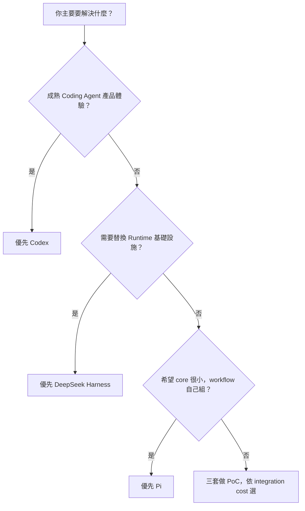
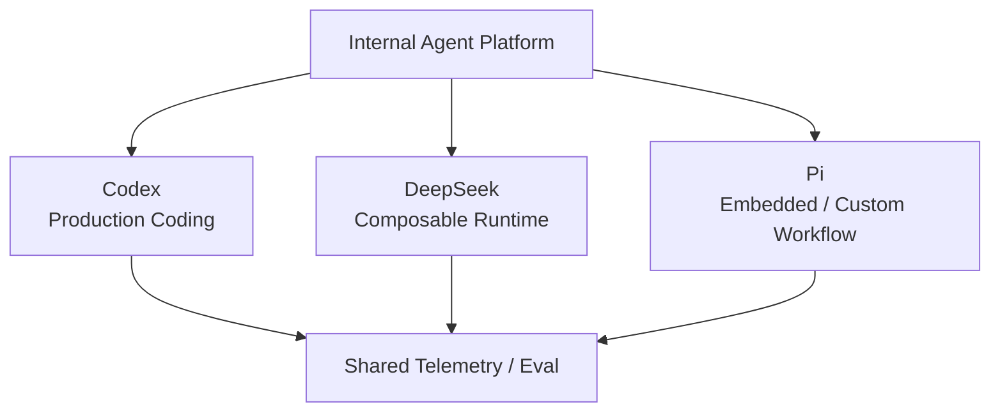

# 三種 Harness 選型指南

現在不應只問「Codex 還是 DeepSeek」。Pi 加進來之後，真正的選型問題變成：

> **我要一個已經替我做很多決策的 Runtime、可重新組裝的 Runtime Framework，還是核心盡量小、由我自己塑形的 Harness？**

## 一張決策圖



這張圖只是第一層。真正選型還要看下面幾個維度。

## 情境 1：日常 Coding Agent

需求：

```text
讀 repo
修 code
跑 tests
看 diff
處理 approvals
```

目前最自然通常仍是 **Codex**。

原因：

- Coding Agent product workflow 完整；
- sandbox / approval / repository UX 已深度整合；
- CLI / IDE / App / App Server surfaces 成熟。

Pi 也能做日常 coding，而且非常輕巧；但如果你把「安全 UX、subagent、plan、policy」視為理所當然的 first-party 功能，就會需要自己補更多。

## 情境 2：我要自己做 Coding Assistant UI

### 選 Codex，若你想要

```text
Your UI
↕
App Server
↕
Codex Runtime
```

重點是：

- 統一 Rich Client boundary；
- Thread / Turn / Item；
- approvals / auth / config / runtime events；
- 少設計一套 protocol。

### 選 DeepSeek，若你想要

```text
Your UI
↕
SDK / JSON-RPC / Host / Typert
↕
Composable Runtime
```

重點是 UI / transport 本身也可以參與 runtime composition。

### 選 Pi，若你是 TypeScript / Node.js 且想直接碰 runtime objects

```text
Your App
↕
AgentSession SDK
↕
Agent / ModelRuntime / ResourceLoader
```

Pi 很適合「不是想呼叫遠端 Agent API，而是想把 Agent 當 library 嵌進程式」的情境。

非 Node.js client 則可走 JSONL RPC。

## 情境 3：Multi-model 是核心需求

如果你的 platform 本來就會：

```text
Claude
OpenAI
Gemini
DeepSeek
Local / Gateway
```

混用，Pi 與 DeepSeek 都很有吸引力。

### Pi

`pi-ai` 原生就是 multi-provider model runtime，適合在同一個 coding harness 中快速切 provider / model。

### DeepSeek

Model adapter 本來就是 capability seam，若 multi-model 只是更大 runtime composition 的其中一部分，會更自然。

### Codex

Custom provider 可行，但整體 product design 不是以 arbitrary multi-provider orchestration 為最中心的 abstraction。

## 情境 4：我要做自己的 Agent Runtime / Platform

問：

```text
Model
Loop
Sandbox
Storage
Scheduler
UI
Subagents
Execution World
```

是否都可能要替換？

如果答案大多是「是」，優先研究 **DeepSeek Harness**。

它的價值是 responsibility 本身已經被抽成 service / provider / consumer seam。

## 情境 5：我要一個小核心，其他都自己決定

例如你認為：

```text
不要內建 MCP
不要規定 subagent abstraction
不要規定 plan mode
不要 permission popup
不要 built-in todo
```

而希望這些都由 team 自己用 extensions / external tools 決定，Pi 很匹配。

Pi 特別適合：

- 個人 workflow；
- agent research；
- internal bespoke tools；
- embedding；
- TypeScript-heavy team；
- 對 framework ceremony 很敏感的團隊。

## 情境 6：Security 是第一優先

### Codex

適合你想直接取得成熟的：

```text
sandbox
approval UX
workspace policy
network / exec restrictions
```

### DeepSeek

適合你希望：

```text
sandbox provider 可替換
approval provider 可替換
credential seam
remote execution world
```

### Pi

不要誤選。

Pi 的 Project Trust **不是 sandbox**，預設 execution 使用啟動 Pi 的 OS user permissions。

如果選 Pi，你要有清楚的 isolation plan：

```text
Docker
microVM
OpenShell
自建 remote worker
其他 sandbox
```

所以 security-heavy enterprise environment 並不是不能用 Pi，而是 **platform team 必須自己擁有 enforcement architecture**。

## 情境 7：Extension 開發速度最重要

Pi 很強。

典型迴圈：

```text
寫 TypeScript Extension
→ /reload
→ 立即試
```

Extension 又能碰：

```text
tools
events
commands
UI
compaction
session entries
providers
```

如果你要快速實驗新的 agent behavior，這個 DX 非常有吸引力。

DeepSeek 也以 TypeScript plugin-first 見長，但 framework abstraction 更深；Pi 更接近「直接寫一個 module 改 runtime behavior」。

## 情境 8：Replay / Audit / Branch 是核心

### DeepSeek

如果你要完整 event sourcing：

```text
model-visible durable fact
→ SessionEvent
→ projection / replay / query
```

DeepSeek 很適合。

### Pi

如果你更在意：

```text
conversation branching
fork
回到舊節點
branch summary
```

Pi 的 JSONL entry tree 非常直覺。

### Codex

Thread / Turn / Item 對產品 UI 與 activity rendering 最直接。

因此這一題不是「誰 state 最強」，而是你需要哪一種 state semantics。

## 情境 9：Remote Sandbox / Cloud Execution

### DeepSeek

如果 filesystem / subprocess / terminal / LSP 都要被遠端 execution world 提供，capability seam 很自然。

### Codex

適合直接使用成熟的 coding sandbox / environment product integration。

### Pi

適合你本來就有自己的 container / microVM platform，只需要把 Pi 放進或接到那個 execution boundary。

Pi 不會和你爭 sandbox ownership，這有時反而是優勢。

## 情境 10：Subagent / Multi-agent 是核心產品能力

### Codex

如果你要 first-party、產品化的 delegation semantics，先看 Codex。

### DeepSeek

如果你希望 delegation backend / provider 可替換，看 DeepSeek。

### Pi

如果你不想被規定 subagent abstraction，Pi 很適合；但要自己用 SDK / extension / multiple processes 定義它。

## 情境 11：Production Stability

### Codex

目前整體 product / integration maturity 最容易直接採用。

### DeepSeek

整體仍是 Developer Preview，但不少 package 已標 stable API；要做好 version pinning 與 compatibility testing。

### Pi

活躍、實用，但採用者需要對 extension / sandbox / policy / package governance 承擔更多責任。

因此 production risk 不能只看「會不會 crash」，還要看：

```text
誰維護 policy？
誰維護 extension compatibility？
誰維護 sandbox？
誰維護 client protocol？
```

## Selection Matrix

先替需求填權重 1～5：

| 需求 | 權重 |
|---|---:|
| 成熟 Coding Agent UX | |
| Built-in sandbox / approval | |
| 統一 Rich Client API | |
| Multi-provider model support | |
| Replaceable Agent Loop | |
| Replaceable Sandbox / Storage | |
| Minimal core | |
| TypeScript extension DX | |
| Session branch / tree | |
| Event sourcing / replay | |
| First-party subagents | |
| External sandbox ownership | |
| Project-level API stability | |
| Low framework ceremony | |

再比較。

## 快速選擇表

| 如果你最在意 | 優先研究 |
|---|---|
| 成熟 Coding Agent product | Codex |
| App Server / Rich Client | Codex |
| Built-in security UX | Codex |
| Runtime responsibility 全部可替換 | DeepSeek |
| Event-sourced platform | DeepSeek |
| Multi-runtime / capability composition | DeepSeek |
| Minimal core | Pi |
| Multi-provider + lightweight coding harness | Pi |
| TypeScript extension hot reload | Pi |
| 自己掌握 sandbox / workflow semantics | Pi |

## 可以混用

三套完全可以在同一個 platform 各自做擅長的事：



## 最後問自己三題

### 1.

> **我是在使用 Runtime，還是在設計 Runtime？**

越偏使用，Codex 越有優勢。

### 2.

> **我要替換的是 workflow，還是 runtime infrastructure？**

越偏 infrastructure，DeepSeek 越有優勢。

### 3.

> **我希望 core 幫我決定多少事情？**

越希望「少決定、讓我自己擴充」，Pi 越有優勢。

## 延伸

- [三種 Agent Harness：Codex、DeepSeek、Pi](./three-harnesses.md)
- [Codex vs DeepSeek：架構逐項比較](./codex-vs-deepseek.md)
- [Pi Agent Harness：先建立正確心智模型](../pi/overview.md)
