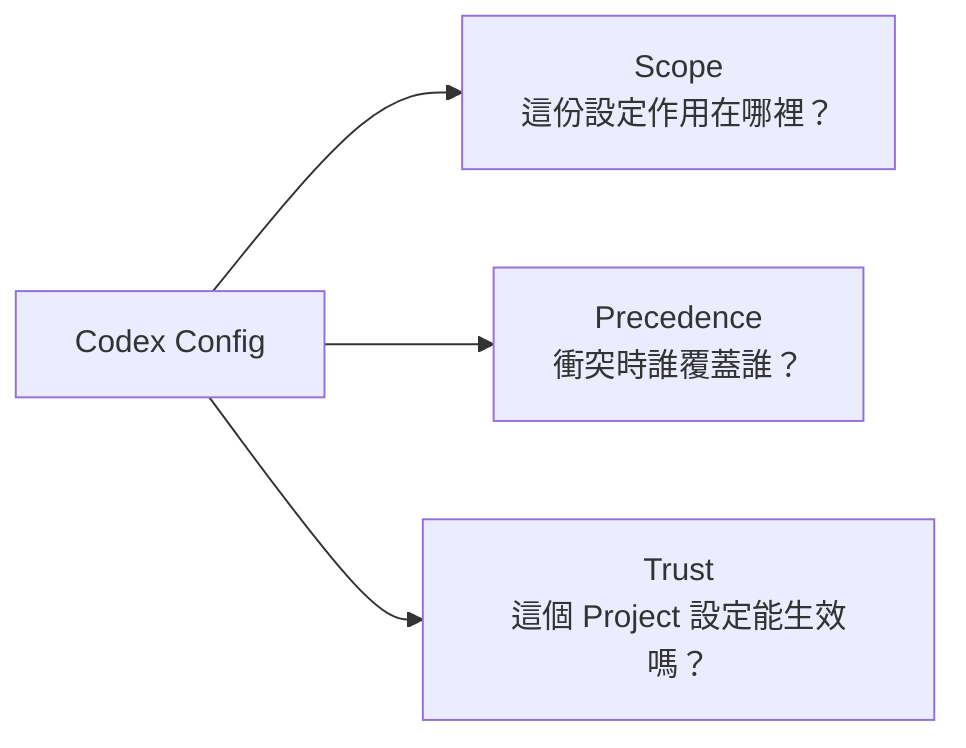
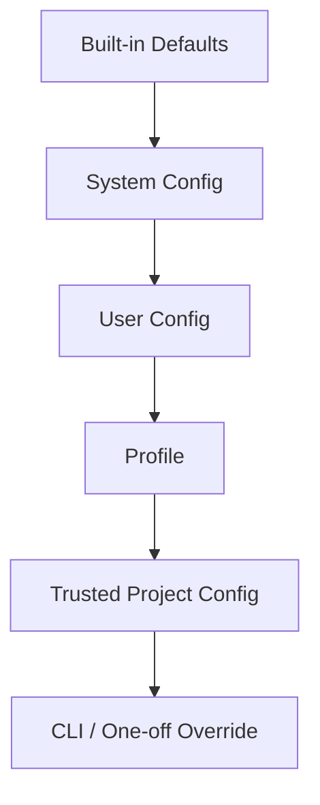
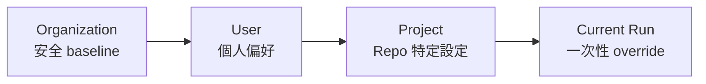
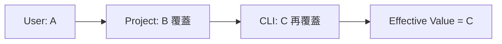
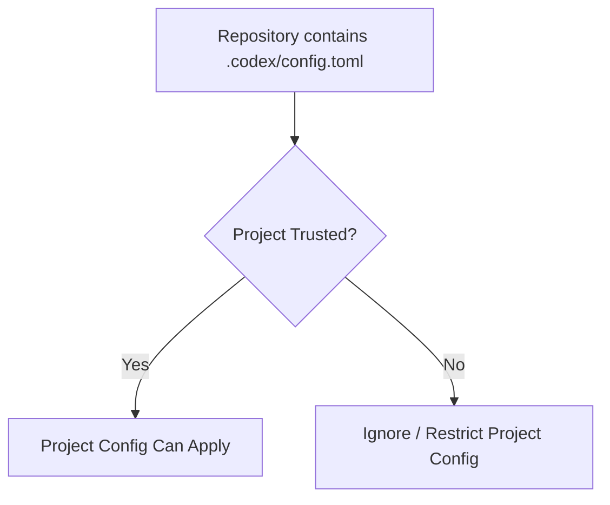
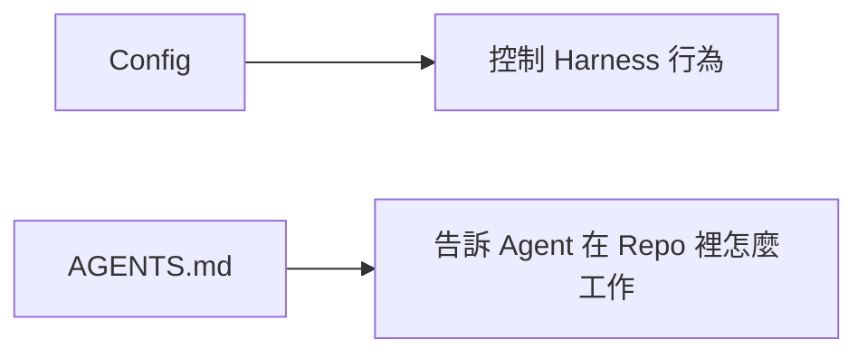
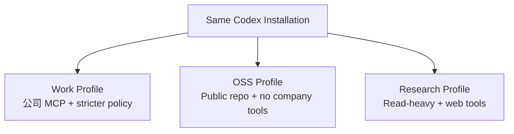
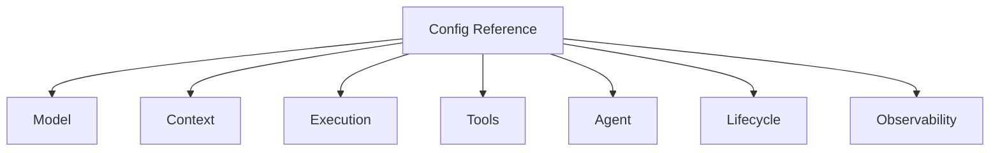

# `config.toml` 與設定優先序

如果你第一次看 Codex 設定，不要先背幾十個 key。

先記住：

> **Config 解決的是「Harness 要怎麼運作」，而不是「這次任務要做什麼」。**

例如：

```text
這次幫我修 auth bug             → Prompt
這個 repo 所有 DB 都走 repository layer → AGENTS.md
Codex 預設用哪個 model / sandbox / MCP → Config
```

## 先看設定的三個維度

任何 config 問題都可以先拆成三題：



這三個概念比記住單一檔案位置更重要。

## Scope：設定可能來自很多地方

Codex 不只有一個 `~/.codex/config.toml`。

概念上可以看成一層一層疊上去：



由低到高越往上越接近「這次執行」。

常見來源由高到低可整理為：

1. CLI flags / `--config` overrides；
2. trusted project 的 `.codex/config.toml`，從 project root 到 cwd，越近越優先；
3. profile config；
4. user `~/.codex/config.toml`；
5. system config，例如 `/etc/codex/config.toml`；
6. built-in defaults。

## 為什麼要有這麼多層？

因為不同人想控制不同範圍。



例如：

- 公司決定安全 baseline；
- 你決定常用 model；
- 某個 repo 需要特定 MCP；
- 這次 command 暫時切成另一個 profile。

如果只有一份 config，這些需求會互相打架。

## Precedence：同一個設定衝突時怎麼辦？

假設：

```text
User config:    model = A
Project config: model = B
CLI override:   model = C
```

最後通常是更高優先層生效：



Troubleshooting 時不要只問：

> 我 config 明明寫 B，為什麼不是 B？

而要問：

> **還有沒有更高 precedence 的來源？**

## Trust：Project Config 為什麼不能隨便自動生效？

假設你 clone 一個陌生 repo，裡面偷偷放：

```text
.codex/config.toml
```

如果它可以無條件改變：

- hooks；
- MCP；
- provider；
- execution behavior；
- permission behavior；

那光是進入一個 repository，就可能改變 Agent 的安全環境。

所以 project config 和 **Project Trust** 有關。



Troubleshooting 時很實用的一題是：

> 這份 config 沒生效，是 syntax 錯，還是 project 尚未 trusted？

## Config 和 AGENTS.md 不同

這兩個很容易被混在一起。



### Config 適合

- model；
- provider；
- sandbox / permission；
- MCP server；
- hooks；
- features；
- telemetry。

### AGENTS.md 適合

- coding convention；
- architecture rule；
- test expectation；
- repository-specific instructions。

不要把一篇團隊開發規範塞進 TOML。

## 個人設定範例

```toml
model = "gpt-5.3-codex"
model_reasoning_effort = "high"

[features]
# 依當前版本支援項目設定

[mcp_servers.docs]
command = "npx"
args = ["-y", "some-mcp-server"]
```

> 具體 model 名稱、feature flags 與 schema 會隨版本變化；請以當前 config reference / schema 為準。

## Project-specific config

```text
repo/
├─ .codex/
│  └─ config.toml
├─ AGENTS.md
├─ packages/
└─ ...
```

適合放：

- repo 的 Agent feature 設定；
- project-specific MCP；
- hooks / rules；
- agent definitions；
- environment-specific controls。

不要 commit 個人 API key。

## Profile：把「工作模式」命名

如果你常在不同情境切換，Profile 比一直改主 config 更好理解。



這代表「同一個 Harness，不同 operation mode」。

## 看 Config Reference 時，用分類法而不是硬背

| 類別 | 你在控制什麼 | 例子 |
|---|---|---|
| Model | 用哪個推理引擎 | model, provider, reasoning effort |
| Context | Model 看什麼 | instructions, compaction, project docs |
| Execution | 真實環境怎麼跑 | sandbox, permission, environment |
| Tools | Agent 有什麼能力 | MCP, web, shell-related features |
| Agent | 怎麼分工與擴充 | subagents, skills, collaboration |
| Lifecycle | 一段工作怎麼延續 | hooks, history, thread behavior |
| Telemetry | 怎麼觀察系統 | logging, OTEL, diagnostics |



先知道某個 key 在控制哪個責任，再看細節會容易很多。

## Schema-driven Config

Config 面積越大，越不適合靠記憶和猜測。

Editor 使用官方 schema 的好處：

- autocomplete；
- enum validation；
- deprecated field 提示；
- 減少拼字錯誤。

對 production integration 來說，versioned schema 更應視為 compatibility contract。

## 常見錯誤

### 把安全 Policy 放在可被覆蓋的普通層

如果 organization policy 必須不可被 user override，就不能只靠普通 config precedence；要使用 managed / deployment-level enforcement。

### 把所有 Project Knowledge 塞 Config

Config 是 machine behavior setting。

```text
開發規則 → AGENTS.md
特定 SOP → Skill
Harness 行為 → Config
```

### 在 Repo Commit Secrets

MCP auth / secret 應使用：

- environment variables；
- credential store；
- external secret mechanism。

## 本章只要記住

1. **Config 控制 Harness，不是描述本次任務。**
2. **先理解 Scope、Precedence、Trust。**
3. **越接近本次執行的設定通常優先度越高。**
4. **Project Config 不應在未信任 repo 中任意生效。**
5. **看 Config Reference 要按責任分類，不要硬背 key。**

## 來源

- [Config basics](https://learn.chatgpt.com/docs/config-file/config-basic)
- [Config reference](https://learn.chatgpt.com/docs/config-file/config-reference)
