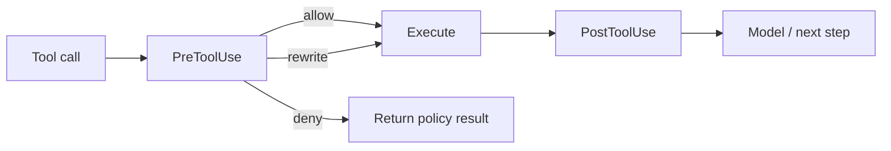

# Hooks：觀察、阻擋、改寫與整合

Hooks 是在 agent lifecycle 的特定事件插入 deterministic 程式邏輯。它非常適合把組織流程接進 harness，但不要把它誤認為唯一安全 boundary。

## 典型 Hook Events

目前 Codex 文件涵蓋的事件包括像：

- `SessionStart` / `SessionEnd`；
- `PreToolUse` / `PostToolUse`；
- `PermissionRequest`；
- compaction 前後相關事件等。

精確事件集合會隨版本變化，應以當前 docs/schema 為準。

## PreToolUse

最有力量的一種 hook。可以在 action 真正執行前：

- deny；
- 加 context；
- rewrite input（若當前 hook contract 支援）；
- 記錄 audit。

## PostToolUse

適合：

- 驗證結果；
- 加入額外 context；
- audit/metrics；
- 阻擋 agent 繼續某條路徑。

但它**不能撤銷已經發生的 side effect**。如果某個 `DELETE` 已打到 API，PostToolUse 再說「不該刪」已經太晚。

## Hook 的好用場景

### 自動檢查

改完 migration 後自動執行 schema validator。

### 組織政策

在 dangerous command 前檢查 ticket/branch/environment。

### Audit

把 tool name、cwd、decision、duration 寫到內部 telemetry。

### Context injection

SessionStart 時載入動態環境資訊，例如目前 service ownership / deployment environment。

## 不要用 Hook 做什麼

### 取代 sandbox

Hook code 可能沒覆蓋所有 tool surface，也可能自己出錯。

### 寫巨大 workflow

如果有多步 agent procedure，Skill 比 Hook 適合；Hook 應保持 deterministic 和窄責任。

### 把每個 tool call 都塞進慢速 remote API

會把 agent latency 放大。Hook 應有 timeout、failure policy、cache。

## Failure mode 要先定義

Hook 掛了怎麼辦？

- fail-open：繼續執行，availability 高但安全弱。
- fail-closed：阻擋 action，安全強但可能癱瘓工作。

對 security hook 與 analytics hook，答案通常不同。

## 來源

- [Hooks docs](https://learn.chatgpt.com/docs/hooks)
- [`codex-rs/hooks`](https://github.com/openai/codex/tree/main/codex-rs/hooks)
- [`core/src/hook_runtime.rs`](https://github.com/openai/codex/blob/main/codex-rs/core/src/hook_runtime.rs)
