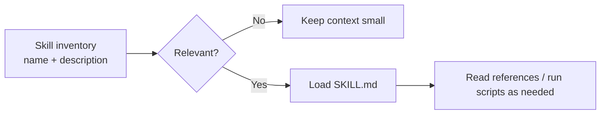

# Skills 與 Plugins：Progressive Disclosure

Skill 的核心不是「再寫一份 prompt」，而是 **讓專門知識按需進 context**。

## 為什麼要 Skill

如果你有 30 套工作流程，而每次 turn 都把 30 套完整 SOP 塞進 prompt：

- context 成本爆炸；
- 相似 instructions 互相干擾；
- prompt cache 變差；
- 模型更難選正確流程。

Skill 採 progressive disclosure：初始只暴露 name + description；模型/使用者決定使用後，才載入完整 `SKILL.md`，必要時再讀 references/scripts/assets。



## Skill 典型結構

```text
my-skill/
├─ SKILL.md
├─ references/
│  └─ api-conventions.md
├─ scripts/
│  └─ validate.sh
├─ assets/
└─ agents/
   └─ openai.yaml   # 若該格式/版本適用
```

`SKILL.md` 應該描述：

- 何時用；
- 何時不要用；
- input / assumptions；
- procedure；
- validation；
- output expectation。

## Description 是 Routing Interface

因為完整內容尚未載入，模型主要靠 description 判斷是否要用 Skill。因此 description 不能只有：

```yaml
description: Helps with databases.
```

應改成明確 scope：

```text
Use when reviewing or writing PostgreSQL/Supabase queries, schema changes,
indexes, RLS policies, or diagnosing unnecessary DB load. Do not use for
pure frontend state or static data.
```

## Explicit vs Implicit Invocation

Codex 可以讓 user 明確選 Skill，也可以根據描述做 implicit matching。兩者的設計用途不同：

- 明確：高控制、可預測。
- 隱式：低摩擦，但 routing description 必須很好。

高風險流程（release、prod migration）通常應偏向明確 invocation，避免「模型覺得好像相關」就自行進入流程。

## Scripts 的價值

能 deterministic 檢查的事，不要全靠 LLM：

```bash
scripts/check-schema-drift.sh
scripts/validate-migration-order.py
scripts/collect-benchmark.sh
```

Skill 讓模型知道何時執行 script、怎麼解釋結果；script 負責精確操作。

## Plugin 是什麼位置？

可以把 Plugin 想成更高一層的 distribution unit：把技能、工具/MCP、設定或相關能力打包成可安裝/選擇的 capability bundle。

概念分工：

```text
Skill  → 教 agent「怎麼做一類工作」
MCP    → 給 agent「新的外部工具」
Plugin → 把一組能力以可分發方式組合
```

具體 plugin 格式仍在快速演進，應以當前 Codex docs/source 為準。

## 何時該把 AGENTS.md 拆成 Skill？

如果一段內容符合任一條：

- 只有 <20% tasks 用到；
- 超過數十行 SOP；
- 有專用 references/scripts；
- 有明確 trigger；
- 未啟用時不該影響一般 coding；

就值得拆成 Skill。

## 來源

- [Build skills](https://learn.chatgpt.com/docs/build-skills)
- [`codex-rs/skills`](https://github.com/openai/codex/tree/main/codex-rs/skills)
- [`codex-rs/plugin`](https://github.com/openai/codex/tree/main/codex-rs/plugin)
