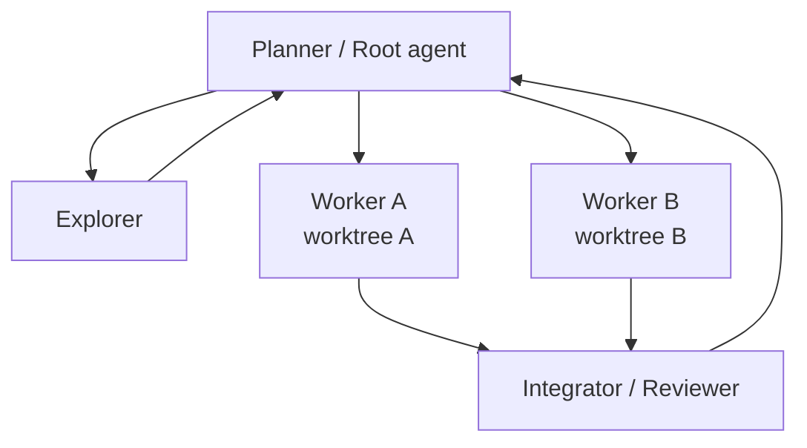

# Subagents 與 Git Worktrees

Subagent 解的是「把問題分解並平行化」，worktree 解的是「讓多個寫入工作彼此隔離」。兩者結合，才真正適合 parallel coding。

## 內建 Agent Roles

Codex 提供像 default、worker、explorer 這類 built-in role，並可透過 user/project agent config 定義專門 agent。

常見角色：

- Explorer：大量讀 code、找 dependency/impact。
- Worker：實作明確子任務。
- Reviewer：檢查 diff/test/security。
- Domain specialist：DB、frontend、infra。

## 什麼時候適合平行

**適合：**

- 讀取型 repository exploration；
- 多個互不依賴的 research questions；
- tests / logs / static analysis 分流；
- 多套方案比較；
- 對不同 package 做 impact analysis。

**不適合：**

- 大量 agent 同時修改同一批檔案；
- 任務依賴同一個尚未決定的 API contract；
- 很小、序列化就能快速完成的工作。

Subagents 會增加 token/coordination cost，不是「越多越聰明」。

## Worktree 解決寫入衝突

Git worktree 讓同一 repository 的不同 branch 有獨立 working directory：

```text
repo-main/         main
worktree-a/        feat/auth
worktree-b/        feat/cache
```

Agent A/B 可以各自 build/test/modify，而不是共享一個 dirty working tree。

Codex 目前也提供 managed worktree 相關能力，讓 parallel task 更自然。

## Planner / Workers / Integrator Pattern



關鍵不是 hierarchy 漂亮，而是明確 contract：

- 每個 worker 的 input；
- 可修改範圍；
- expected output；
- shared assumptions；
- merge/integration owner。

## Custom Agent 設計

一個好的 custom agent description 應該說明它為何存在：

```text
Database performance specialist. Use for PostgreSQL query plans,
index design, Supabase RLS performance, and diagnosing excessive DB reads.
Do not modify frontend code unless required to remove a data-access bug.
```

再搭配 developer instructions、model/effort、sandbox、MCP、skills 等配置。

## 不要讓 Subagent 自己發明組織

平行 agent 最常見失敗：

1. 所有人都先重讀同一堆檔案，浪費 token。
2. 兩個 worker 同改同一 interface。
3. 沒有 integrator，產出彼此矛盾。
4. worker 回傳超長報告，root context 被塞爆。

Root agent 應先切清楚問題與 output contract。

## 來源

- [Subagents](https://learn.chatgpt.com/docs/agent-configuration/subagents)
- [Git worktrees](https://learn.chatgpt.com/docs/environments/git-worktrees)
- [`codex-rs/core/src/agent.rs`](https://github.com/openai/codex/blob/main/codex-rs/core/src/agent.rs)
