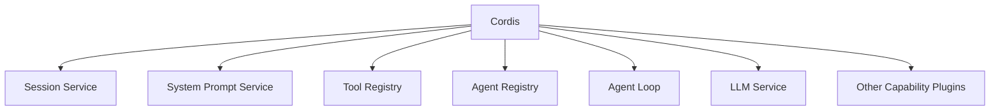
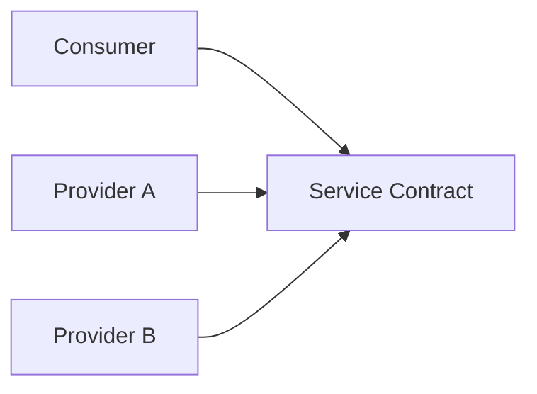
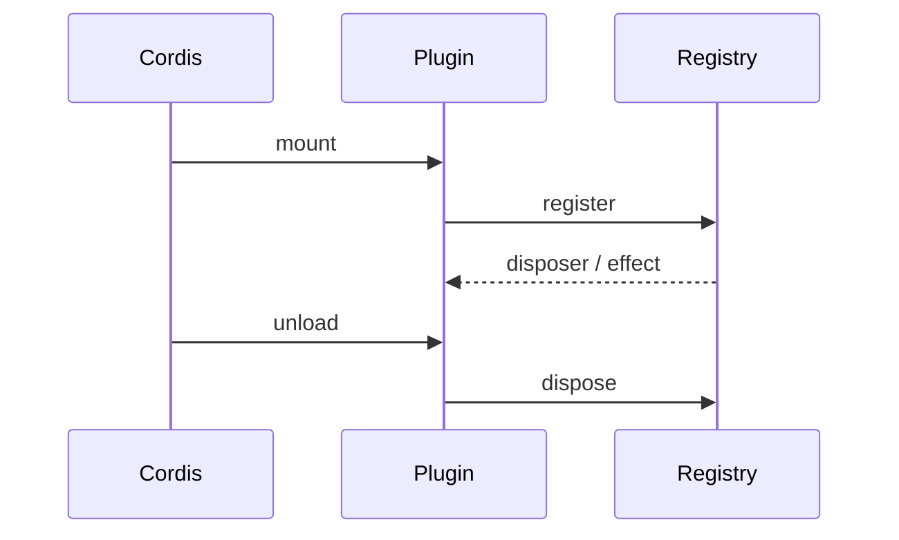
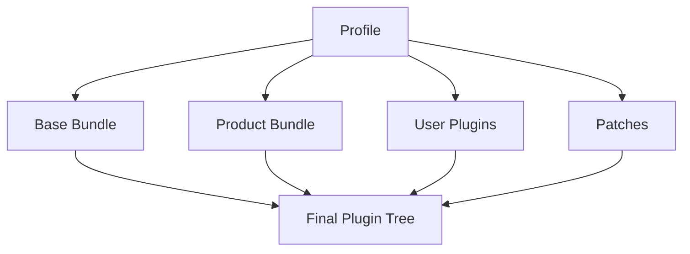

# Cordis 與 Everything-is-a-Plugin 架構

DeepSeek Harness 最關鍵的架構選擇不是某個 Tool，而是：

> **Runtime responsibility 本身由 Plugin / Service Composition 組成。**

讀這套系統時，先不要把它想成「一個 Agent Core 再加外掛」，而要先問：

```text
Service Definition 在哪？
Provider 是誰？
Consumer 是誰？
哪個 Profile / Bundle 把它們 mount 起來？
```

## Cordis 是 Composition Kernel



Cordis 負責：

- plugin mount / unload；
- dependencies；
- shared context services；
- typed events；
- scoped context；
- reversible effects。

真正的 Agent 能力由 Plugins 提供。

## 六個 Spine Capability

| Package / Seam | 責任 | Context Key |
|---|---|---|
| Session | durable event log | `ctx.sessions` |
| System Prompt | ordered prompt contributions | `ctx.systemPrompt` |
| Tools | registry + execution pipeline | `ctx.tools` |
| Agent | registry / live agent surface | `ctx.agents` |
| Agent Loop | concrete loop driver | `ctx.agentLoop` |
| LLM | model vocabulary + adapters | `ctx.llm` |

這六個足以先看懂一個基本 Agent 如何被 composition 起來。

## Service / Provider / Consumer

把 capability seam 想成插座：



Consumer 不應硬綁某個 backend。

例如 filesystem：

```text
Tool / LSP / Runtime Consumer
→ ctx.fs
← Local FS Provider
← Remote FS Provider
← Test Provider
```

同樣模式可用在：

```text
LLM
Subprocess
Shell
Sandbox
Storage
Telemetry
Subagent
Code Runtime
```

這就是 Capability Seam。

## Reversible Effects

Plugin mount 時可能：

```text
register service
register event handler
register tool
register command
start scoped resource
```

Cordis 希望這些 effect 在 unload 時可以一起撤銷。



這對 HMR、test、dynamic runtime composition 很重要。

## Profile / Bundle：Runtime 是怎麼被組出來的？



Profile 是具名 composition；Bundle 是可重用 composition layer；Patch 可以覆寫後面的 runtime tree。

因此 troubleshooting 時要問的是：

> **這個 capability 在當前 tree 裡是否真的有 Provider？**

不是只問 npm package 有沒有安裝。

## Turn / Step 與 Composition

Loop 會消費：

```text
sessions
llm
tools
systemPrompt
agents
```

但高階 policy 並不一定寫在 loop 裡。

例如：

```text
compaction
retry
permission
sandbox
subagents
UI
```

可以透過 service / event extension points 接入。

這條規則讓 concrete loop 保持相對聚焦。

## Plugin-first 的優點

- backend 可以替換；
- Runtime 可以依用途組成不同 Profile；
- test 可以用 fake providers；
- UI / transport 也能成為 composition；
- dynamic mount / teardown 更自然；
- Harness research 可以控制單一變因。

## 代價

需要理解：

```text
service
provider
consumer
scope
realm
effect
profile
bundle
patch
```

抽象越一般化，integration / ownership decision 也越多。

所以 composability 不是免費的彈性，而是把更多架構責任交給 runtime builder。

## 閱讀 Source 的固定順序

遇到一個功能，例如 Sandbox：

```text
1. 找 Service Definition
2. 找 Provider implementations
3. 找 Consumers
4. 找 events / guards
5. 找 Profile / Bundle composition
6. 最後才追 function call
```

這比直接從一個 implementation file 往下鑽更符合 DeepSeek 的設計。

## 本章重點

1. **Cordis 是 composition kernel，不是完整 Agent 本身。**
2. **Runtime responsibilities 透過 Service / Provider / Consumer 解耦。**
3. **Profile / Bundle / Patch 決定真正 boot 出來的 Plugin Tree。**
4. **Reversible effects 讓 dynamic composition 能被正確 teardown。**
5. **讀 DeepSeek source 時，先追 capability seam，再追 call graph。**

## 官方來源

- [DeepSeek Harness Architecture](https://github.com/deepseek-ai/deepseek-harness/blob/master/docs/architecture.md)
- [Core subsystem](https://github.com/deepseek-ai/deepseek-harness/blob/master/docs/subsystems/core.md)
- [`packages/README.md`](https://github.com/deepseek-ai/deepseek-harness/blob/master/packages/README.md)
