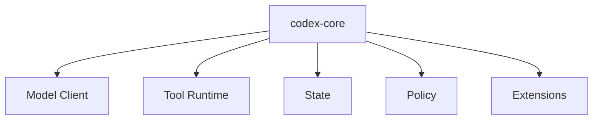
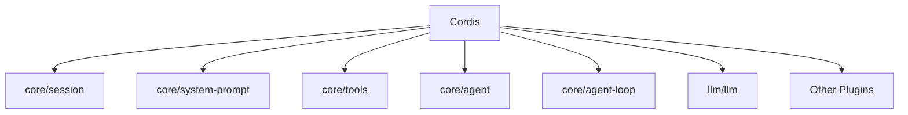
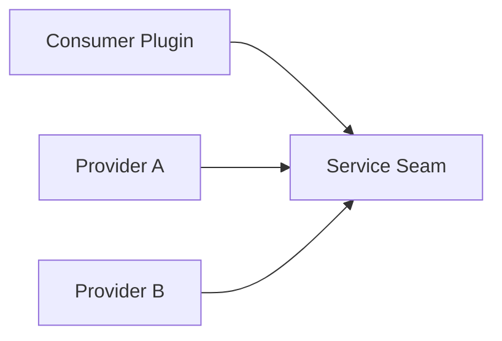
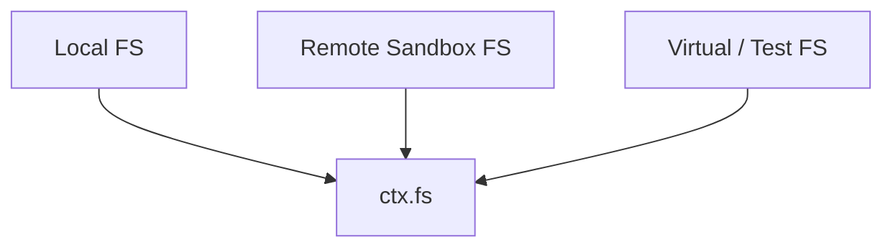
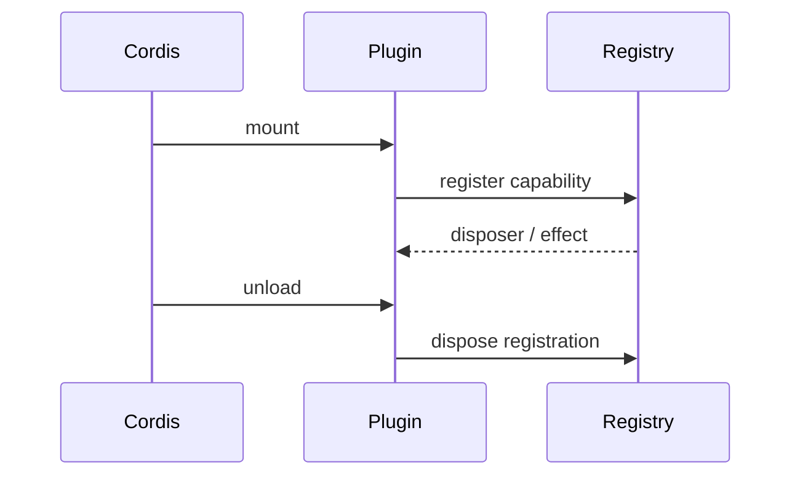
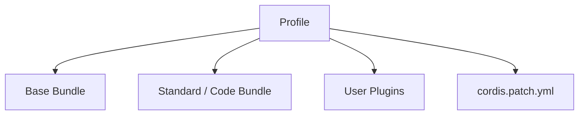
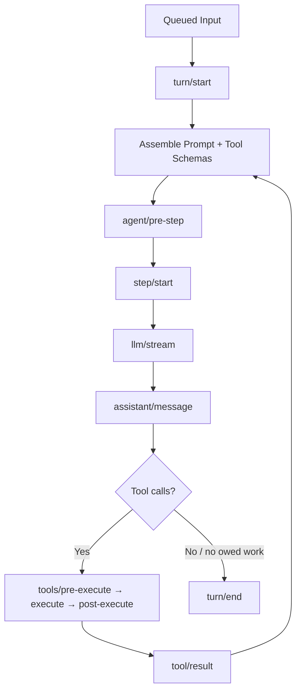
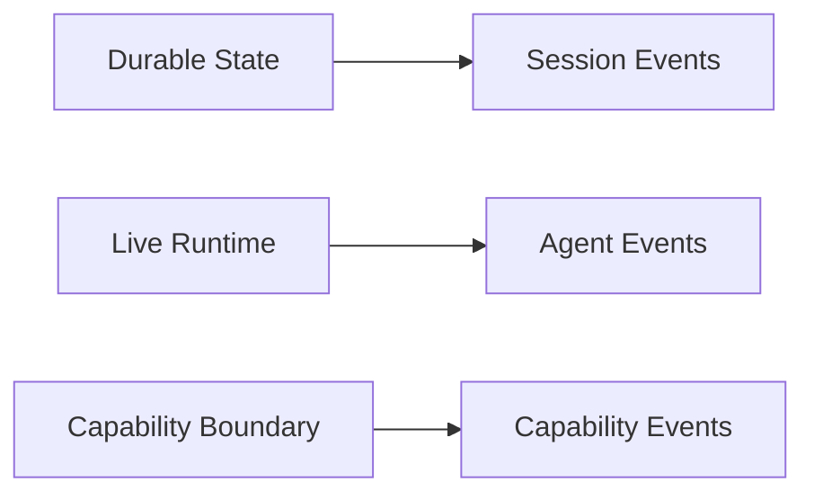

# Cordis 與 Everything-is-a-Plugin 架構

DeepSeek Harness 最關鍵的架構選擇不是某個 Tool，而是：**Runtime 本身由 Plugin Tree 組成。**

## 先從 Codex 熟悉的世界轉過來

Codex 比較容易畫成：



DeepSeek Harness 則更像：



這不是說 DeepSeek 沒有 core package，而是這些 package 仍以 Cordis service / event / plugin 的方式組合。

## 六個先理解的 Spine Package

官方架構文件列出的核心骨架可以先整理成：

| Package | 責任 | 主要 Context Seam |
|---|---|---|
| `core/session` | append-only SessionEvent log | `ctx.sessions` |
| `core/system-prompt` | system prompt sections + tool schema assembly | `ctx.systemPrompt` |
| `core/tools` | tool registry + guarded execution | `ctx.tools` |
| `core/agent` | Agent interface / registry / live events | `ctx.agents` |
| `core/agent-loop` | 預設 concrete loop driver | `ctx.agentLoop` |
| `llm/llm` | model message / streaming vocabulary + adapter seam | `ctx.llm` |

最重要的是依賴方向：

> Extension 應依賴 service seam，而不是直接綁定某個 concrete loop implementation。

## Service Provider 與 Consumer

可以用「插座」理解。



例如 filesystem consumer 不應該硬寫：

```text
Local Node fs
```

而是依賴：

```text
ctx.fs
```

那麼 backend 可以換成：



同樣概念可以套到：

- LLM；
- subprocess；
- shell；
- sandbox；
- storage；
- terminal；
- telemetry。

這就是 **Capability Seam**。

## 為什麼「沒有 Privileged Core」很重要？

假設你想加一個新的 model provider。

在 plugin-first 的設計裡，理想路徑是：

```text
新增 Adapter Plugin
→ register 到 ctx.llm
→ 現有 Agent Loop 繼續消費同一個 seam
```

不是：

```text
修改核心 switch-case
→ 改 agent loop
→ 改 UI
→ 改 storage
```

再例如你想換 sandbox：

```text
Local sandbox provider
↓ replace
Remote container provider
```

依賴 `ctx.sandbox` 的 consumer 不應因此全部重寫。

## Plugin Lifecycle 不只是「載入 JS」

Cordis 的重要觀念是 reversible effects。

Plugin mount 時可能：

```text
register service
register event handler
register tool
register command
```

Plugin unload 時，對應 effect 應一起撤銷。



這讓 Runtime composition 可以比「程式啟動時註冊一次全域 singleton」更動態。

## Profile 與 Bundle

一個執行中的 `dsh` 可以理解成由多層 composition 組出的 Plugin Tree。



Profile 的價值不是只切換設定值，而是切換「這個 Runtime 由哪些能力組成」。

因此可以有：

```text
standard profile
code profile
minimal profile
creator profile
company-internal profile
benchmark profile
```

## Turn / Step 流程

DeepSeek 的詞彙和 Codex 不完全相同。

- **Session**：durable event stream 的邊界。
- **Turn**：從輸入被 claim 到沒有待完成工作為止。
- **Step**：一次 model request，加上該 step 產生的 tool calls。

簡化流程：



與 Codex Agent Loop 的本質相似，但 DeepSeek 把中間 seam 與事件公開得更強烈。

## 三種 Event Domain

官方架構可概括成三種用途：

### Session events

**Durable facts**。需要 reload 後仍存在，就應進 Session log。

### Agent events

**Live work in flight**。用於攔截 request、step、status、continuation 等 runtime 行為。

### Capability events

**在 service seam 周圍掛 policy / adapter / observation**，例如 tools / fs / telemetry。

可以畫成：



## 這種架構的優點

- Model provider 容易替換。
- Loop 本身有清楚 abstraction boundary。
- Sandbox / filesystem / storage 可換 backend。
- Plugin 可動態 mount / unload。
- 很適合建立不同 purpose 的 Runtime Preset。
- 研究 Harness 時可以隔離單一變因。

## 代價

自由度不是免費的。

你需要理解：

```text
Cordis
service
provider
consumer
event
scope
realm
effect
profile
bundle
```

才能真正掌握整個系統。

因此 DeepSeek 的學習曲線不是「API 少」，而是**抽象層比較一般化**。

Codex 的 opinionated extension surface 反而常讓一般使用者比較容易知道：

```text
Repo rule → AGENTS.md
Workflow → Skill
External capability → MCP
Security → Permission / Rule
```

所以 plugin-first 並不是永遠比較好，而是換取更高 runtime composability。

## 官方來源

- [DeepSeek Harness Architecture](https://github.com/deepseek-ai/deepseek-harness/blob/master/docs/architecture.md)
- [Core subsystem](https://github.com/deepseek-ai/deepseek-harness/blob/master/docs/subsystems/core.md)
- [Agent Loop package](https://github.com/deepseek-ai/deepseek-harness/blob/master/packages/core/agent-loop/README.md)
