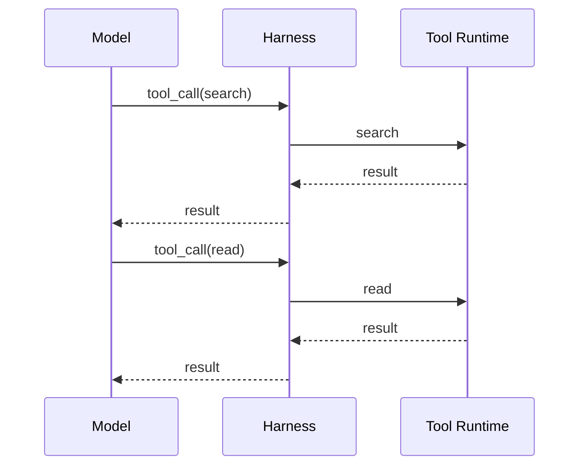
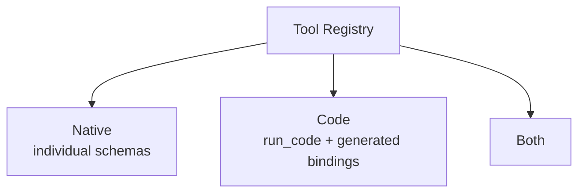
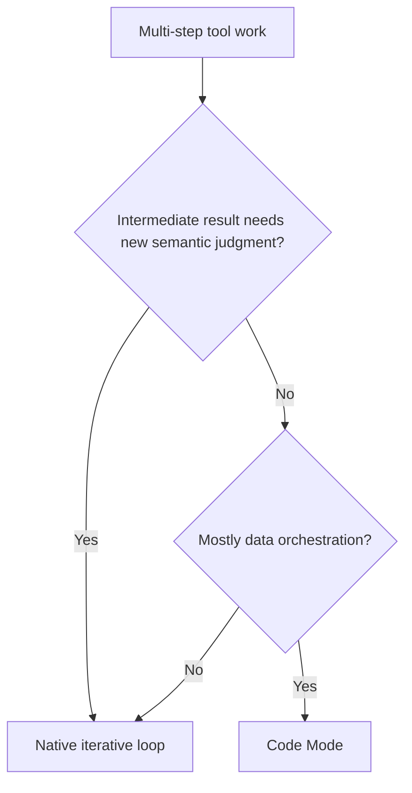
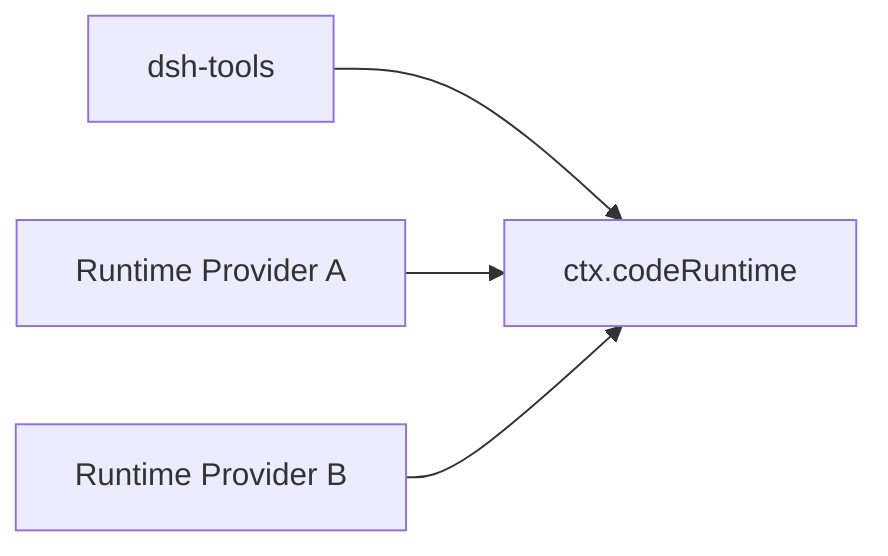
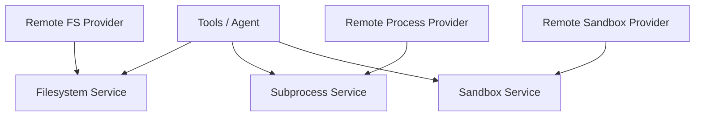

# Code Mode、Capability 與 Runtime 組合

DeepSeek Harness 的 Code Mode 很容易被看成「比較花俏的 Tool Calling」，但真正值得學的是：

> **Tool presentation、Code Runtime、Tool Pipeline、Sandbox 與 Filesystem 是不同 capability boundaries。**

## Native Tool Calling



優點是每個 Observation 都能讓 Model 重新判斷；代價是 model round trip、latency、context growth。

## Code Mode 改的是 Tool Presentation

Tool Registry 可以有不同 presentation：



Code Mode 讓 Model 產生受控 TypeScript program，利用 Runtime 暴露的 async bindings 編排多個 tool operations。

```ts
const files = await tools.search({query: 'target'})
const matches = []
for (const file of files) {
  const content = await tools.read({path: file.path})
  if (content.includes('needle')) matches.push(file.path)
}
return matches
```

這是概念示意；實際 binding / SDK 以當前官方 contract 為準。

## 什麼工作適合 Code Mode？

### 需要新語意判斷

```text
根因是什麼？
下一步該查哪裡？
這個修改是否安全？
```

通常適合 native iterative loop。

### 主要是資料操作

```text
map
filter
aggregate
batch
bounded parallel calls
```

比較可能成為 Code Mode candidate。



## Round Trip 與 Context Pollution

Native mode：

```text
Tool A result → Model
Tool B result → Model
Tool C result → Model
```

Code Mode 可以先在 runtime 內聚合：

```text
Tool A / B / C
→ program aggregation
→ compact result
→ Model
```

所以它可能降低 model calls、tokens、latency 與 intermediate context noise。

## Code Runtime 是獨立 Capability Seam



Code Runtime 接收：

```text
program
+ named async bindings
```

回傳：

```text
value
logs
error
```

它不需要知道每個 Tool 的業務語意。

## Code Mode 不能繞過 Tool Security Pipeline

生成 program 不代表 program 可直接任意碰 OS。

理想路徑仍是：

```text
Generated Program
→ Code Runtime
→ Tool Binding
→ Tool Registry / Guards / Approval
→ Executor / Sandbox
→ Result
```

所以 Code Mode 是 orchestration layer，不應成為 bypass policy 的 escape hatch。

## 為什麼 Capability Composition 很重要？

假設同一個 Agent 要從 local workspace 移到 remote execution world。

不希望做：

```text
read_local → read_remote_v2
bash_local → bash_remote_v2
edit_local → edit_remote_v2
```

更理想是 consumer 依賴 capability seams：



Model-facing Tool 可以維持較穩定，execution backend 則由 composition 替換。

## 新能力應放在哪個 Boundary？

### 新 Model

```text
LLM Adapter / Provider
```

### 新 Tool

```text
ctx.tools provider / registration
```

### 新 Filesystem / Process backend

```text
FS / subprocess provider
```

### 新 Sandbox

```text
sandbox provider / execution world
```

### 新 Agent lifecycle behavior

```text
agent/* typed events / plugin
```

### 新 Durable State

```text
SessionEvent / persistence contract
```

### 新 UI / Client

```text
Host / Client / SDK / ACP / typed remote APIs
```

這就是 Plugin-first 真正的工程含義：**不同 responsibility 有清楚 seam，而不是所有新功能都塞進 Agent Loop。**

## Plugin-first 的優點

- backend replaceability；
- controlled experiments；
- profile-specific runtime；
- model independence；
- remote execution composition；
- test doubles / alternate providers。

## Plugin-first 的代價

- dependency graph 更複雜；
- event interception 會增加 control-flow debugging 成本；
- profile differences 可能造成 runtime drift；
- seam 過多會製造 abstraction tax；
- developer preview 階段的 compatibility pressure 更高。

所以原則不是「拆得越碎越好」，而是：

> **真正需要替換、隔離、測試、組合的 runtime responsibility，才值得有 formal seam。**

## 放進三套共同座標

Code Mode 本身是 DeepSeek 特有的 orchestration answer；其他 Harness 可以用不同方式解多步 Tool orchestration。比較章會再討論 Tool / Workflow boundary，這裡不把 DeepSeek 專章寫成兩方競賽。

## 本章重點

1. **Code Mode 是 Tool presentation / orchestration strategy。**
2. **它適合 map / filter / batch 類工作，不一定適合每個需要新語意判斷的步驟。**
3. **Code Runtime 是獨立 capability seam。**
4. **Code Mode 仍應經過相同 Tool policy / sandbox boundary。**
5. **DeepSeek 的重點不是「什麼都是 Plugin」，而是需要替換的 responsibility 有一致 composition contract。**

## 官方來源

- [DeepSeek Harness official page](https://deepseek.com/harness/en/)
- [Code Mode implementation note](https://github.com/deepseek-ai/deepseek-harness/blob/master/.agents/notes/implemented/feature/2026-06-15-code-mode.md)
- [DeepSeek Harness Architecture](https://github.com/deepseek-ai/deepseek-harness/blob/master/docs/architecture.md)
- [Tools subsystem](https://github.com/deepseek-ai/deepseek-harness/blob/master/docs/subsystems/tools.md)
