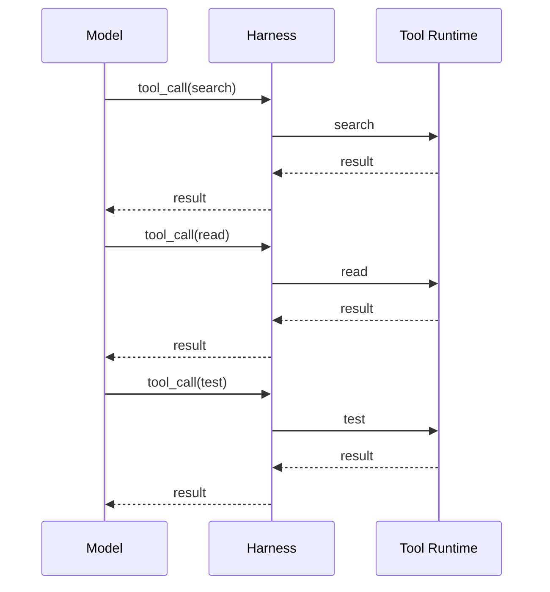
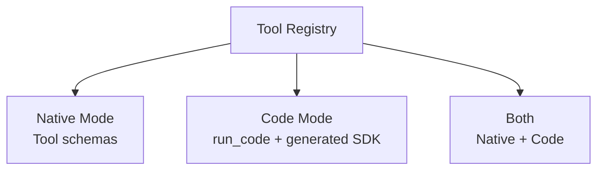
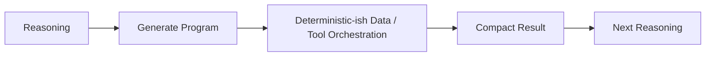
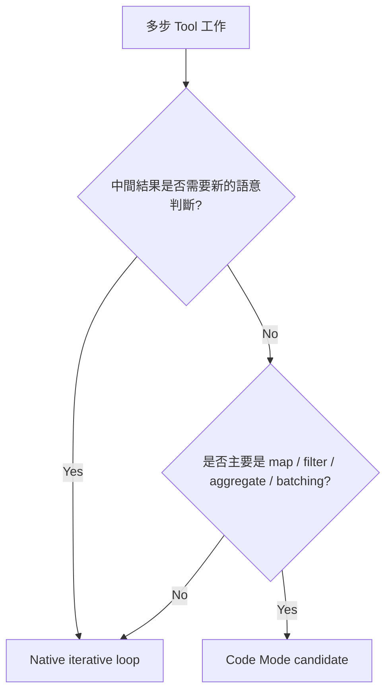
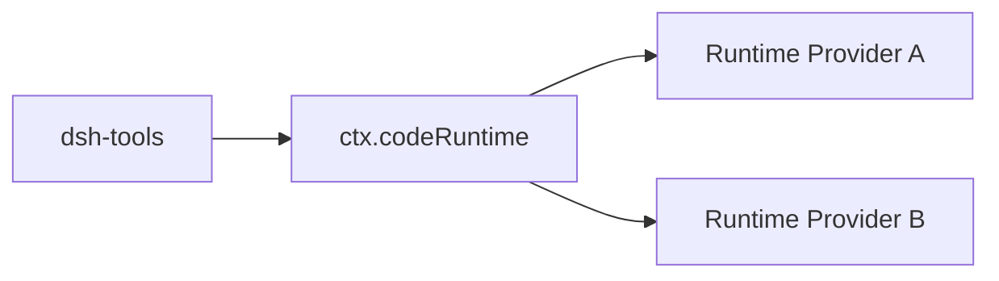
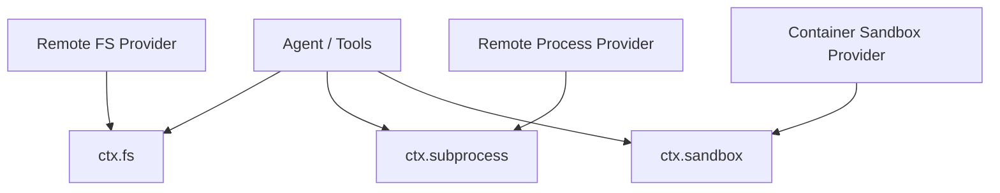

# Code Mode、Capability 與 Runtime 組合

DeepSeek Harness 最容易讓人覺得「跟一般 Function Calling 不一樣」的功能，是 **Code Mode**。

但 Code Mode 不是孤立功能；它其實展示了 DeepSeek Harness 的核心哲學：

> **Tool presentation、Code Runtime、Sandbox、Filesystem、LLM 都應是可以被組合的 Capability，而不是焊死在 Agent Loop 裡。**

## 先看普通 Tool Calling

一般 Agent Loop：



每一輪的好處是模型可以根據最新結果重新判斷。

代價則是：

- inference round trip 多；
- latency 增加；
- 中間 Tool Result 全部進 context；
- 大量簡單資料處理也要模型介入。

## Code Mode 在改什麼？

Code Mode 會讓 Tool Runtime 不一定把每個 capability 都直接暴露成 function schema。

它可以改成只暴露一個受控 transport，例如 `run_code`，並在 prompt 中提供生成的 SDK type definition。

概念：



官方實作目前把 Tool presentation mode 分成類似：

```text
native
code
both
```

## Model 寫的是 Tool Orchestration Program

假設目標是：

> 找出 20 個符合條件的檔案，讀取內容，過濾結果，再執行幾個檢查。

普通模式可能是：

```text
model
→ search
→ model
→ read file 1
→ model
→ read file 2
→ model
→ ...
```

Code Mode 可以更接近：

```ts
const files = await tools.search({query: '...'})
const matches = []

for (const file of files) {
  const content = await tools.read({path: file.path})
  if (content.includes('target')) {
    matches.push(file.path)
  }
}

return matches
```

注意：這是**概念示意**，實際 SDK / binding 以當前 DeepSeek Harness 版本為準。

## 為什麼這可能更有效率？

可以把工作分成兩種：

### 需要智能判斷

```text
這個錯誤的真正根因是什麼？
下一步該查哪裡？
這個修改是否合理？
```

適合讓 Model 每輪重新 reasoning。

### 只是資料操作

```text
foreach
filter
map
aggregate
if
parallel calls
```

這些若每一步都重新 inference，常常很浪費。

Code Mode 的思想是：



## Round Trip 與 Context Pollution

傳統模式：

```text
Tool A result
→ context
Tool B result
→ context
Tool C result
→ context
```

Code Mode 可以先在 Runtime 內聚合：

```text
Tool A
Tool B
Tool C
↓
Program aggregates
↓
compact result
↓
Model
```

因此它可能降低：

- model calls；
- tokens；
- latency；
- intermediate context noise。

## 但 Code Mode 不一定比較好

如果每個 Tool Result 都會改變下一個高層決策，那讓 Model 每輪看到結果反而比較安全。

例如：

```text
修改 production config
→ inspect result
→ 決定是否繼續
```

不應該只是因為 Code Mode 能寫 loop，就一次執行十個不可逆操作。

所以可以用這個判斷：



## Code Runtime 是獨立 Capability Seam

這是架構上最值得注意的點。

官方設計不是讓 Tool Runtime 自己偷偷 `eval()` model code，而是把 code execution 抽成獨立 service：



Code Runtime 接收：

```text
program
+
named async bindings
```

然後回傳：

```text
value
logs
error
```

它不需要知道每個 Tool 的業務語意。

這讓安全與 execution backend 可以獨立演進。

## Capability 組合的真正價值

假設你要一個 Remote Coding Agent。

理想架構不是：

```text
把所有 local tool 重寫成 remote-tool-v2
```

而是：



Tool 依賴 capability seam，backend 可以換掉。

這就是 DeepSeek Harness 比較「framework-like」的地方。

## Plugin 應該放在哪裡？

DeepSeek 官方 architecture 提供非常清楚的分類思維。

### 新模型

```text
register adapter on ctx.llm
```

### 新 Tool

```text
register capability on ctx.tools
```

### 新 Filesystem / Policy

```text
ctx.fs provider / fs events
```

### 新 Sandbox

```text
ctx.sandbox backend
```

### 攔截 Agent Request

```text
agent/* events
```

### Durable State

```text
SessionEventMap
```

### UI

```text
drive ctx.agents
render session/event
```

這和 Codex 的「Skill / MCP / Hook / Rule / App Server」分類方法很不同。

## DeepSeek 的 Plugin-first 優點

```text
replaceability
composability
experimentation
per-profile runtime design
model independence
backend independence
```

尤其適合：

- Harness research；
- multi-model platform；
- remote execution platform；
- benchmark environment；
- 公司內部有自訂 storage / sandbox / LLM gateway 的情境。

## Plugin-first 的風險

越通用的 abstraction，也越需要 discipline。

常見風險：

- 為了「可替換」而做太多 interface；
- Plugin dependency graph 變複雜；
- Event interception 太多後難以追蹤 control flow；
- 每個 team 都組不同 Runtime，行為不一致；
- developer preview 下 API churn 成本較高。

因此「Everything is a Plugin」不是代表：

> 所有功能都應拆得越碎越好。

而是：

> **真正需要替換、隔離、組合的 runtime responsibility，應有清楚 seam。**

## 本章記住四件事

```text
1. Code Mode 是 Tool presentation strategy，不只是 gimmick。
2. 它把多步 Tool orchestration 移到受控 TypeScript program。
3. Code Runtime 是獨立 capability seam。
4. DeepSeek 的強項是可以把 Model / Loop / FS / Sandbox / Storage 一起重新組合。
```

## 官方來源

- [DeepSeek Harness official page](https://deepseek.com/harness/en/)
- [Code Mode implementation note](https://github.com/deepseek-ai/deepseek-harness/blob/master/.agents/notes/implemented/feature/2026-06-15-code-mode.md)
- [DeepSeek Harness Architecture](https://github.com/deepseek-ai/deepseek-harness/blob/master/docs/architecture.md)
