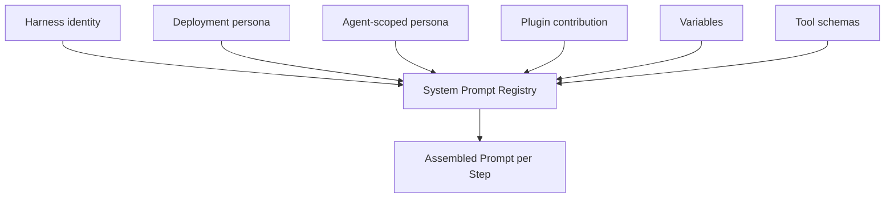
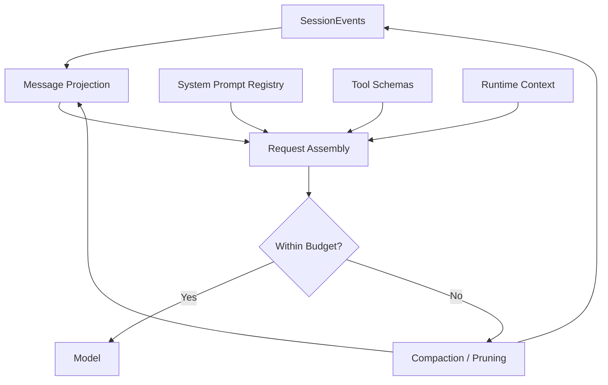

# Context、System Prompt 與 Compaction

DeepSeek Harness 把「Model 這一輪看到什麼」拆成幾個可獨立理解的責任：

```text
System Prompt Registry
Session Event Projection
Tool Schemas
Runtime Context
Compaction / Pruning
```

因此 Context 並不是 Agent Loop 裡隨手 concat 的一串字串。

## System Prompt 是 Registry，不是單一字串

`ctx.systemPrompt` 可以收集有順序的 sections，以及 runtime variables / tool schemas。



這種設計有兩個好處：

1. 不同 Plugin 可以貢獻自己的 prompt section，而不必共同修改中央模板。
2. scope 可以決定某個 agent 是否看到不同 persona / context。

## 每個 Step 都重新 Assemble

Agent Loop 在進入 Model Request 前，會根據當前 scoped context 組出完整 request。

概念上：

```text
system prompt sections
+ selected tool schemas
+ derived message history
+ provider/model settings
= effective request
```

這讓動態 composition 可以在下一個 Step 生效，但也代表：如果某個 plugin 改變 system text 或 schema，prompt cache reuse 可能從那個 token boundary 失效。

## Message History 從 SessionEvents 投影

DeepSeek 的 durable source of truth 不是單純 `messages[]`。


Raw stream chunks、某些 lifecycle events、audit-only facts 不一定會直接變成 Model message。

反過來，如果某個 durable fact 會影響未來 Model decision，就應有可重建的 Session representation。

這就是「Model-visible means logged」的工程價值。

## Live Context Injection 與 Durable Fact 要分開

Plugin 可以在 lifecycle 中加入 runtime context，但要先問：

```text
這段資訊只對這一 Step 有效？
還是未來 resume 之後也必須存在？
```

如果是前者，可以是 live contribution；如果是後者，就應考慮寫入 Session event / durable state。

否則重啟後 Model 看到的世界可能和原本 trajectory 不一致。

## Compaction 是 Capability Family

Context 壓力出現時，DeepSeek 不只提供一個 hard-coded summarize function。

可以把 compaction family 想成：

```text
pressure detection
→ select old surface history
→ summarization provider
→ replacement / compacted projection
```

另外還有 model-free 的 Tool Result pruning：對巨大 tool output 先做 deterministic reduction，不一定每次都要花一次 Model Call 摘要。

## Summarization 與 Tool-result Pruning 不同

### Summarization

適合保存：

```text
goal
constraints
decisions
verified facts
unresolved work
important identifiers
```

### Tool-result Pruning

適合：

```text
巨大 log
重複 output
可以重新查詢的 raw content
```

兩者目的不同：前者保存 knowledge，後者降低無謂 context volume。

## Compaction 必須和 Replay 一起思考

Event-sourced system 不能只在 memory 中「把舊 messages 刪掉」。

需要明確回答：

- 哪些 old facts 被 compacted representation shadow？
- resume 時如何產生相同 projection？
- query / audit 是否仍能讀取原始 event？
- compaction event 本身是否符合 invariant？

這也是 DeepSeek 把 compaction、session、projection 分開的原因。

## Prompt Contribution 不等於 Security Policy

Plugin 可以加入：

```text
「不要執行 destructive command」
```

但這仍然是 model guidance。

真正 enforcement 應在：

```text
tools/pre-execute
guards
approval
sandbox
credential boundary
```

所以 System Prompt Registry 雖然可組合，仍不應承擔所有 policy responsibility。

## 一個完整的 Context Path



## 本章重點

1. **System Prompt 是可組合 Registry，而不是唯一中央字串。**
2. **Model history 從 SessionEvents 投影，durable state 與 message array 分離。**
3. **每個 Step 都重新組 request，composition change 可能影響 cache reuse。**
4. **Compaction 與 deterministic Tool-result pruning 是不同手段。**
5. **會影響未來 decision 的 facts 必須有可重建的 durable representation。**

## 官方來源

- [`system-prompt`](https://github.com/deepseek-ai/deepseek-harness/tree/master/packages/core/system-prompt)
- [`compaction`](https://github.com/deepseek-ai/deepseek-harness/tree/master/packages/compaction)
- [Session subsystem](https://github.com/deepseek-ai/deepseek-harness/blob/master/docs/subsystems/session.md)
