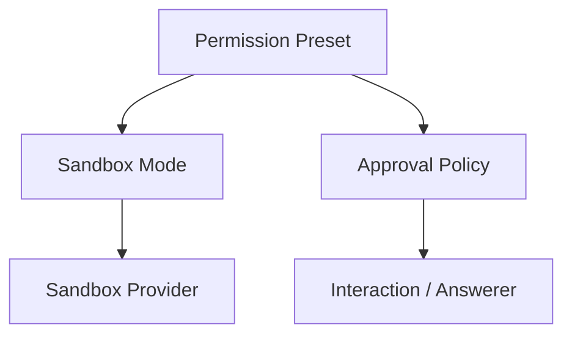
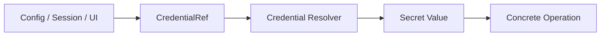
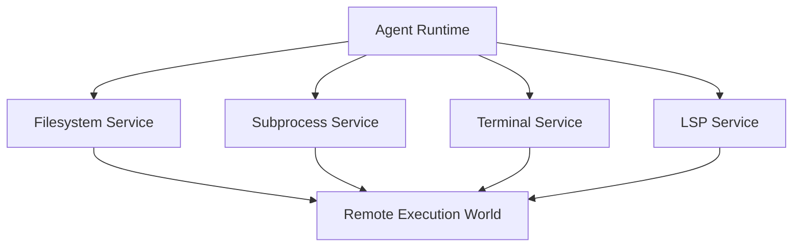
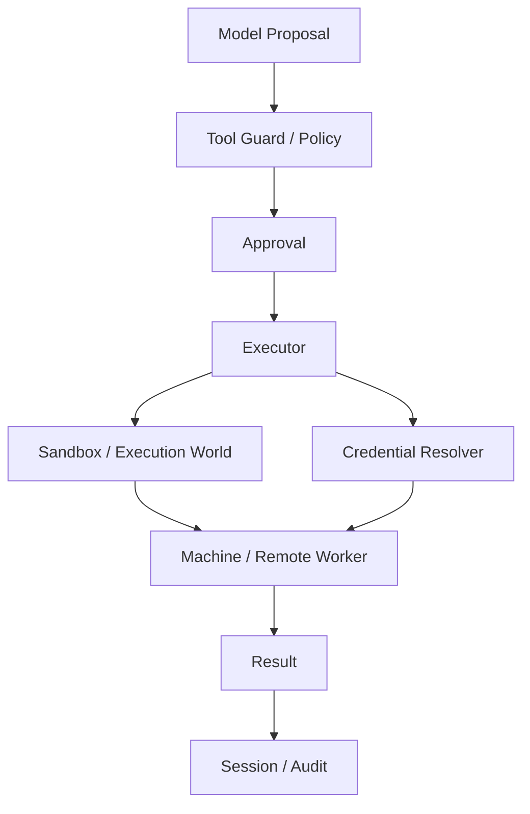

# Permission、Credentials 與 Execution Worlds

DeepSeek Harness 的安全模型不只是一個 `sandboxMode`。真正的 execution boundary 由多個 responsibility 一起形成：

```text
Permission Preset
Approval
Sandbox
Credentials
Filesystem / Subprocess / Terminal
Remote Execution World
```

## Permission Preset 是產品層組合

Permission Preset 可以把：

```text
Sandbox Mode
+
Approval Policy
```

包成使用者看得懂的選項。

但 preset 本身不是 enforcement。



真正的限制仍由 sandbox / execution provider 實作。

## Approval 與 Sandbox 是不同問題

```text
Approval
→ 這一次 action 是否被授權？

Sandbox
→ 即使 process 執行了，技術上能造成哪些 effect？
```

只有 approval、沒有 sandbox，代表一旦某個 tool / plugin 繞過 application policy，OS boundary 仍可能很寬。

只有 sandbox、沒有 approval，則缺少「這一次是否值得放行」的人類 decision boundary。

## CredentialRef：不要讓 Secret 到處流動

DeepSeek 將 credential reference 與真正 secret value 分開。



這樣可以避免：

```text
API key
→ 被當普通 config string
→ 寫進 Session Event
→ 出現在 Plugin Tree dump
→ 被 UI / telemetry 複製
```

Production Harness 應讓 secret 在真正 operation 邊界才被 resolve。

## Process Confinement 與 Execution World 不是同一件事

如果只是把本機 process 關進 sandbox：

```text
Agent
→ local filesystem / shell
→ sandbox wrapper
→ local OS
```

這仍然是「同一個 execution world」。

但如果真正工作環境在 container、microVM、remote worker：



那通常不是只替換 `ctx.sandbox` 就夠，而是整組 capability 都應指向同一個 world。

## 為什麼這個區分重要？

假設 Shell 已遠端執行，但 Filesystem 還讀本機：

```text
Model 看見的檔案
≠
Command 真正執行的檔案
```

這會造成非常難 debug 的 split-brain environment。

所以 remote execution design 應先定義：

```text
workspace identity
filesystem
process
terminal
network
credentials
LSP / code runtime
```

是否共享同一個 execution world。

## Sandbox Enforcement Strength

DeepSeek 的 sandbox provider 會回報：

```text
full
partial
```

這個設計值得保留到任何自製 Harness：

> **如果平台能力只能部分滿足 policy，不應假裝 enforcement 已完整成立。**

Caller 可以再決定：

```text
partial 可接受
或
fail closed
```

## Credentials 與 Remote Worker

Remote execution 常帶來另一個問題：secret 要在哪裡 resolve？

較安全的模式通常不是把所有 host secrets 直接傳進 worker，而是：

```text
operation declares credential reference
→ policy checks scope
→ resolver chooses where secret is materialized
→ worker gets minimum necessary credential
```

這讓 credential boundary 和 execution boundary 可以協同設計。

## Plugin Trust 也是安全問題

Composable runtime 代表 plugin code 本身可能：

- 註冊 tools；
- 提供 services；
- 攔截 events；
- mount / unmount runtime capability。

所以 production 還要治理：

```text
plugin provenance
version pinning
allowed package sources
configuration review
capability ownership
upgrade regression tests
```

Sandbox 只能限制部分 side effect，不能替代 plugin supply-chain governance。

## 一張安全責任圖



每一層都回答不同問題。

## 本章重點

1. **Permission Preset 是 UX 組合，不是 OS enforcement。**
2. **Approval、Sandbox、Credential 是不同 security responsibility。**
3. **Remote execution 通常要替換整組 execution capability，而不是只包 Shell。**
4. **`full / partial` enforcement 讓安全承諾可被誠實描述。**
5. **Composable Runtime 還需要 Plugin provenance 與 supply-chain governance。**

## 官方來源

- [Sandbox](https://github.com/deepseek-ai/deepseek-harness/blob/master/docs/subsystems/sandbox.md)
- [Approval](https://github.com/deepseek-ai/deepseek-harness/blob/master/docs/subsystems/approval.md)
- [Permission Presets](https://github.com/deepseek-ai/deepseek-harness/blob/master/docs/subsystems/permission-presets.md)
- [Credentials](https://github.com/deepseek-ai/deepseek-harness/blob/master/docs/subsystems/credentials.md)
