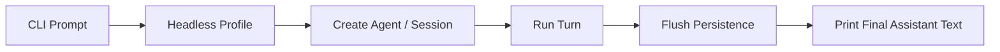

# CLI、Headless 與 Automation

理解 DeepSeek Harness 不能只看 Cordis source。真正使用時，最重要的是知道：**你啟動的是哪一個 Profile，以及這次 process 會組出什麼 Runtime。**

## `dsh web`：互動式產品入口

官方 Quick Start 可以直接：

```bash
npx @deepseek-ai/dsh web
```

`web` 是產品入口 / profile alias，不代表 Harness 只有 Web 模式。

底層仍是：

```text
Profile
+ Bundles
+ Patches
→ Final Plugin Tree
```

## Headless：一次性 Agent 工作

Headless profile 適合 automation / script：

```bash
dsh --profile headless "run the tests and summarize failures"
```

概念流程：



這和「Web UI 隱藏起來」不同；headless composition 可以只 mount automation 需要的 surfaces。

## 先學會 Inspect Runtime

DeepSeek 使用者最值得養成的習慣：

```bash
dsh --profile web --dump-config
```

以及需要時查看 default composition。

因為 debugging 的第一題應該是：

> **現在實際 mount 了哪些 Plugin / Provider？**

而不是只看 package 是否安裝。

## Composition Layer

```text
Profile bundles
→ profile cordis.patch.yml
→ Harness-home patch
→ runtime --patch
```

越後面的 layer 可以覆寫前面 composition。

這表示 CLI config troubleshooting 需要追：

```text
row 是否存在？
provider 是否被後層 replace？
dependency 是否 satisfy？
plugin 是否真的 mount？
```

## Automation 的成功條件

一次 headless run 不應只看「CLI 有沒有印字」。

至少要觀察：

```text
process exit status
agent / turn completion state
final assistant output
session flush
tool failures
approval unavailable / rejected
```

特別是 unattended environment，approval policy 不應卡住等人回答。

## CI 中的 Permission 設計

CI 常見原則：

```text
不需要 write → read-only
需要 workspace edit → workspace-write
需要危險 action → 不應因為 CI 無人回答就自動放寬
```

`ApprovalPolicy=never` 的語意是 deterministic reject，而不是 auto-approve。

這對 unattended Harness 很重要。

## Profile 對 Automation 的價值

可以建立不同 composition：

```text
review profile
→ read-only + code search + tests

fix profile
→ workspace-write + selected tools

benchmark profile
→ minimal tool surface + controlled model
```

這比在同一個 mega-runtime 裡到處用 if/else 關 feature 更容易測試。

## SDK / ACP / JSON-RPC 何時比 CLI 更適合？

### CLI / Headless

適合：

- shell pipeline；
- CI step；
- simple one-shot job；
- operational debugging。

### TypeScript SDK / JSON-RPC

適合：

- 需要持續控制 agent lifecycle；
- programmatic session creation / resume；
- custom client / service integration。

### ACP

適合 automation-oriented Agent interoperability；不要把它當成完整 human interaction presentation layer。

## 一個 Production Automation Checklist

```text
[ ] pin DeepSeek Harness version
[ ] dump / snapshot effective composition
[ ] explicit model provider + credentials
[ ] explicit permission preset / sandbox mode
[ ] no interactive approval dependency
[ ] durable session / flush strategy
[ ] bounded tool/runtime timeout
[ ] capture exit code + final result
[ ] regression test profile loading
[ ] test plugin compatibility before upgrade
```

因為 project 仍處於 Developer Preview，version pinning 與 composition smoke test 特別重要。

## 本章重點

1. **`web` 與 `headless` 是不同 product/runtime composition。**
2. **`--dump-config` 應是 troubleshooting 的第一級工具。**
3. **Headless automation 要明確處理 exit、flush、permission 與 unattended approval。**
4. **Profile 可以把不同 operational risk 做成不同 runtime，而不是只切 config flags。**
5. **需要長時間 programmatic control 時，再從 CLI 升級到 SDK / JSON-RPC / ACP。**

## 官方來源

- [DeepSeek Harness README](https://github.com/deepseek-ai/deepseek-harness)
- [Architecture：Profiles and bundles](https://github.com/deepseek-ai/deepseek-harness/blob/master/docs/architecture.md)
- [`dsh-base`](https://github.com/deepseek-ai/deepseek-harness/blob/master/packages/bundle/base/README.md)
