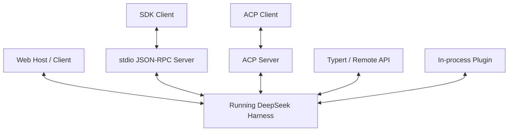
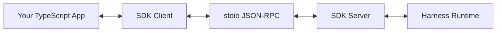
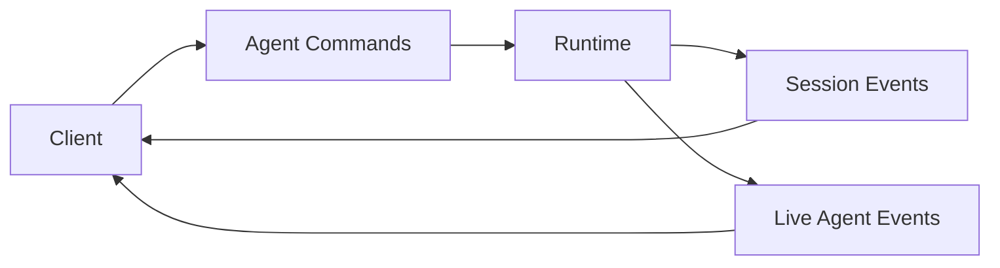

# 整合介面：Web、SDK、JSON-RPC、ACP 與自製 Client

DeepSeek Harness 沒有把所有 client integration 收斂成單一 protocol 名稱，而是提供多個用途不同的 surface：

```text
Web Host / Browser Client
TypeScript SDK
stdio JSON-RPC Server
ACP
Typert / Remote API
In-process Cordis Services
```

理解它們的關鍵不是「哪個最像 App Server」，而是：**Human UI、Runtime Client、Automation Protocol、In-process Composition 分別需要什麼 boundary。**

## 整體圖



## Web：Host 與 Client 分開

官方 package map 將 Web 產品拆成 server-side Host 與 browser-side Client。

### Host

負責：

```text
HTTP routes
API gateway
runtime boot
server-side product services
```

### Client

負責：

```text
browser shell
conversation / settings modules
UI plugin slots
wire / object services
```

UI 本身也能沿 plugin philosophy 擴充，而不是一個完全封閉 monolith。

## TypeScript SDK：跨 Process 驅動 Runtime

SDK 可以拆成：

```text
protocol
client
server
```

Server 透過 stdio JSON-RPC 對外暴露 runtime。



重要邊界是：SDK drive 已存在的 runtime executable / composition；它不是 project scaffolder。

## ACP：Automation Interoperability

ACP 適合 programmatic Agent interoperability，而不是完整 human presentation layer。

```text
Programmatic Client
↕ ACP
Harness Agent
```

同一 ecosystem 也可以把 ACP 當 subagent provider transport，讓 Root Agent 將工作委派給另一個 runtime。

所以 protocol 可以同時扮演：

```text
Harness 被外部 automation 驅動
以及
Harness 主動 delegate 外部 agent
```

## Typert / Remote API

Typert 類 capability 負責把 runtime service 描述成 typed remote surface。

概念上：

```text
Plugin Services
→ typed descriptors / registries
→ Host Gateway
→ Client API
```

這讓 Web / remote client 不必為每個 plugin 手寫一套完全獨立 wire model。

## Session Events 如何供 UI 使用？

一條重要模式是：

```text
Client sends agent commands
+
Client renders durable Session Events / live Agent Events
```



Durable 與 live event 可以有不同 rendering strategy。

## In-process Integration

如果產品本來就在同一個 Node process，可以直接使用 Cordis services：

```text
ctx.agents
ctx.sessions
ctx.tools
ctx.llm
ctx.approval
```

這是最深的 integration，也是和 runtime internal contracts 綁得最緊的方式。

因此 adoption 時要明確選：

```text
in-process flexibility
vs
cross-process compatibility boundary
```

## Surface Selection

| 需求 | 適合 surface |
|---|---|
| 官方 human Web UI | Host / Client |
| 自製 TypeScript app | SDK |
| 跨 process Runtime Client | stdio JSON-RPC |
| Agent automation interoperability | ACP |
| Plugin service remote exposure | Typert / API |
| 同 process 深度整合 | Cordis services |
| 一次性 task | Headless CLI |

## Integration 真正要驗證什麼？

不是只有「API 能呼叫」。

至少包括：

```text
Session create / resume / fork
streaming granularity
Tool activity rendering
approval round trip
cancel / steering
provider/model selection
protocol versioning
backpressure
process crash recovery
composition compatibility
```

尤其 project 仍快速演進時，SDK / protocol regression tests 應該是 adoption gate。

## 本章重點

1. **DeepSeek 有多種用途不同的 integration surface，不需要硬找單一主入口。**
2. **SDK + stdio JSON-RPC 適合跨 process runtime control。**
3. **ACP 專注 automation interoperability。**
4. **UI 可以由 durable Session Events + live Agent Events 驅動。**
5. **In-process Cordis API 最自由，也最接近 runtime internal contracts。**

## 官方來源

- [`packages/sdk/README.md`](https://github.com/deepseek-ai/deepseek-harness/blob/master/packages/sdk/README.md)
- [`packages/acp/README.md`](https://github.com/deepseek-ai/deepseek-harness/blob/master/packages/acp/README.md)
- [Typert subsystem](https://github.com/deepseek-ai/deepseek-harness/blob/master/docs/subsystems/typert.md)
- [Web server](https://github.com/deepseek-ai/deepseek-harness/blob/master/docs/subsystems/web-server.md)
