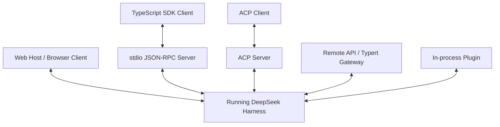
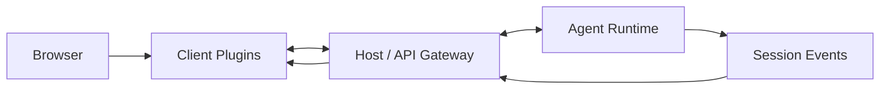
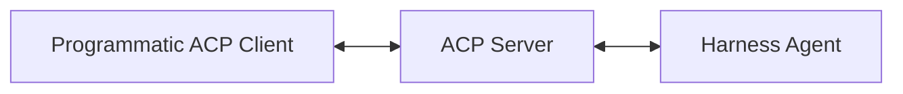
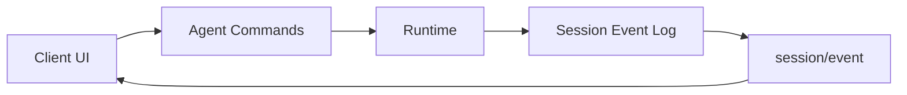

# 整合介面：Web、SDK、JSON-RPC、ACP 與自製 Client

Codex 有 App Server，所以教材很容易形成一個錯覺：

> Codex 有完整 integration surface，DeepSeek Harness 只有 Web UI。

這不準確。

DeepSeek Harness 目前已經有數種不同層次的整合方式：

```text
Web UI / Host + Client
Out-of-process TypeScript SDK
stdio JSON-RPC server
ACP automation server
Typert / API gateway
Plugin-level in-process integration
```

它們不是一個單一「App Server」名稱包住，而是被拆成不同 package groups。

## 先看整體圖



所以要找 DeepSeek「對應 Codex App Server 的東西」，不能只搜尋 `app-server` 同名 package。

## 1. Web UI：Host 與 Client 是分開的

官方 package map 把 Web 產品拆成：

```text
packages/host/
packages/client/
```

### Host

負責：

- API gateway；
- HTTP route server；
- Web boot graph；
- browser application 的 server-side half。

### Client

負責：

- browser-side shell；
- wire / object services；
- UI plugin slots；
- conversation / settings 等 UI modules。

這延續「Everything is a Plugin」哲學：UI 本身也不是一個寫死的 monolith。



## 2. TypeScript SDK：跨 Process 驅動 Harness

`packages/sdk/` 是一個很重要的 product boundary。

官方把它拆成：

```text
sdk/protocol
sdk/client
sdk/server
```

其中 server 會透過 **stdio JSON-RPC** 對外提供 Harness runtime。


這裡和 Codex App Server 有很強的可比性。

### 但定位不完全相同

DeepSeek SDK 的官方邊界是：

> Caller 提供已存在的 runtime executable 與 composition；SDK 負責 drive runtime，不負責替你建立、build 或組裝 developer project。

所以 SDK 是「Runtime Client」，不是 project scaffolding tool。

## 3. ACP：Automation interoperability

DeepSeek 還有 Agent Client Protocol server。

ACP 的定位很清楚：

```text
automation-only interoperability transport
```

它不是 human UI layer。



這表示 DeepSeek 可以同時存在：

```text
Web UI → 給人互動
SDK    → 自製應用控制
ACP    → Agent / automation interoperability
```

而不必讓同一個 protocol 同時承擔所有 UX requirement。

## 4. Subagent ACP 反方向也能作為 Consumer

很有意思的是，同一個 ecosystem 也有 ACP client 形式的 Subagent Provider。

所以：

```text
DeepSeek Runtime
→ 可以被 ACP client 驅動
```

同時：

```text
DeepSeek Root Agent
→ 可以透過 ACP 把任務 delegate 給另一個 Agent Runtime
```

這就是 protocol 和 capability seam 組合後的效果。

## 5. Typert / Remote API

DeepSeek 的 `api` 與 `typert` package family 負責另一層 remote invocation / type graph / registry 能力。

可以把它理解為：

```text
Runtime services
→ typed remote descriptors
→ Host Gateway
→ Client API
```

它主要解決的是：

- Plugin 服務如何被描述成 remote-callable surface；
- runtime type graph 如何產生 / 載入；
- Host 與 Client 如何共享 typed contract。

這讓 Web / remote product surface 不需要手動為每個 Plugin 寫另一套 RPC definition。

## 6. Session Events 是 UI 的重要資料來源

DeepSeek UI integration 的另一個關鍵不是 RPC，而是 Session Event Log。

官方 architecture 直接建議 UI / editor integration：

```text
drive ctx.agents
+
render from session/event
```

也就是：



這和 Codex App Server 的 Item / Delta / Turn event 很接近，只是資料模型不同。

## 7. In-process Plugin Integration

如果你的產品本身就在同一個 Node.js process 內，也可以直接使用 Cordis services，而不必一定走 JSON-RPC。

例如概念上：

```text
ctx.agents
ctx.sessions
ctx.tools
ctx.llm
ctx.approval
```

這是 DeepSeek 很自然的一條路，因為 runtime 本來就是 plugin context。

但這也意味著你的 integration 和 DeepSeek internal contracts 綁得更近；跨 process SDK / protocol 通常 compatibility boundary 更清楚。

## 8. 和 Codex App Server 怎麼公平比較？

### Codex

有一個很清楚、產品化的主入口：

```text
Custom Client
↕
App Server
↕
Codex Runtime
```

App Server 同時處理：

- Thread / Turn / Item；
- events；
- approvals；
- config；
- auth；
- model discovery；
- skills 等產品能力。

這個統一入口很適合 IDE / App 開發者。

### DeepSeek Harness

比較像多個 integration surfaces：

```text
Web Host / Client
SDK JSON-RPC
ACP
Typert Gateway
In-process Cordis APIs
```

優點是不同 use case 可以選不同邊界；缺點是第一次理解時比較沒有「一個入口就看懂全部」的感覺。

## Integration 對照表

| 需求 | Codex | DeepSeek Harness |
|---|---|---|
| 官方互動 UI | CLI / TUI / IDE / App | Web UI / plugin client |
| 自製 Rich Client | App Server | SDK / Host API / Typert |
| 跨 Process protocol | App Server transport | stdio JSON-RPC SDK server |
| Automation protocol | `codex exec`, SDK, App Server | ACP / SDK / headless |
| UI event model | Thread / Turn / Item events | Session Events + Agent live events |
| In-process integration | Codex internal clients | Cordis services / plugins |
| Protocol 統一度 | 高，一個 App Server 很核心 | 較分散，但用途分工清楚 |

## 9. 什麼情況選哪個 surface？

### 我只是要自動跑一次 Agent

DeepSeek：

```text
headless profile / ACP / SDK
```

Codex：

```text
codex exec / SDK
```

### 我要做自己的聊天 / Coding UI

DeepSeek：

```text
SDK + JSON-RPC
或
Host / Client plugin architecture
```

Codex：

```text
App Server
```

### 我要讓另一個 Agent 把它當 worker

DeepSeek：

```text
ACP / SDK / subagent provider
```

Codex：

```text
App Server / exec / 外層 orchestrator
```

## 10. Integration 的真正選型問題

不是只問：

> 有沒有 API？

而要問：

```text
State model 是否適合我的 UI？
Approval 怎麼回傳？
Streaming granularity 夠不夠？
Resume / Fork 怎麼做？
Protocol compatibility pressure 多大？
我需要跨 process 還是同 process？
我需要 automation interoperability 嗎？
```

這些才是 Harness integration 的核心。

## 本章重點

1. **DeepSeek 不是只有 Web UI；它有 SDK、stdio JSON-RPC、ACP、Typert、Host/Client 等多種 integration surface。**
2. **SDK 的責任是 drive 已存在的 Runtime，不是替你建立 Harness project。**
3. **ACP 是 automation transport，不是 human interaction UI。**
4. **UI 可以從 Session Event Log 衍生畫面，Agent command 與 durable event 分開。**
5. **Codex 的優勢是 App Server 統一而成熟；DeepSeek 的優勢是多種 integration boundary 都能參與 Plugin Composition。**

## 官方來源

- [`packages/sdk/README.md`](https://github.com/deepseek-ai/deepseek-harness/blob/master/packages/sdk/README.md)
- [`packages/acp/README.md`](https://github.com/deepseek-ai/deepseek-harness/blob/master/packages/acp/README.md)
- [`packages/README.md`](https://github.com/deepseek-ai/deepseek-harness/blob/master/packages/README.md)
- [Typert subsystem](https://github.com/deepseek-ai/deepseek-harness/blob/master/docs/subsystems/typert.md)
- [Web server subsystem](https://github.com/deepseek-ai/deepseek-harness/blob/master/docs/subsystems/web-server.md)
- [Client modules](https://github.com/deepseek-ai/deepseek-harness/blob/master/docs/subsystems/client-modules.md)
