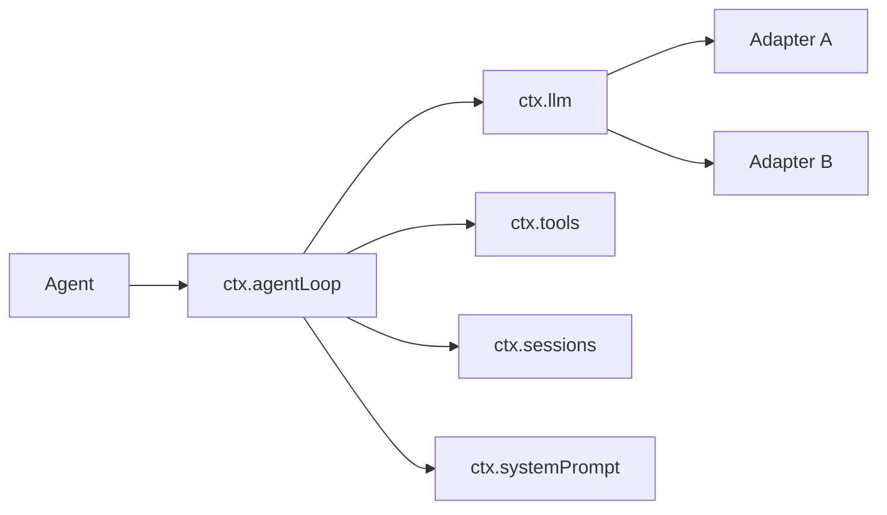
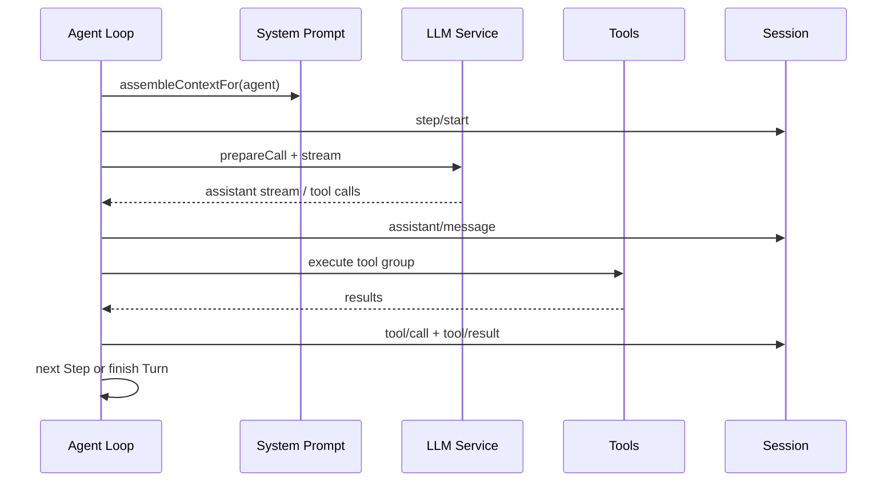
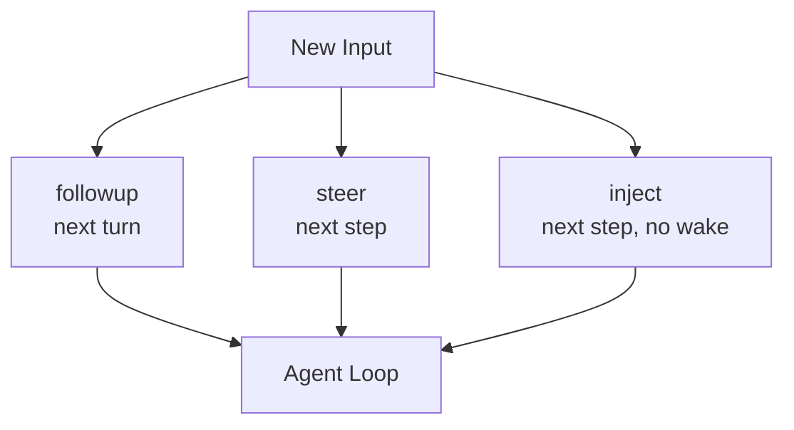

# Model Adapter 與 Agent Loop

DeepSeek Harness 的一個核心設計是：**Model 連線與 Agent Loop 是兩個不同 capability seam。**

這讓你可以在不改 tool/session/security 的情況下換 model adapter，也可以保留 model adapter 而替換 loop driver。

## 先看依賴關係



官方 `agent-loop` package 直接說明：它是 Harness 中唯一包含 concrete loop logic 的 package；其他 behavior 應透過 service / plugin extension points 加入，而不是繼續膨脹 loop 本身。

## LLM Service 與 Adapter

`ctx.llm` 對 consumer 提供的是抽象 model capability，而不是某個固定 SDK client。

可以把一個 adapter 拆成：

```text
provider/model identity
credential resolution
request preparation
reasoning / token defaults
stream dispatch
finish / usage normalization
retry policy metadata
```

Agent Loop 只需要一個準備好的 model call，不應直接知道每家 provider 的 transport 細節。

## 一次 Step 怎麼跑？

DeepSeek 的正式 vocabulary：

```text
Turn = 一次被 claim 的 user work boundary
Step = 一次 model request + 這次 request 產生的 tool calls
```



這裡最重要的是：**每個 Step 都重新組 context，而且 provider/model route 可以在 lifecycle extension point 被調整。**

## `agent/request` 是 Model Routing 的關鍵 seam

Model route 不必完全寫死在 Agent 建立時。

概念上：

```text
Agent options
→ proposed provider / model
→ agent/request middleware
→ effective provider / model / settings
→ ctx.llm.prepareCall()
→ adapter dispatch
```

這讓 plugin 可以做：

- fallback；
- model routing；
- workload-specific model selection；
- reasoning effort policy；
- request retry / recovery。

但 production 使用時要記得：route 變更可能讓 prompt cache reuse 從改變位置失效。

## Streaming 與 Durable State 的界線

Raw token / reasoning chunks 是 live stream，不一定全部永久保存。

官方 loop 會在 successful finish 時追加一個 `assistant/message` completion anchor；如果 cancellation 發生在已經有可見文字之後，也會把使用者實際看到的 prefix 以 interrupted anchor 保留下來。

這個設計在處理 resume 時很重要：

> **Durable history 應該反映使用者已經看見的 model output，而不是只看 provider 最後有沒有正常 finish。**

## Parallel Tool Calls

Agent Loop 可以設定：

```text
maxParallelToolCalls
```

但平行不是「所有 tool 一起跑」。

實際上需要先分類：

```text
parallel-safe call
exclusive call
```

exclusive call 會形成 barrier；parallel-safe calls 才進 bounded rolling pool。

更重要的是：即使 dispatch/body 有重疊，policy、durable result 與 Model 看到的 result context 仍維持 model order。

這避免 concurrency 把 trajectory 變成 nondeterministic mess。

## Steering 與 Inbox

DeepSeek 把工作中途的新輸入分得很細：

```text
followup → next-turn FIFO + wake
steer    → next-step inbox + wake
inject   → next-step inbox，不主動 wake
```

因此「使用者又補一句」不是單一 API 行為，而是有清楚 admission semantics。



這是研究 interactive agent runtime 很值得看的部分。

## Failure / Retry 不應全部塞進 Loop

DeepSeek 的 loop 會把 model request failure 暴露到 lifecycle event，retry plugin 可以再決定是否重試。

概念上：

```text
adapter error
→ agent/request-error
→ retry plugin / middleware
→ retry or terminal failure
```

而 tool policy、compaction、sandbox、permission、subagents 都透過其他 extension point 接進來。

這維持一條很清楚的規則：

> **Loop 只負責 call model → run tools → repeat；高階策略留在 Plugins。**

## Model / Loop 分離的架構價值

你可以做 controlled experiment：

```text
相同 Session model
相同 Tool set
相同 Sandbox
相同 Model Adapter
只換 Agent Loop
```

或反過來：

```text
相同 Agent Loop
只換 Model Adapter
```

這對 Harness benchmark、multi-provider platform、研究新的 turn semantics 都很有價值。

## 本章重點

1. **`ctx.llm` 與 `ctx.agentLoop` 是兩個不同 seam。**
2. **Step 是一次 Model Request + 該 request 產生的 Tool Calls。**
3. **Model routing、retry、compaction 等策略可在 loop 外由 plugin 介入。**
4. **parallel tool execution 仍要維持 policy / durable state 的 deterministic ordering。**
5. **followup / steer / inject 展示了 DeepSeek 對 interactive input admission 的細緻語意。**

## 官方來源

- [`dsh-agent-loop`](https://github.com/deepseek-ai/deepseek-harness/blob/master/packages/core/agent-loop/README.md)
- [`dsh-llm`](https://github.com/deepseek-ai/deepseek-harness/tree/master/packages/llm)
- [Core subsystem](https://github.com/deepseek-ai/deepseek-harness/blob/master/docs/subsystems/core.md)
