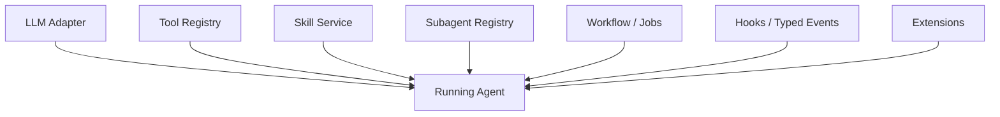
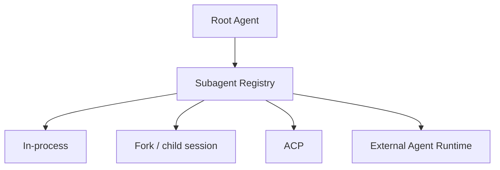
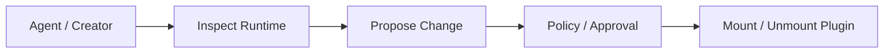
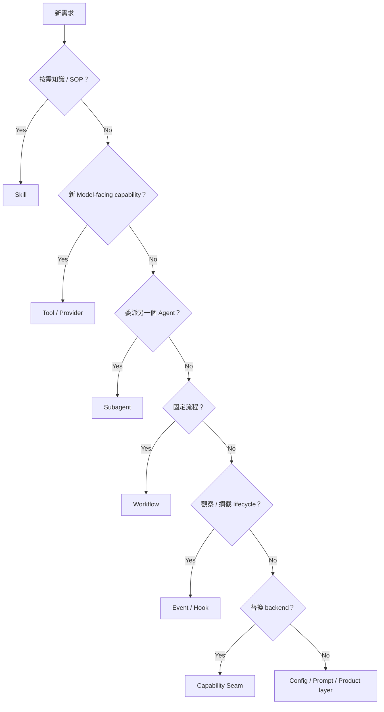

# Models、Skills、Subagents、Hooks 與 Extensions

DeepSeek Harness 雖然以「Everything is a Plugin」為底層哲學，但對 Agent 使用者來說，仍有清楚的高階 capability families。

這一章先建立總覽；後續專章再深入 Model/Loop、Tool、Skills/Subagents/Workflow 與安全。



## Model Adapter

Model 是 capability family：

```text
LLM Service Contract
→ Provider Adapter
→ stream / normalize
```

Agent Loop 消費 service，不應依賴特定 vendor SDK。

詳細見：[Model Adapter 與 Agent Loop](./model-and-agent-loop.md)。

## Skills

Skill subsystem 支援 provider registry、discovery、summary/catalog 與按需載入。

核心是 progressive disclosure：

```text
先讓 Agent 知道有哪些 Skill
→ 判斷相關
→ 再讀完整內容
```

這避免大量 SOP 永久佔據 context。

## MCP

MCP 可以被視為 Tool provider 的來源：

```text
MCP Server
→ Plugin discovery
→ register tools into ctx.tools
→ ordinary tool pipeline
```

因此 MCP 不需要成為 Agent Loop 的特殊分支。

## Subagents

Subagent 是 provider registry。



Delegation 的 backend 因此可以被替換。

## Workflow / Jobs

不是所有長工作都該塞回自由推理 loop。

```text
Workflow
→ explicit reusable process

Job
→ background lifecycle

Subagent
→ delegated autonomous reasoning
```

這三個 abstraction 要分開。

詳細見：[Skills、Subagents、Workflows 與長生命週期工作](./skills-subagents-workflows.md)。

## Hooks / Typed Events

Cordis 本身就提供 lifecycle / event mechanism。

可以用來：

```text
observe
intercept
waterfall-transform
register reversible effects
```

而 Harness-level hooks / compatibility bridges 可以建立在這些機制上。

## Extensions：Runtime 可以觀察與修改自己

Extensions subsystem 可支援：

```text
runtime inspection
plugin/service discovery
dynamic activation
mount / unmount
controlled model-written extension flows
```

這讓 Creator / research scenario 很強，但也提高 plugin trust / provenance 的重要性。



## Capability Seam 是共同底層模式

不論表面名稱叫 Model、Subagent 或 Sandbox，底層常能回到：

```text
Service Definition
→ Provider
→ Consumer
→ Composition
```

例如：

```text
LLM      → adapters
FS       → local / remote providers
Sandbox  → platform providers
Subagent → in-process / external providers
Code     → runtime providers
```

這是閱讀 DeepSeek package map 最重要的共通語言。

## 怎麼判斷新需求放哪裡？



## 本章重點

1. **Everything-is-a-Plugin 不代表所有能力都沒有高階語意。**
2. **Skills、Subagents、Workflow、Jobs、Hooks、Extensions 都是正式 subsystem。**
3. **MCP 可以自然成為 Tool Registry 的 provider source。**
4. **Extensions 能動態修改 runtime，因此 production trust boundary 必須更清楚。**
5. **共同底層模型仍是 Service → Provider → Consumer → Composition。**

## 官方來源

- [`packages/README.md`](https://github.com/deepseek-ai/deepseek-harness/blob/master/packages/README.md)
- [Skills](https://github.com/deepseek-ai/deepseek-harness/blob/master/docs/subsystems/skills.md)
- [Subagent](https://github.com/deepseek-ai/deepseek-harness/blob/master/docs/subsystems/subagent.md)
- [Workflow](https://github.com/deepseek-ai/deepseek-harness/blob/master/docs/subsystems/workflow.md)
- [Extensions](https://github.com/deepseek-ai/deepseek-harness/blob/master/docs/subsystems/extensions.md)
