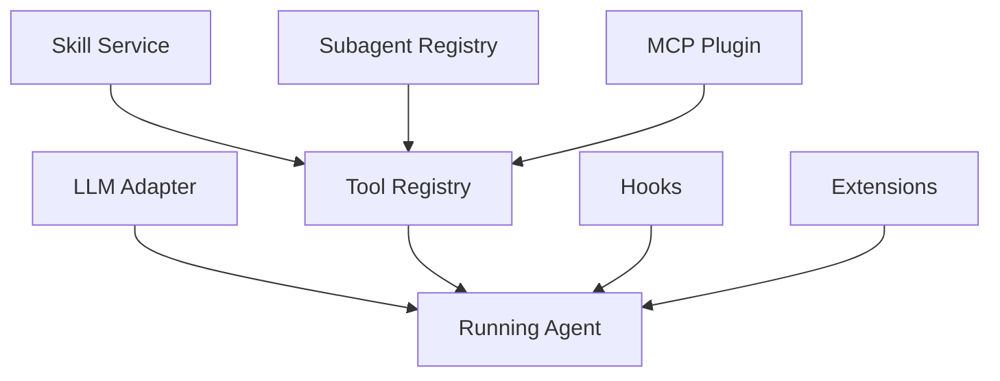
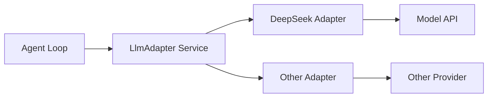
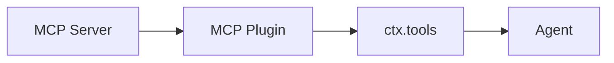
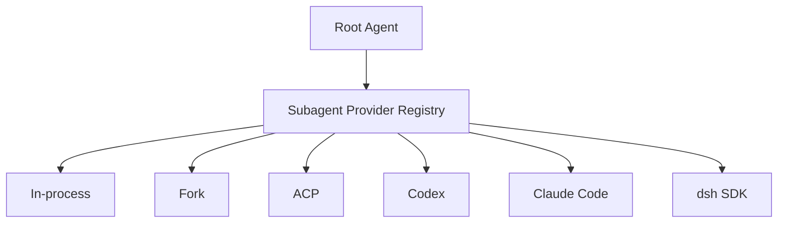
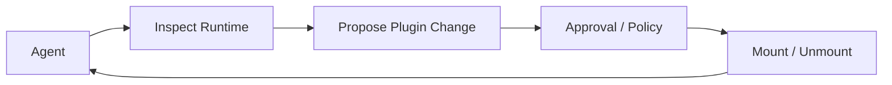
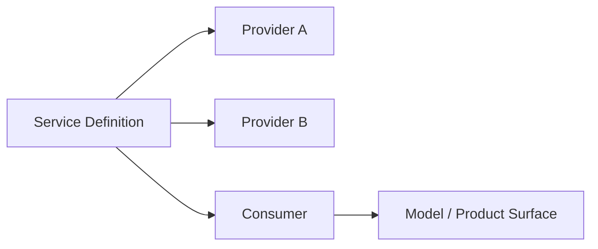
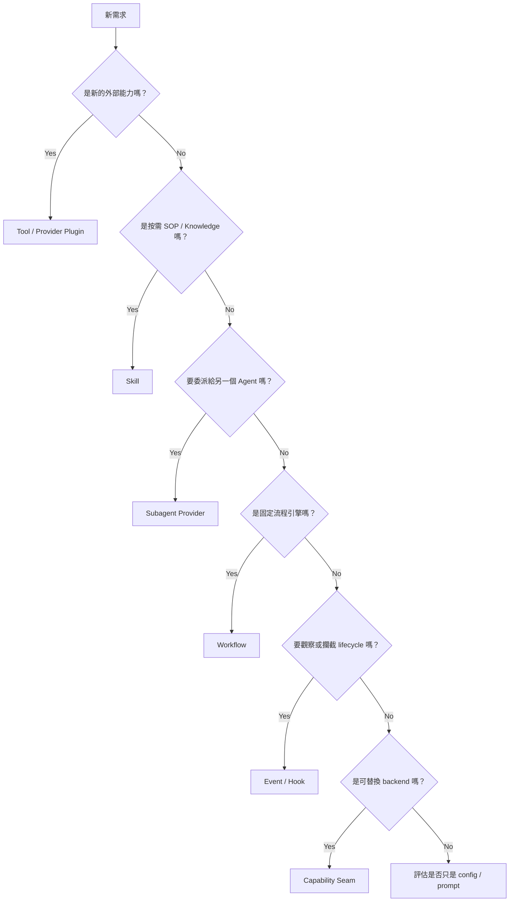

# Models、Skills、Subagents、Hooks 與 Extensions

如果只看「Everything is a Plugin」，很容易把 DeepSeek Harness 想成一個抽象框架；但它實際上已經有相當完整的 Agent capability families。

這一章用和 Codex 客製化章節相同的問題來看：

> **我要換 Model、加 Tool、加 Skill、加 Subagent、接 MCP、做 Hook，DeepSeek Harness 分別放在哪一層？**

## 先看一張總圖



這些能力不是全部塞在 Agent Loop 裡，而是由不同 service / plugin family 提供。

## 1. Model Adapter

DeepSeek Harness 的 LLM 是一個 capability family。

概念上：



官方 package map 目前把 `packages/llm/` 定義為「abstract service + provider adapters」。

讀 source 時應分：

```text
LLM service contract
provider adapter
streaming protocol
model selection
credentials
```

而不是把「換模型」理解成只是換一個 base URL。

## 2. Skills

DeepSeek Harness 也有 Skill subsystem。

主要概念包括：

- Skill provider registry；
- local filesystem provider；
- Skill discovery priority；
- `SkillSummary` / `SkillDefinition`；
- model-facing catalog；
- 按需載入 Skill 內容。

因此它和 Codex Skill 的核心思想其實很接近：

```text
先暴露摘要 / catalog
→ Model 判斷需要
→ 再載入完整 Skill
```

也就是 progressive disclosure。

## Codex Skill vs DeepSeek Skill

| 面向 | Codex | DeepSeek Harness |
|---|---|---|
| 目的 | 按需 workflow / knowledge | 按需 workflow / knowledge |
| 初始暴露 | metadata | catalog / summary |
| 完整內容 | 需要時載入 | 需要時載入 |
| 底層設計 | Codex extension surface | Provider registry + tool / section integration |
| 替換 provider | 有既定 Skill loading 行為 | 更自然地視為 capability provider |

兩者概念相近，但 DeepSeek 更傾向把 discovery / loading 本身也 service 化。

## 3. MCP

DeepSeek 沒必要讓 MCP 成為 Agent Loop 特例。

官方 extension cookbook 的建議思路是：

```text
每個 MCP Server
→ 由 Plugin 負責 discovery
→ 把 tools 註冊到 ctx.tools
```

所以從 Harness 角度看：



MCP 是「Tool Provider 的來源」，不是另一套獨立 runtime。

這和 Codex 的差別是：Codex 有較明確的 MCP 專用 integration surface；DeepSeek 更容易把 MCP 當成普通 Plugin 對 Tool Registry 的一種供應方式。

## 4. Subagents

DeepSeek 的 Subagent subsystem 很值得注意，因為它本身是一個 **provider registry**。

概念上：



這表示「子 Agent」不一定等於「同一個 Harness 裡再開一個相同 runtime」。

它可以是一個 delegation seam。

### 這帶來什麼？

你可以把：

```text
同一個 Model 的 child agent
```

和：

```text
另一套 Agent Runtime
```

都抽象成某種 subagent provider。

這也讓 multi-agent / multi-runtime orchestration 比較自然。

## 5. Workflow

DeepSeek 還把 Workflow 做成獨立 capability seam。

官方 package map 描述：

```text
workflow seam
+ worker-thread engine
+ model-facing workflow / ralph tools
```

這代表它不只支援「Agent 自己一輪一輪 tool call」，也可以把較固定或長流程封裝成 workflow runtime。

可以把它和 Subagent 分開理解：

```text
Subagent → 把任務交給另一個 Agent
Workflow → 把任務交給另一個流程引擎
```

## 6. Jobs / Scheduling

DeepSeek 還有：

```text
jobs
schedule
goal
feedback
```

這類 product services。

例如 Jobs 可以提供：

- background job runtime；
- model-facing `job_*` control tools；
- durable lifecycle / status。

這讓 DeepSeek Harness 更接近「Agent Platform Runtime」，而不是只做 coding loop。

## 7. Hooks

DeepSeek 的 Hook 不是只有一個 pre/post callback 概念。

Cordis 本身就提供：

```text
ctx.effect()
ctx.on()
ctx.waterfall()
```

而 `packages/hooks/` 再提供 Hook bridges 與相容協議相關能力。

因此要區分兩層：

### Cordis lifecycle / events

用來做 Plugin 的原生 lifecycle 與 typed event coordination。

### Harness Hooks compatibility / bridge

用來接其他 Agent ecosystem 的 hook wire protocol 或產品 hook 能力。

## 8. Extensions：Runtime 可以觀察與修改自己

`packages/extensions/` 是 DeepSeek 很特別的一區。

官方描述它可以支援：

- runtime plugin / service inspection；
- dynamic activation；
- mount / unmount；
- lifecycle teardown；
- model-written plugin 的受控安裝流程。

也就是：



這是一種非常「self-referential runtime」的設計。

### 優點

- 可以實驗新能力；
- Creator / research use case 很強；
- 不必重新編譯中央 core；
- HMR / teardown 可以沿用 Cordis lifecycle。

### 風險

- Runtime attack surface 變大；
- Plugin provenance / trust 更重要；
- approval / capability boundary 必須更清楚；
- production 不應把「可以 mount plugin」等同於「Model 應該有權 mount 任意 plugin」。

## 9. Capability Seam 的共同模式

DeepSeek 最值得學的，不是每個 package 名稱，而是共同模式：



例如：

```text
LLM      → adapters
FS       → local / sandbox / E2B
Sandbox  → platform backend
Subagent → in-process / ACP / Codex / Claude Code / SDK
Code     → worker runtime provider
```

Consumer 依賴 Service Definition，而不是具體 backend。

## 10. 怎麼判斷該新增哪一種能力？



## 與 Codex 的公平比較

不要把結論寫成：

```text
Codex 有 Skills / MCP / Hooks
DeepSeek 只有 Plugins
```

這不公平。

更精確是：

```text
Codex
→ 提供多個語意清楚、產品化的 extension surfaces

DeepSeek
→ 也有 Skills / Subagents / Hooks / MCP pattern
→ 但底層更一致地把它們視為 Plugin + Service Composition
```

Codex 的優點是「用途分類清楚」；DeepSeek 的優點是「底層抽象一致」。

## 本章重點

1. **DeepSeek 不只是 Model / Loop 可換；Skills、Subagents、Workflow、Hooks 也都有正式 subsystem。**
2. **Subagent 是 provider registry，可以委派給不同 runtime，而不一定只是 clone 同一個 Agent。**
3. **MCP 在 DeepSeek 中可以自然地被視為 Tool Registry 的 Plugin provider。**
4. **Extensions 讓 runtime 可以被動態觀察與修改，但 production trust boundary 也更重要。**
5. **最值得學的是 Service Definition → Provider → Consumer 的共同模式。**

## 官方來源

- [`packages/README.md`](https://github.com/deepseek-ai/deepseek-harness/blob/master/packages/README.md)
- [Skills subsystem](https://github.com/deepseek-ai/deepseek-harness/blob/master/docs/subsystems/skills.md)
- [Subagent subsystem](https://github.com/deepseek-ai/deepseek-harness/blob/master/docs/subsystems/subagent.md)
- [Workflow subsystem](https://github.com/deepseek-ai/deepseek-harness/blob/master/docs/subsystems/workflow.md)
- [Extensions subsystem](https://github.com/deepseek-ai/deepseek-harness/blob/master/docs/subsystems/extensions.md)
- [Extension cookbook](https://github.com/deepseek-ai/deepseek-harness/blob/master/docs/cookbook/extension-cookbook.md)
