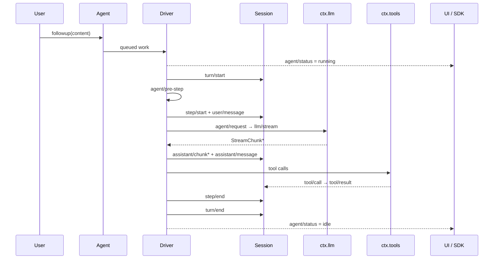
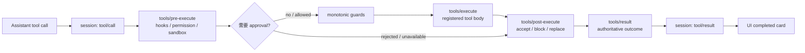

# 官方視角：DeepSeek Harness Lifecycle 與 Tool Pipeline

DeepSeek Harness 的官方 repo 和 Codex 不太一樣：它很少用產品宣傳截圖解釋架構，反而把大量「正式架構圖」直接寫成 Mermaid 放在文件裡，而且由 repo scripts 維護與驗證。

所以這一頁不放裝飾性截圖，而是直接對照官方最值得看的兩組圖：**Agent lifecycle** 與 **Tool execution pipeline**。

> 下面的 Mermaid 都是本教材依官方圖簡化重繪；若要看完整事件與分支，請點每段下方的官方原圖。DeepSeek Harness repo 採 [MIT License](https://github.com/deepseek-ai/deepseek-harness/blob/b150a551b8d465e31e418e1b2eaf5e79bbb7d28e/LICENSE)。

## 官方圖 1：Turn / Step Lifecycle

DeepSeek 官方的 [Agent 轮次与步骤生命周期](https://github.com/deepseek-ai/deepseek-harness/blob/b150a551b8d465e31e418e1b2eaf5e79bbb7d28e/docs/agent-lifecycle.zh.md) 用完整 sequence diagram 描述：

- inbox 如何進入 Driver；
- `turn/start`、`step/start` 何時寫入 Session；
- `agent/pre-step`、`agent/request` 與 `llm/stream` 如何串接；
- assistant chunks 如何先成為 session events；
- tools 如何執行；
- 最後如何 `step/end` 與 `turn/end`。

下面是保留主要責任邊界的教材版：



*教材重繪來源：DeepSeek Harness 官方 [`docs/agent-lifecycle.zh.md`](https://github.com/deepseek-ai/deepseek-harness/blob/b150a551b8d465e31e418e1b2eaf5e79bbb7d28e/docs/agent-lifecycle.zh.md)。官方原圖包含更多 inbox、retry、hook waterfall、tool batching 與 request-error 細節。*

### 這張官方圖最值得學什麼？

它把兩種 event domain 分得很清楚：

```text
session/event
→ durable / replayable facts

agent/*
→ live coordination / interception
```

因此「模型看過什麼」與「runtime 正在發生什麼」不是同一條 event stream。這也直接支撐官方反覆強調的 invariant：

> **Model-visible means logged.**

## 官方圖 2：Tool Execution Pipeline

DeepSeek 另外維護一張非常重要的 [工具执行流水线](https://github.com/deepseek-ai/deepseek-harness/blob/b150a551b8d465e31e418e1b2eaf5e79bbb7d28e/docs/tool-execution-pipeline.zh.md)。它不是只畫「Model → Tool → Result」，而是把 policy、approval、guards、execution、post-processing、final result 與 UI render 都放在同一條 pipeline。

教材版先縮成這樣：



*教材重繪來源：DeepSeek Harness 官方 [`docs/tool-execution-pipeline.zh.md`](https://github.com/deepseek-ai/deepseek-harness/blob/b150a551b8d465e31e418e1b2eaf5e79bbb7d28e/docs/tool-execution-pipeline.zh.md)。官方原圖還包含 `fs/write-intent`、tool-owned events、normalization、`finalizeContent`、additional contexts 與 Code Mode 子呼叫。*

## 這和「Everything is a Plugin」怎麼接起來？

官方 [DeepSeek Harness 架構文件](https://github.com/deepseek-ai/deepseek-harness/blob/b150a551b8d465e31e418e1b2eaf5e79bbb7d28e/docs/architecture.zh.md) 把核心服務直接列成：

| 官方 Service | 官方責任 |
|---|---|
| `ctx.sessions` | SessionEvent log / session store |
| `ctx.systemPrompt` | Prompt fragments + tool schema assembly |
| `ctx.tools` | Tool registry + guarded execution pipeline |
| `ctx.agents` | Agent handles + live agent events |
| `ctx.agentLoop` | Concrete default loop driver |
| `ctx.llm` | LLM adapter registry / streaming seam |

這張表非常重要，因為它讓「Everything is a Plugin」不只是 slogan。你可以直接從 service definition 問：

```text
誰宣告這個 service？
誰提供 provider？
誰是 consumer？
哪個 profile / bundle 把它 mount 起來？
```

這正是本教材 DeepSeek source map 採用的閱讀方法。

## 為什麼不直接複製官方完整圖？

官方 lifecycle 與 tool pipeline 都很完整，但也很密。教材如果原封不動放在每章主線裡，初學者很容易只看到事件名稱，反而失去責任邊界。

因此這份教材採兩層：

```text
教材圖
→ 先看 responsibility / invariant

官方圖
→ 再追完整事件、hook、retry、guard 與 pipeline 細節
```

建議你讀完 [Cordis 與 Plugin 架構](./architecture.md) 後，再打開官方原圖並排閱讀。

## 官方來源

- [DeepSeek Harness Architecture（中文）](https://github.com/deepseek-ai/deepseek-harness/blob/b150a551b8d465e31e418e1b2eaf5e79bbb7d28e/docs/architecture.zh.md)
- [Agent Turn / Step Lifecycle（中文）](https://github.com/deepseek-ai/deepseek-harness/blob/b150a551b8d465e31e418e1b2eaf5e79bbb7d28e/docs/agent-lifecycle.zh.md)
- [Tool Execution Pipeline（中文）](https://github.com/deepseek-ai/deepseek-harness/blob/b150a551b8d465e31e418e1b2eaf5e79bbb7d28e/docs/tool-execution-pipeline.zh.md)
- [Capability Seams（中文）](https://github.com/deepseek-ai/deepseek-harness/blob/b150a551b8d465e31e418e1b2eaf5e79bbb7d28e/docs/capability-seams.zh.md)
- [`deepseek-ai/deepseek-harness`](https://github.com/deepseek-ai/deepseek-harness)

素材與官方文件固定到 revision `b150a55…` 供本頁核對；架構是否改變仍應以 upstream 最新版為準。
