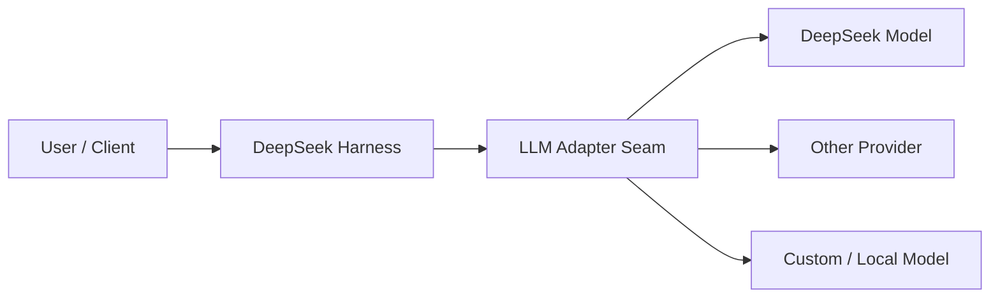
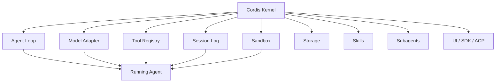
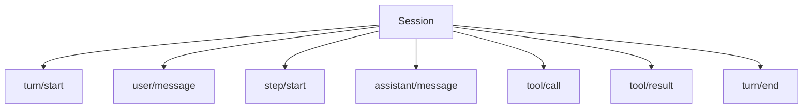

# DeepSeek Harness：先建立正確心智模型

> 最後核對：2026-08-23。DeepSeek Harness 整體目前仍標示為 **developer preview**；同時官方 package map 已把不少核心 packages 標成 Product / stable API。教材會把「架構原則」「package contract」「產品整體成熟度」分開討論。

前面的教材主要用 Codex 建立 Harness 心智模型。現在換一個刻意採取不同架構哲學的實作：**DeepSeek Harness（`dsh`）**。

先記住一句：

> **Codex 比較像一套核心明確、產品化程度高的 Agent Runtime；DeepSeek Harness 則把 Runtime 本身拆成可組合的 Plugins 與 Capability Seams。**

這不是在比較 GPT 與 DeepSeek 模型能力，而是在比較兩套 **Harness architecture**。

## DeepSeek Harness 不是「只能跑 DeepSeek 模型」

Model Adapter 本身就是 capability family。



所以更精確的理解是：

```text
DeepSeek Harness = 可組合 Agent Runtime
DeepSeek Model   = 可接入的其中一種 Model
```

## 一張圖先看整體

DeepSeek 官方的核心口號是：**Everything is a Plugin**。



Codex 也有 Skills、MCP、Hooks、Providers 等 extension points；DeepSeek 更進一步，把 **Agent Loop、Session、Model Adapter、Sandbox、Storage、UI integration 本身**都放進 composition system。

## Cordis 是什麼？

如果把 DeepSeek Harness 比喻成一台電腦：

```text
Cordis           ≈ 微核心 + Dependency / Lifecycle Runtime
Plugins          ≈ 可插拔系統服務
DeepSeek Harness ≈ 用這些服務組成的 Agent Runtime
```

Cordis 負責：

- plugin mount / unmount；
- dependency；
- shared context services；
- typed events；
- reversible effects。

真正的 Agent 能力由 Plugins 提供。

這也是「沒有 privileged core 需要 patch」的核心意思：新增行為通常是掛新的 Plugin / Provider / Consumer，而不是修改一個中央 Agent Core。

## DeepSeek 的核心資料模型

Codex 對外最容易理解的是：

```text
Thread → Turn → Item
```

DeepSeek Harness 更強調 append-only event log：



後續的 Context reconstruction、Resume、Fork、Replay、UI projection 與 telemetry 都能從 durable events 推導。

## Step 是很重要的額外 primitive

DeepSeek 定義：

```text
Step = 一次 Model Request + 這次回應產生的 Tool Calls
Turn = 0 個或多個 Steps
Session = 多個 Turns 的 durable event stream
```

所以一次 Turn 可能：

```text
Step 1 → Model 看檔案並呼叫 Tool
Step 2 → Model 看 Tool Result 再修改
Step 3 → Model 跑 Test 後完成
```

這和 Codex 的 Turn 內部多次 Model / Tool 往返概念相近，但 DeepSeek 把 Step 本身明確做成 durable lifecycle vocabulary。

## 四種 Runtime Mode

目前官方總覽把典型使用方式整理成四種模式：

| Mode | 心智模型 | 適合 |
|---|---|---|
| Standard | 完整 Agent | 一般工作 |
| Code | 用 TypeScript 編排多步 Tool | 降低 round trip / batch orchestration |
| Minimal | 極小 Tool Surface | Benchmark / Harness 研究 |
| Creator | 觀察與重組 Plugins | Runtime 實驗 / Plugin 開發 |

### Code Mode

傳統 Tool Calling：

```text
Model → Tool A → Model → Tool B → Model → Tool C
```

Code Mode 可以變成：

```text
Model
→ 產生受控 TypeScript Tool Program
→ Code Runtime 執行 Tool A / B / C、Loop、Condition、Aggregate
→ Combined Result
→ Model
```

這不等於允許任意 JavaScript；Model 只能使用 Runtime 暴露的 bindings。

## DeepSeek 不只是「架構實驗框架」

為了和 Codex 公平比較，教材不會只介紹 Cordis / Code Mode。

目前 DeepSeek 官方 repo 已有完整的 subsystem families：

```text
LLM streaming
Prompt / Context
Tools
Shell / FS / Terminal / LSP / Web
Sandbox / Approval / Permission Presets
Skills / Subagents / Workflows
Session / Persistence / Query / Projection
Settings / Credentials / Storage
SDK / JSON-RPC / ACP
Web Host / Client
Telemetry / Guards / Invariants / Test Support
```

因此後面的 DeepSeek 區塊也會用和 Codex 相同的問題來讀，而不是把它當附錄。

## 對稱學習矩陣

| Harness 問題 | Codex 教材 | DeepSeek 教材 |
|---|---|---|
| Runtime 怎麼拆 | `codex-core` / App Server | Cordis / Service / Provider / Consumer |
| 怎麼啟動與設定 | Config / CLI | Profiles / Bundles / Patches |
| Model 怎麼接 | Model Provider | LLM Adapter Seam |
| Loop 怎麼跑 | Agent Loop / Turn | Agent Loop / Turn / Step |
| State 怎麼存 | Thread / Rollout / Store | SessionEvent / Persistence / Projection |
| Tool 怎麼執行 | Tool Router / Exec | Tool Registry / Capability Provider |
| 怎麼擴充 | Skill / MCP / Hook / Subagent | Skills / MCP pattern / Hooks / Extensions / Subagents |
| 安全怎麼做 | Sandbox / Approval / Rules | Sandbox / Approval / Permission Presets / Credentials |
| 怎麼嵌入產品 | App Server / SDK / exec | Web / SDK JSON-RPC / ACP / Typert |
| Production correctness | tests / protocol / product runtime | Invariants / Replay / Test Support / Telemetry |
| 原始碼怎麼讀 | Codex Source Map | DeepSeek Source Map |

這才是本教材後續比較兩者的基準。

## DeepSeek 最值得學的六個架構思想

1. **Everything is a Plugin**：Runtime responsibilities 本身可以 composition。
2. **Capability Seam**：Consumer 依賴 Service Definition，不依賴具體 backend。
3. **Event-sourced Session**：Model-visible durable facts 可以重建。
4. **Code Mode**：Model 可以用受控程式一次編排多個 Tool operation。
5. **Profile / Bundle Composition**：啟動的不是固定 binary 行為，而是一棵可 inspect / patch 的 Plugin Tree。
6. **Protocol / UI 也可組合**：SDK、ACP、Host / Client 都是 runtime boundary 的不同選擇。

## 建議完整閱讀順序

1. 本章：建立全局心智模型。
2. [Cordis 與 Plugin 架構](./architecture.md)。
3. [使用方式：Profiles、Bundles 與啟動組合](./usage-and-profiles.md)。
4. [Session、Events 與可追溯狀態](./session-and-events.md)。
5. [Models、Skills、Subagents、Hooks 與 Extensions](./models-skills-and-extensions.md)。
6. [Code Mode、Capability 與 Runtime 組合](./code-mode-and-plugins.md)。
7. [安全模型：Sandbox、Approval 與 Permission Presets](./security-and-approvals.md)。
8. [整合介面：Web、SDK、JSON-RPC、ACP 與自製 Client](./integration-surfaces.md)。
9. [Production、測試、Invariant 與成熟度](./production-and-testing.md)。
10. [`deepseek-ai/deepseek-harness` 原始碼導讀地圖](../reference/deepseek-source-map.md)。
11. [Codex vs DeepSeek Harness](../comparison/codex-vs-deepseek.md)。

## 官方來源

- [DeepSeek Harness](https://deepseek.com/harness/en/)
- [`deepseek-ai/deepseek-harness`](https://github.com/deepseek-ai/deepseek-harness)
- [Architecture](https://github.com/deepseek-ai/deepseek-harness/blob/master/docs/architecture.md)
- [`packages/README.md`](https://github.com/deepseek-ai/deepseek-harness/blob/master/packages/README.md)
- [Subsystem index](https://github.com/deepseek-ai/deepseek-harness/blob/master/docs/subsystems/README.md)
