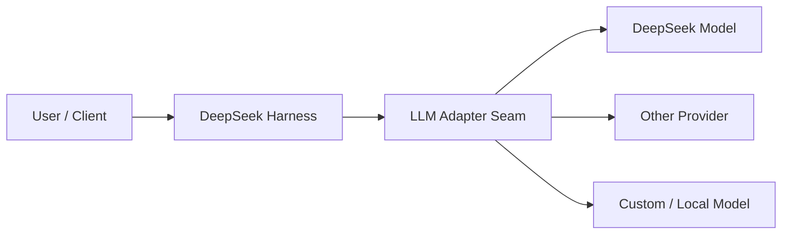
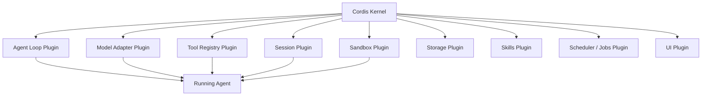
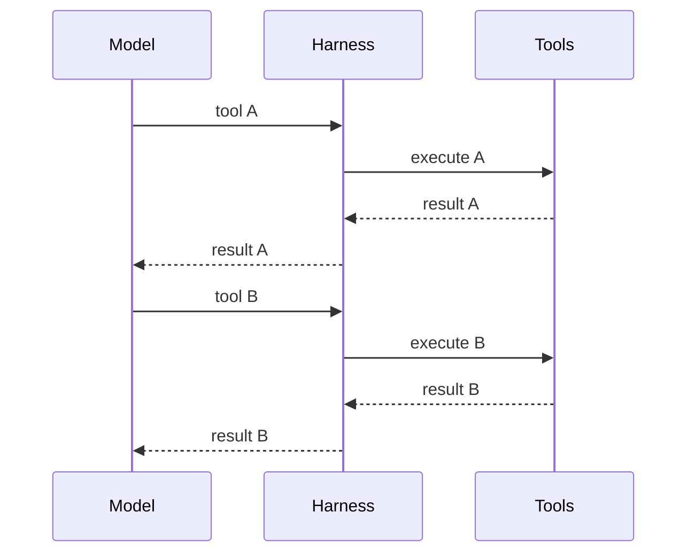
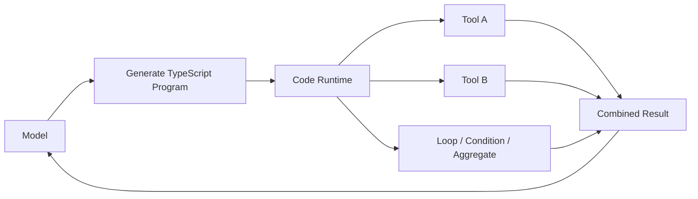
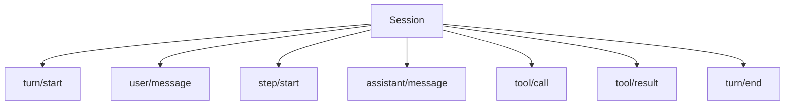

# DeepSeek Harness：先建立正確心智模型

> 最後核對：2026-08-23。DeepSeek Harness 目前仍標示為 **developer preview**，官方明確提醒 API 與相容性仍可能出現破壞性變更。本章把穩定的架構思想與版本敏感的操作細節分開。

前面的教材主要用 Codex 說明 Harness。現在換一個刻意採取不同架構哲學的實作：**DeepSeek Harness（`dsh`）**。

先記住最重要的一句：

> **Codex 比較像一套完成度很高、核心明確的 Agent Runtime；DeepSeek Harness 則把 Runtime 本身拆成可組合的 Plugins。**

這不是在比較 GPT 與 DeepSeek 模型能力，而是在比較兩套 **Harness architecture**。

## DeepSeek Harness 不是「只能跑 DeepSeek 模型」

名稱很容易造成誤解。DeepSeek Harness 是 DeepSeek AI 開源的 agent harness，但架構中的 Model Adapter 本身也是 Plugin。



所以更精確的理解是：

```text
DeepSeek Harness = 一套可組合 Agent Runtime
DeepSeek Model   = 其中一種可以被接入的 Model
```

## 一張圖先看整體

DeepSeek 官方的核心口號是：**Everything is a Plugin**。



Codex 也有 Skills、MCP、Hooks、Providers 等 extension points，但 DeepSeek 更進一步：**連 agent loop、session log、model adapter、sandbox 與 UI 都屬於可配置的 plugin tree。**

## Cordis 是什麼？

如果把 DeepSeek Harness 比喻成一台電腦：

```text
Cordis          ≈ 微核心 + Dependency / Lifecycle Runtime
Plugins         ≈ 可插拔系統服務
DeepSeek Harness≈ 用這些服務組成的 Agent Runtime
```

Cordis 負責：

- plugin mounting / unmounting；
- dependency；
- shared context services；
- typed events；
- reversible effects。

真正的 Agent 能力則由 Plugins 提供。

這也是官方所說「沒有 privileged core 需要 patch」的真正意思：新增能力通常是**掛一個 Plugin 到現有 composition**，而不是先修改一個中央核心。

## 四種官方 Runtime Mode

目前官方頁面把使用方式整理成四種 Mode。

| Mode | 心智模型 | 適合 |
|---|---|---|
| Standard | 完整 Coding Agent | 一般開發工作 |
| Code | Model 用 TypeScript 組合多步 Tool 操作 | 降低大量 Tool round trip |
| Minimal | 只保留極少數核心 Tool | Benchmark / Harness 研究 |
| Creator | 可以觀察、實驗並組裝 Plugins | 建立自己的 Agent Preset |

### Standard Mode

最接近一般人熟悉的 Coding Agent：

```text
Model
→ Files / Shell / Search / Skills / Planning / Subagents
→ Observe result
→ Continue
```

### Code Mode

這是 DeepSeek Harness 很有代表性的設計。

傳統 Tool Calling：



Code Mode 則可以把多個操作組成一段 TypeScript：



重點不是「讓模型任意執行 JS」，而是讓 Tool Registry 用一個受控的 Code Runtime 暴露可用 bindings，讓多步 orchestration 可以在一次 model step 中完成。

### Minimal Mode

刻意把 Harness 壓到很小，例如只剩 persistent Bash 與 file editor。

它特別適合研究：

> **到底是 Model 本身變強，還是 Harness 提供太多輔助能力？**

### Creator Mode

Creator Mode 更像 Harness Developer Workbench：可以觀察 Runtime、測試 Plugin、組出新的 Preset。

這反映 DeepSeek Harness 的產品定位不只是在「用 Agent」，也包含「造 Agent Runtime」。

## DeepSeek 的核心資料模型

Codex 對外最容易理解的是：

```text
Thread → Turn → Item
```

DeepSeek Harness 則更強調 append-only event log：



後續的 Resume、Fork、Replay、Trajectory 與 Context reconstruction 都能從同一個 durable event stream 推導。

這部分會在 [Session、Events 與可追溯狀態](./session-and-events.md) 詳細拆解。

## DeepSeek Harness 最值得學的不是 API

由於它仍在 developer preview，現在背所有 package / config key 的投資報酬率不高。

更值得帶走的是四個架構思想：

1. **Everything is a Plugin**：連 Loop 與 Storage 都可以是 composition。
2. **Capability Seam**：Consumer 依賴抽象 service，不依賴具體 backend。
3. **Event-sourced Session**：模型看過的重要事實都進 durable log。
4. **Code Mode**：讓 Model 不只選 Tool，也能產生受控的 Tool orchestration program。

## 這和 Codex 的差異先不要急著下結論

兩者的強項不同：

```text
Codex
→ opinionated runtime
→ stable product integration
→ App Server / Thread / Turn / Item
→ coding-agent security 與 UX 完整度高

DeepSeek Harness
→ composable runtime
→ plugin-first
→ event-sourced session
→ loop / provider / sandbox / storage 可替換性高
```

詳細比較請放到後面的 [Codex vs DeepSeek Harness](../comparison/codex-vs-deepseek.md)，不要在還沒理解 DeepSeek 本身前，只用「誰比較強」來讀它。

## 建議閱讀順序

1. 本章：建立全局心智模型。
2. [Cordis 與 Plugin 架構](./architecture.md)。
3. [Session、Events 與可追溯狀態](./session-and-events.md)。
4. [Code Mode、Capability 與 Runtime 組合](./code-mode-and-plugins.md)。
5. [Codex vs DeepSeek Harness](../comparison/codex-vs-deepseek.md)。

## 官方來源

- [DeepSeek Harness](https://deepseek.com/harness/en/)
- [`deepseek-ai/deepseek-harness`](https://github.com/deepseek-ai/deepseek-harness)
- [Architecture](https://github.com/deepseek-ai/deepseek-harness/blob/master/docs/architecture.md)
- [Core subsystem](https://github.com/deepseek-ai/deepseek-harness/blob/master/docs/subsystems/core.md)
