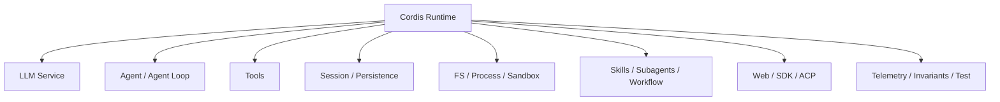
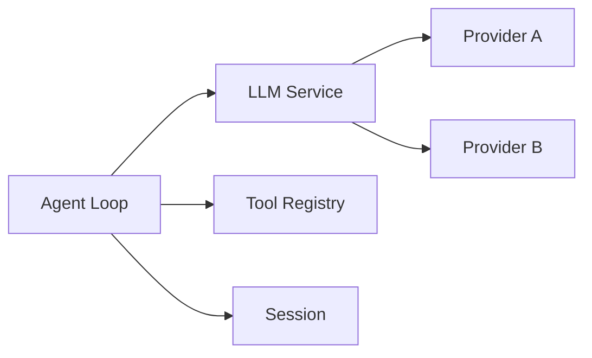
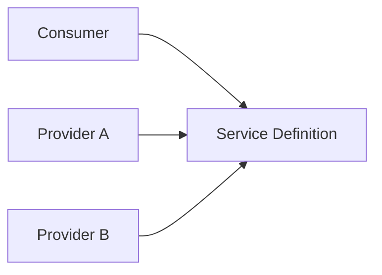

# DeepSeek Harness：Composable Runtime 完整導讀

> 最後核對：2026-08-24。DeepSeek Harness 專案整體仍屬快速演進階段；教材把 architecture principles、package contracts 與產品成熟度分開看。

DeepSeek Harness 最值得學的不是「Everything is a Plugin」這句口號本身，而是它把 Agent Runtime 的多數 responsibility 都做成可組合的 service / provider / consumer relationships。

```text
Cordis
→ Plugin lifecycle
→ Service Definitions
→ Providers
→ Consumers
→ Typed Events
→ Profiles / Bundles / Patches
```

## 一張圖看整體



這些不是一個中央 core 裡的幾個 switch，而是可以被 composition 管理的 capability families。

## Runtime Center：Cordis + Contracts

DeepSeek 的穩定中心不是單一巨大 Agent class，而是：

```text
Plugin lifecycle
+ shared Context
+ typed service contracts
+ typed events
+ composition rules
```

真正的 Model、Loop、Tool、Session、Sandbox、UI 都由 packages / plugins 提供。

這讓它適合研究：

> **如果 Agent Runtime 的基礎設施本身要可替換，要怎麼讓 consumer 不依賴 concrete backend？**

## Model 與 Agent Loop

LLM 是一個 capability seam；Agent Loop 是另一個明確責任。



Loop 負責 Turn / Step lifecycle，但 provider selection、tool policy、compaction、subagent、persistence 等可以透過其他 services / events 參與。

## State：Event-sourced Session

DeepSeek 的 durable state 不是只有 messages array。

```text
Session
→ append-only SessionEvent log
→ projections
→ context reconstruction
→ resume / fork / replay
```

常見 durable facts 可以包含：

```text
turn/start
user/message
step/start
assistant/message
tool/call
tool/result
approval/asked
approval/decided
turn/end
```

這讓「Model-visible means logged」「durable facts 可重建」成為重要 correctness 原則。

## Turn / Step

```text
Turn
→ 一批 input 被 claim 到工作收斂

Step
→ 一次 Model Request + 該回應產生的 Tool phase
```

一個 Turn 可以包含多個 Steps，所以 Tool Result 會推動下一個 Model Request，而不是把一個 User Message 簡化成一次 API Call。

## Tools：Pipeline 而不是單一 execute()

DeepSeek 的 Tool execution 值得獨立閱讀：

```text
Tool Call
→ validation / classification
→ guards / policy
→ approval if needed
→ execute
→ post-execute
→ finalize result
→ durable tool/result
```

同時還要處理 parallel-safe calls、exclusive barriers、cancel、sandbox escalation 等 production 問題。

## Context / System Prompt / Compaction

Context 不是 Loop 裡隨手 concat messages，而由 system prompt、tool schemas、session-derived messages、scoped plugin contributions 共同形成。

Compaction 也被視為可插入 lifecycle 的能力，而不是永久鎖死在 Loop 內部。

## Capability Seam

最值得反覆記住的是：



可以套到：

- LLM；
- filesystem；
- subprocess；
- sandbox；
- storage；
- code runtime；
- subagent；
- telemetry。

## Extension / Orchestration

DeepSeek 不只有 Plugin 這個泛稱，還有具體 capability families：

```text
Skills
Subagent Providers
Workflow
Jobs / Schedule / Goal / Feedback
Hooks / Events
Extensions
MCP-to-Tool providers
```

其中 Subagent Provider 很有代表性：delegation target 可以是 in-process Agent，也可以是另一套 runtime / protocol endpoint。

## Code Mode

Code Mode 把多次 Tool orchestration 變成受控 TypeScript program：

```text
Model
→ generated program
→ Code Runtime + async bindings
→ multiple operations / loops / aggregation
→ result
→ Model
```

它適合高密度 map/filter/batch 類操作，但不等於每個任務都應取代 iterative Agent Loop。

## Security / Execution

DeepSeek 把 security responsibility 拆得很明確：

```text
Sandbox Mode
Approval Policy
Permission Preset
Credentials
Tool Guards
Execution Providers
```

Sandbox backend 還會明確區分 `full` / `partial` enforcement，而 remote container / microVM 通常被視為「整個 execution world」替換，而不是只包一層 shell。

## Usage / Integration

DeepSeek 有多種 product boundary：

```text
Web Host / Client
CLI / Headless
TypeScript SDK
stdio JSON-RPC
ACP
Typert / remote API
In-process Cordis APIs
```

所以它不是只有 Web UI，也不是只有 framework API。

## Production / Correctness

DeepSeek 特別值得研究：

- session persistence；
- replay；
- invariants；
- loader smoke tests；
- telemetry；
- session query / projection；
- generated contract equivalence。

也就是不只問「Agent 能不能跑」，還問「runtime trajectory 能不能被重建與驗證」。

## 完整閱讀順序

### A. 架構與 Runtime

1. [官方視角：Lifecycle 與 Tool Pipeline](./official-visuals.md)
2. [Cordis 與 Everything-is-a-Plugin](./architecture.md)
3. [Model Adapter 與 Agent Loop](./model-and-agent-loop.md)
4. [Tool Execution Pipeline](./tool-execution.md)
5. [Context、System Prompt 與 Compaction](./context-and-compaction.md)
6. [Session 與 Events](./session-and-events.md)
7. [Profiles、Bundles 與啟動組合](./usage-and-profiles.md)

### B. Extensions / Orchestration

8. [Models、Skills、Hooks 與 Extensions](./models-skills-and-extensions.md)
9. [Subagents、Workflows 與 Jobs](./subagents-workflows-and-jobs.md)
10. [Code Mode 與 Plugins](./code-mode-and-plugins.md)

### C. Security / Execution

11. [Sandbox、Approval 與 Permission Presets](./security-and-approvals.md)
12. [Credentials 與 Execution Worlds](./execution-worlds-and-credentials.md)

### D. Usage / Integration / Production

13. [CLI、Headless 與 Automation](./headless-and-automation.md)
14. [Web、SDK、JSON-RPC、ACP 與自製 Client](./integration-surfaces.md)
15. [Production、Testing、Invariant 與 Replay](./production-and-testing.md)

### E. Labs / Source

16. DeepSeek Labs：Trace / Capability Plugin / Replay & Invariant
17. [`deepseek-ai/deepseek-harness` Source Map](../reference/deepseek-source-map.md)

## DeepSeek 最值得學的七件事

1. **Runtime responsibility 可以被 composition。**
2. **Consumer 應依賴 capability contract，而不是 provider implementation。**
3. **SessionEvent 可以成為 state、replay、audit、UI projection 的共同事實來源。**
4. **Tool pipeline 是 authorization、execution、result correctness 的核心 boundary。**
5. **Profile / Bundle 讓「啟動哪套 runtime」本身成為產品選擇。**
6. **Security backend 與 execution world 可以被當成一級可替換能力。**
7. **Production Harness 不只要跑得動，也要能 replay、inspect、validate。**

## 官方來源

- [DeepSeek Harness](https://deepseek.com/harness/en/)
- [`deepseek-ai/deepseek-harness`](https://github.com/deepseek-ai/deepseek-harness)
- [Architecture](https://github.com/deepseek-ai/deepseek-harness/blob/master/docs/architecture.md)
- [`packages/README.md`](https://github.com/deepseek-ai/deepseek-harness/blob/master/packages/README.md)
- [Subsystem index](https://github.com/deepseek-ai/deepseek-harness/blob/master/docs/subsystems/README.md)
