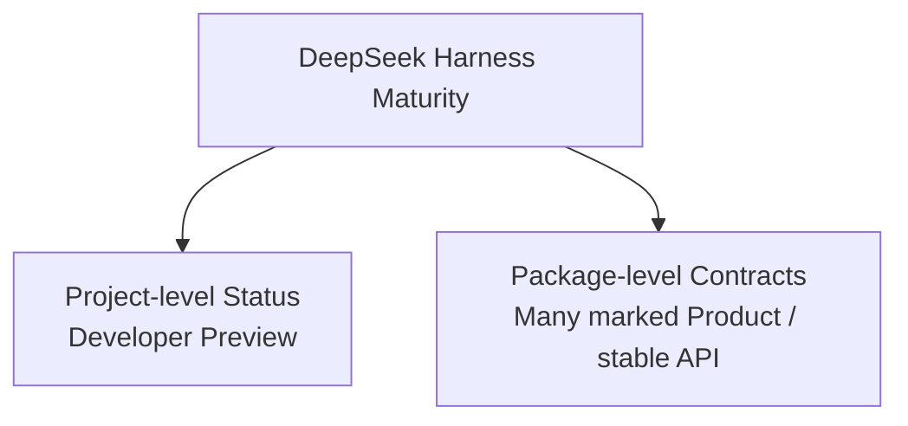
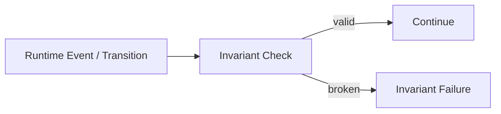
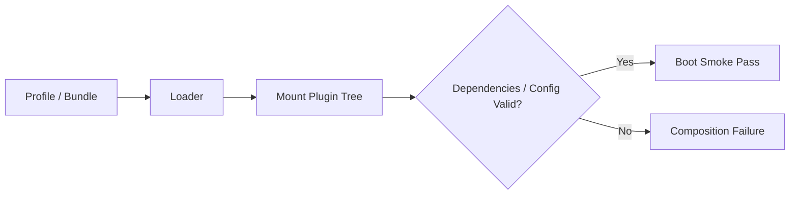
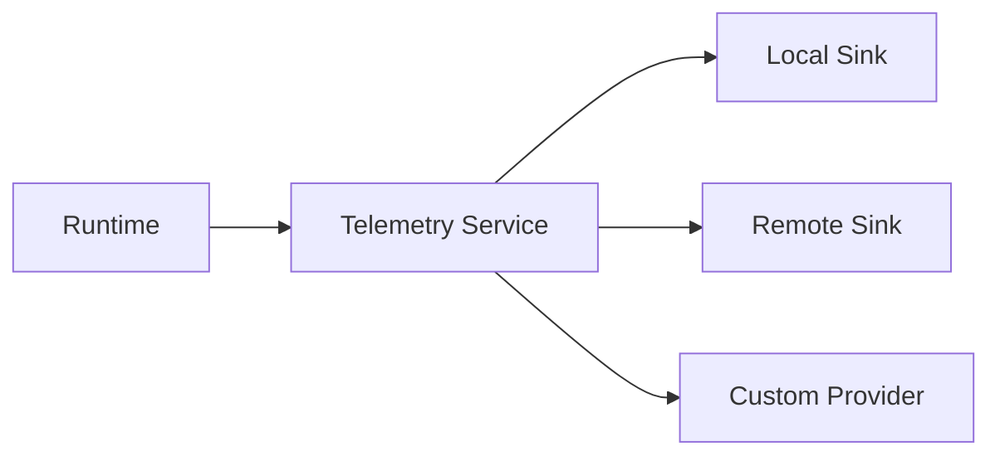

# Production、測試、Invariant 與成熟度

DeepSeek Harness 的另一個容易被低估的地方，是它不只在做「Plugin 架構示範」。目前 repo 已經有不少針對 correctness、replay、testing、telemetry、background jobs 與 production operation 的 subsystem。

但同時，官方 top-level README 仍明確標示：

> **Developer Preview — compatibility-breaking changes will happen.**

這兩件事要同時成立，才是公平的理解。

## 先拆成兩層成熟度



所以不要只說：

```text
DeepSeek 還是 preview，所以什麼都不穩。
```

也不要反過來說：

```text
很多 package 標 stable API，所以整套產品已經完全 production-stable。
```

比較精確的是：

> **局部 package contract 已開始承擔 stable API 壓力，但整個 Harness composition、產品 surface 與相容性仍處於快速演進期。**

## 1. Package Hierarchy 有明確 Release Expectation

官方 `packages/README.md` 目前直接為 package group 標記 release expectation。

很多核心 group 被標成：

```text
Product — stable API
```

包括：

```text
core
llm
subprocess
shell
terminal
code-runtime
sandbox
fs
lsp
skill
compaction
subagent
workflow
session
settings
credentials
storage
sdk
acp
interaction
host
client
```

而某些區域則明確標為：

```text
POC
Experimental
Support / lower compatibility expectations
```

這是一個很健康的 repo contract：不是把整棵 monorepo 都宣稱同樣穩定。

## 2. Invariant 是 Runtime Correctness 的第一級概念

DeepSeek 有獨立的 runtime-invariant registry。

Invariant 不是 unit test 的同義詞，而是：

> **Runtime 運行時必須一直成立的結構性條件。**

例如前面多次提到：

```text
Model-visible means logged
```

如果某個 model-visible input 沒有被 durable event 表達，resume / replay 後就可能重建出不同 context。

這類問題用「最後測試 pass」很難保證，因此需要 invariant。



## 3. Event Sourcing 讓 Replay 變成測試工具

因為 Session 是 append-only event log，所以可以把既有 trajectory 拿來做：

```text
replay
projection verification
regression
resume correctness
fork behavior
```

這對 Harness 特別重要。

普通 application test 常問：

```text
輸入 A → 輸出 B 嗎？
```

Harness 還要問：

```text
同一條 event history 重播後
→ Model Context 是否一樣？
→ UI Projection 是否一樣？
→ Session State 是否一樣？
```

## 4. `test-support` 不是普通 helper folder

官方 package map 把 `packages/test-support/` 描述為支援：

```text
testkits
invariants
replay
Loader smokes
```

這對 plugin-first architecture 特別重要，因為除了 function correctness，還需要測：

```text
Plugin 能否 mount？
dependency 是否齊全？
unmount 後 effect 有沒有清乾淨？
不同 composition 是否能 boot？
replay 是否 deterministic？
```

## 5. Loader Smoke Test 很適合 Composition Framework

一個 Plugin 自己的 unit test 通過，不代表整個 profile boot 得起來。

因此 DeepSeek 這種架構需要另一種測試：



這是 Codex 這種較固定 runtime 和 DeepSeek 這種 composition runtime 在測試策略上的自然差異。

## 6. Generated Docs / Type Equivalence 也被當成 CI Contract

DeepSeek 官方 subsystem docs 中有不少內容是由 source 產生，並透過 CI 驗證 freshness / type equivalence。

例如：

```text
Cordis API catalog
type-equivalent declarations
module graph
package README requirements
known limitations sections
```

這代表「文件跟 source drift」本身也被視為 correctness 問題。

對快速演進的 Framework，這比人工維護 API table 更可靠。

## 7. Guard：Loop Hygiene 與 Deadline

`packages/guard/` 不是 OS sandbox，而是 loop-level hygiene。

官方目前提到：

```text
repeat-call advisory reminders
tools/execute deadline enforcement
```

可以把安全 / correctness 分成：

```text
Sandbox   → capability boundary
Approval  → authorization
Guard     → runtime hygiene
Invariant → structural correctness
```

這四個層次不要混在一起。

## 8. Telemetry

DeepSeek 有 session telemetry capability seam。

這種設計的好處是：

```text
Runtime 產生 telemetry record
→ sink provider 決定送去哪裡
```

而不是 Agent Loop 直接 import 某個 observability vendor。



## 9. Session Query / Projection 對 Production Debug 很重要

Event sourcing 如果只有 raw log，實務上會很難查。

DeepSeek 目前還有：

```text
session-query
session-projection
full-text search
relationship trace
bounded exact-event reads
projection snapshots
```

這表示它已開始處理 production 系統真正會遇到的問題：

> Log 很完整，但我要怎麼快速找到「哪一次 Tool Call 導致這個結果」？

## 10. Background Jobs / Workflow / Schedule

Production Agent 常常不是「一個 Turn 跑完就結束」。

DeepSeek 目前把幾種長生命週期工作拆開：

```text
Jobs      → generic background work
Workflow  → workflow engine
Schedule  → session-local scheduled follow-ups
Goal      → same-session objective lifecycle
```

這比把全部都塞成「Agent 再呼叫一次自己」更容易觀察與管理。

## 11. Crash Recovery / Persistence

Session persistence seam 目前有 JSONL 與 SQLite backend，並處理：

```text
flush
SessionHeader
crash recovery
resume
```

Production 的關鍵問題不是「有沒有存聊天」，而是：

```text
process crash 後
哪些 event 已 commit？
哪些沒有？
resume 要從哪個 durable boundary 開始？
```

Event-sourced Session 正是在解這種問題。

## 12. Production 使用仍要保守在哪裡？

即使很多 package 標 stable API，整個專案仍是 developer preview，所以要把以下成本算進去：

- Profile / Bundle composition 可能變；
- package 拆分仍可能調整；
- CLI / Web product UX 仍可能有 breaking change；
- cross-package integration contract 仍在快速收斂；
- Plugin ecosystem 還年輕；
- production deployment pattern 沒有 Codex 那麼長的產品使用壓力。

## 13. 哪些地方反而很適合現在就採用？

如果你是：

### Harness researcher

DeepSeek 很適合，因為：

```text
Loop / Model / Sandbox / Storage 可換
Minimal / Code / Creator Mode
Replay / Invariants
Plugin composition
```

### 內部 Agent Platform 團隊

如果團隊可以承擔 API churn，而且真的需要高度可替換 backend，DeepSeek 很有吸引力。

### 想直接做穩定商業 Coding Agent Client

目前仍要更仔細評估 compatibility / maintenance；Codex 的 App Server 與既有 Coding Agent product surface 通常風險較低。

## 14. 公平的成熟度比較

| 面向 | Codex | DeepSeek Harness |
|---|---|---|
| Top-level product maturity | 高 | Developer Preview |
| 核心 package contracts | 成熟、受產品使用壓力 | 很多已標 Product / stable API |
| Runtime correctness tooling | tests / evals / state / protocol validation | invariants / replay / test-support / generated-doc checks |
| Integration compatibility pressure | 高 | 正在建立，SDK 等已有 stable API 標記 |
| Ecosystem maturity | 高 | 較新 |
| 架構實驗能力 | 高 | 非常高 |
| API churn risk | 中 | 目前較高 |

所以不應再把 DeepSeek 簡化成「只有研究價值」。

更準確是：

> **它已具備不少 production-oriented subsystem，但整體產品版本承諾仍不如 Codex 穩定。**

## 本章重點

1. **Developer Preview 是 project-level status，不代表每個 package 都沒有穩定 contract。**
2. **DeepSeek 已把 Invariant、Replay、Test Support、Telemetry、Session Query 等 correctness / operations 能力做成正式 subsystem。**
3. **Composition Framework 需要 Loader / Mount / Teardown 類測試，不只是 unit test。**
4. **Event sourcing 讓 resume / replay correctness 可以被直接驗證。**
5. **現在採用 DeepSeek 的主要 production 風險是 compatibility churn，而不是「缺少 production-oriented architecture」。**

## 官方來源

- [Top-level README / Developer Preview](https://github.com/deepseek-ai/deepseek-harness/blob/master/README.md)
- [`packages/README.md`](https://github.com/deepseek-ai/deepseek-harness/blob/master/packages/README.md)
- [Subsystem index](https://github.com/deepseek-ai/deepseek-harness/blob/master/docs/subsystems/README.md)
- [Invariants](https://github.com/deepseek-ai/deepseek-harness/blob/master/docs/subsystems/invariants.md)
- [Persistence](https://github.com/deepseek-ai/deepseek-harness/blob/master/docs/subsystems/persistence.md)
- [Session Query](https://github.com/deepseek-ai/deepseek-harness/blob/master/docs/subsystems/session-query.md)
- [Session Projection](https://github.com/deepseek-ai/deepseek-harness/blob/master/docs/subsystems/session-projection.md)
