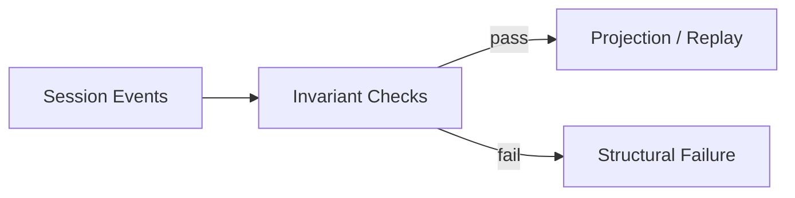
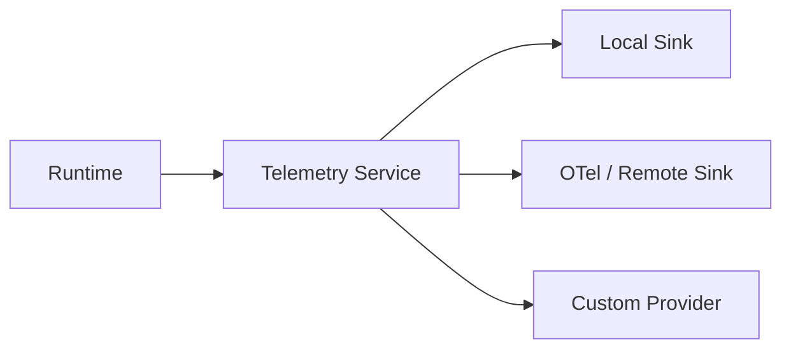

# Production、測試、Invariant 與成熟度

DeepSeek Harness 的 production 評估要同時看兩層：

```text
Project-level status
→ Developer Preview

Package-level contracts
→ 許多核心 package 已標 Product / stable API
```

不能因為 top-level 是 preview 就說「沒有 production-oriented architecture」，也不能因為部分 package stable 就假設整個 product composition 已沒有 churn。

## 1. Runtime Invariant

Event-sourced runtime 的 correctness 可以明確寫成 invariant。

例如：

```text
Session seq 單調增加
Turn / Step enclosure 正確
Tool Result 必須對應 Tool Call
Model-visible history 可由 durable log 重建
```



這讓資料錯誤可以在 test / replay 階段被抓到，而不是等 UI 或下一輪 Model 出現奇怪行為。

## 2. Replay / Test Support

官方 test-support family 包含：

```text
testkits
invariants
replay
Loader smokes
```

對 Harness 來說，replay 的價值是：

```text
固定 trajectory
→ 換 projection / plugin / runtime version
→ 驗證結果是否仍符合 contract
```

不必每次都重新呼叫 live Model 才能測 state correctness。

## 3. Composition Smoke Test

Plugin framework 多了一類一般 monolith 不明顯的 failure：

```text
package 都存在
但 composition mount 不起來
```

因此需要：

```text
load profile
→ resolve dependencies
→ mount tree
→ basic operation
→ unload / teardown
```

這種 Loader smoke 應是每個 production Profile 的 CI contract。

## 4. Generated Docs / Type Equivalence

快速演進的 framework 很容易 source 與 docs drift。

DeepSeek 將部分 generated docs / type-equivalence 當成 CI contract，可以驗證：

```text
public type surface
generated subsystem docs
module graph
package metadata
```

和實際 source 沒有悄悄分叉。

## 5. Session Query / Projection

Event log 完整不代表 production debug 就容易。

需要額外 query / projection capability：

```text
full-text search
relationship trace
bounded exact-event reads
projection snapshots
```

這樣才能回答：

> **哪個 Tool Call 導致這個 Result？這段 activity 屬於哪個 Turn / Step？**

## 6. Telemetry

Telemetry 本身也可以是 capability seam：



Agent Loop 不必硬 import 某個 observability vendor。

## 7. Long-lived Work

Production Agent 常常不是一個 Turn 結束就全部消失。

DeepSeek 已拆出：

```text
Jobs
Workflow
Schedule
Goal
Feedback
```

這讓 background / long-lived responsibility 有正式 lifecycle，而不是全部藏在 Agent Loop 的 Promise 裡。

## 8. Persistence / Crash Recovery

Session persistence 支援 JSONL / SQLite 等 backend，重點不只是「有保存聊天」。

真正要問：

```text
哪些 event 已 durable commit？
flush boundary 在哪？
process crash 後從哪裡 resume？
projection 如何重建？
compaction state 是否一致？
```

Event sourcing 讓這些問題可以被具體驗證。

## 9. Developer Preview 要怎麼採用？

至少準備：

```text
version pinning
profile / bundle smoke tests
plugin compatibility tests
session migration strategy
SDK / protocol regression tests
replay fixtures
sandbox backend verification
```

真正風險主要是 cross-package / product composition churn，而不是完全缺乏 production subsystem。

## 10. 哪些情境特別適合？

### Harness Research

因為 Loop / Model / Sandbox / Storage / Profile 容易替換，適合 controlled experiments。

### Internal Agent Platform

如果團隊真的需要替換 backend，並且可以承擔 version / composition ownership，架構彈性很有價值。

### Long-term Product Client

則要特別評估 SDK / protocol compatibility、profile churn 與 upgrade budget。

## Production Adoption Checklist

```text
[ ] pin project + plugin versions
[ ] snapshot effective profile composition
[ ] Loader smoke test
[ ] replay core fixtures
[ ] validate Session invariants
[ ] test persistence crash / resume
[ ] verify sandbox full/partial behavior
[ ] no unattended approval deadlock
[ ] SDK / protocol regression tests
[ ] telemetry + session query available
[ ] migration / rollback plan
```

## 本章重點

1. **Developer Preview 是 project-level status，不代表每個 package 都沒有 stable contract。**
2. **Invariant / Replay 是 event-sourced Harness 很重要的 production correctness tooling。**
3. **Composable Runtime 需要 composition smoke test，不只 unit test。**
4. **Session Query / Projection 讓完整 event log 變成可操作 debug system。**
5. **目前主要 adoption risk 是 compatibility / composition churn，需要 version pinning 與 regression strategy。**

## 官方來源

- [`packages/README.md`](https://github.com/deepseek-ai/deepseek-harness/blob/master/packages/README.md)
- [Invariants](https://github.com/deepseek-ai/deepseek-harness/blob/master/docs/subsystems/invariants.md)
- [Persistence](https://github.com/deepseek-ai/deepseek-harness/blob/master/docs/subsystems/persistence.md)
- [Session Query](https://github.com/deepseek-ai/deepseek-harness/blob/master/docs/subsystems/session-query.md)
- [Session Projection](https://github.com/deepseek-ai/deepseek-harness/blob/master/docs/subsystems/session-projection.md)
