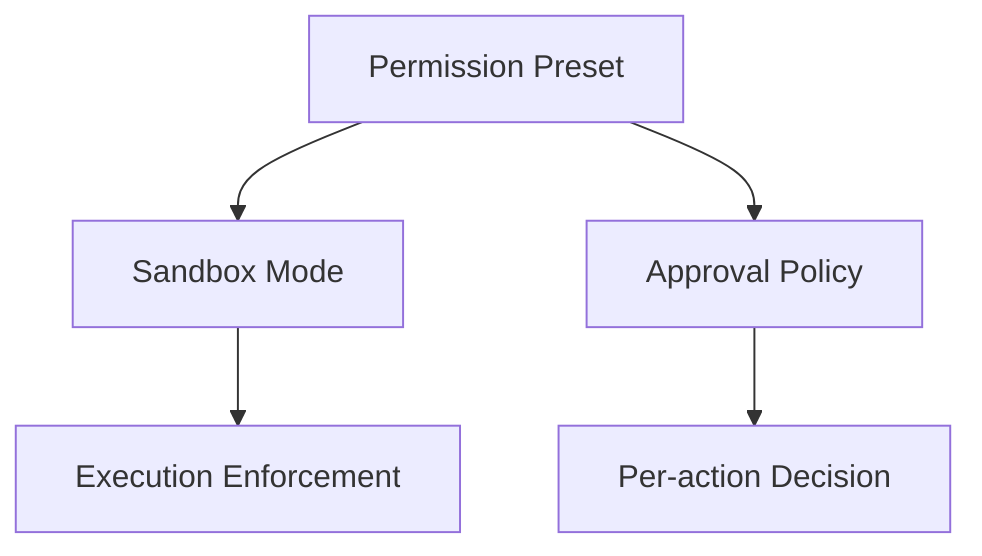
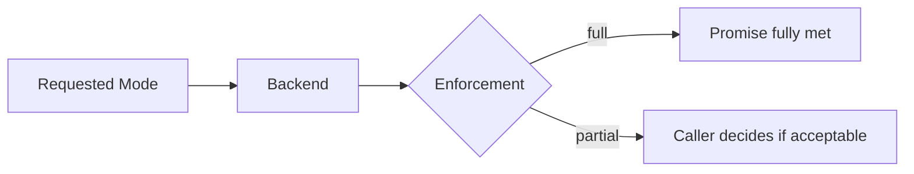
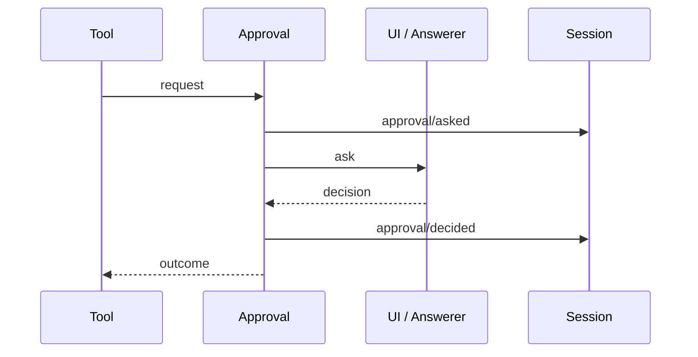

# 安全模型：Sandbox、Approval 與 Permission Presets

DeepSeek Harness 將安全責任拆成多個相對獨立 capability：

```text
Sandbox
Approval
Permission Preset
Credentials
Tool Guards
Execution Providers
Audit Events
```

第一件事就是不要把它們混成一個「安全模式」。

## 三個最容易混淆的概念



### Sandbox Mode

回答：某類 execution effect 技術上能不能發生？

### Approval Policy

回答：這一次 action 是否需要 / 能取得額外授權？

### Permission Preset

回答：產品 UI 怎麼把前兩者包成可理解的模式？

Preset 本身不是 enforcement。

## Sandbox Modes

目前 vocabulary：

```text
read-only
workspace-write
danger-full-access
```

要注意：官方的 `SandboxMode` 主要描述 filesystem effects，不代表 network、process visibility、secret access 都一起被同一個 enum 管理。

### read-only

限制寫入，只保留 backend 必要 sink。

### workspace-write

允許 workspace 與指定 temp area 的寫入。

### danger-full-access

跳過 confinement，直接在原始 execution context 執行。

因此它不是「更大的 sandbox」，而是**不使用 confined mode**。

## Enforcement Strength：`full / partial`

Runtime 不應假裝每個 OS backend 都能做到相同程度的 isolation。



這是一個很重要的 production pattern：**安全承諾要能被量測與回報，不要只回傳 enabled=true。**

## Local Sandbox Providers

目前 local implementations 涵蓋不同平台，例如：

```text
Linux  → bwrap / Landlock
macOS  → Seatbelt
Windows→ ACL / restricted-token backend
```

Consumer 依賴 sandbox contract，不應直接依賴某個平台 command wrapper。

## Approval Outcomes

Approval 是一個窄而清楚的問題：

> **May this specific action proceed?**

目前 outcome：

```text
allowed-once
rejected
cancelled
unavailable
```

只有 `allowed-once` 是 grant。

`unavailable` 也 fail closed：沒有 answerer、answerer error、非法 response 都不會默認放行。

## `ask` 與 `never`

Approval policy 可以決定：

```text
ask
→ 交給 interaction / answerer chain

never
→ 不詢問，deterministic reject
```

`never` 對 unattended / CI 很重要，因為「無人回答」不能變成自動允許。

## Approval Audit

Decision 可寫入 Session Log：

```text
approval/asked
approval/decided
```

這些可以是 audit-only durable facts，不必污染 Model transcript。



## Credentials

Config / UI 應持有 CredentialRef，而不是到處複製真正 secret。

```text
CredentialRef
→ resolver
→ secret only at operation boundary
```

詳細見：[Permission、Credentials 與 Execution Worlds](./permissions-credentials-execution-worlds.md)。

## Guard、Approval、Sandbox、Invariant

四層不要混：

```text
Guard
→ runtime hygiene / owner policy

Approval
→ authorization

Sandbox
→ technical confinement

Invariant
→ structural correctness
```

例如重複 Tool Call advisory 是 Guard 問題；filesystem write boundary 是 Sandbox 問題；orphan Tool Result 是 Invariant 問題。

## Remote Execution

Container / microVM / remote worker 往往代表整個 execution world 被替換：filesystem、subprocess、terminal、LSP 可能都要一起指向遠端。

因此不要把「remote environment」簡化成 sandbox mode 的另一個 enum value。

## 本章重點

1. **Sandbox、Approval、Permission Preset 是三個不同責任。**
2. **SandboxMode 不能被過度解讀成所有 security boundary。**
3. **`full / partial` 讓 enforcement strength 可被明確回報。**
4. **Approval 只有 allowed-once 是 grant；unavailable 也 fail closed。**
5. **Guard、Approval、Sandbox、Invariant 分別處理不同層次。**

## 官方來源

- [Sandbox](https://github.com/deepseek-ai/deepseek-harness/blob/master/docs/subsystems/sandbox.md)
- [Approval](https://github.com/deepseek-ai/deepseek-harness/blob/master/docs/subsystems/approval.md)
- [Permission Presets](https://github.com/deepseek-ai/deepseek-harness/blob/master/docs/subsystems/permission-presets.md)
- [Credentials](https://github.com/deepseek-ai/deepseek-harness/blob/master/docs/subsystems/credentials.md)
