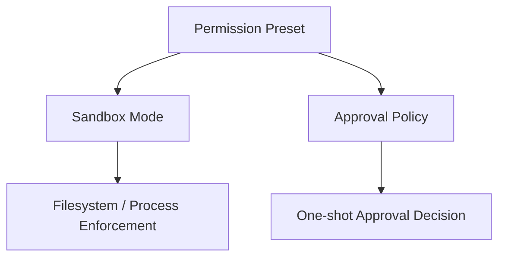
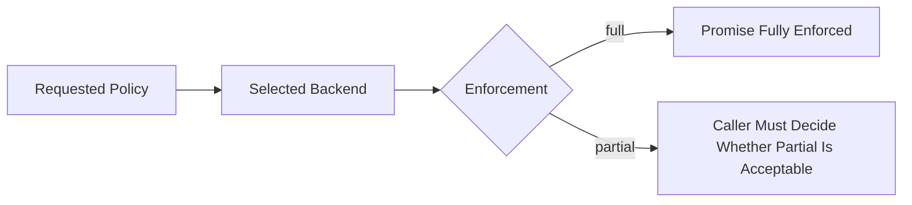
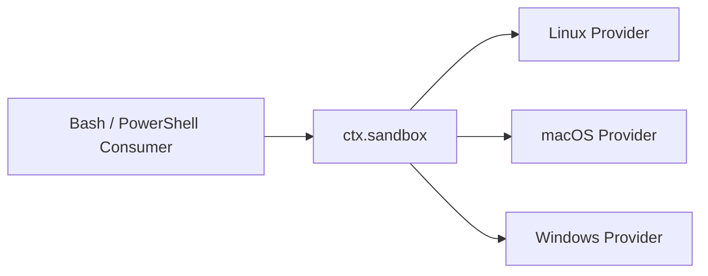
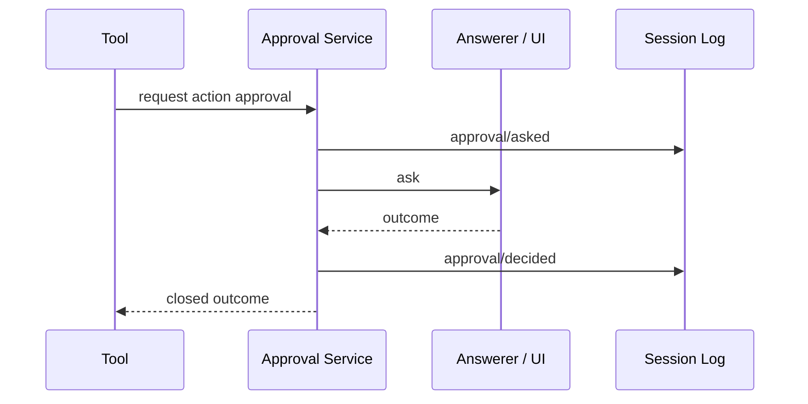

# 安全模型：Sandbox、Approval 與 Permission Presets

如果只談 DeepSeek Harness 的可組合性，卻不談安全，會讓比較失真。

DeepSeek 目前已把安全責任拆成幾個相對獨立的 capability：

```text
Sandbox Mode
Approval Policy
Permission Preset
Credentials
Tool Guards / Events
```

和 Codex 一樣，核心原則仍是：

> **Model 提出 Action，不等於 Runtime 一定允許執行。**

## 先拆開三個最容易混淆的概念



### Sandbox Mode

回答：**這次 Process 在 filesystem effect 上技術上能做什麼？**

### Approval Policy

回答：**某個 Tool Action 需要額外授權時，要不要問人或 reviewer？**

### Permission Preset

回答：**產品 UI 要怎麼把前兩個 knob 組成一個使用者看得懂的模式？**

Permission Preset 本身不是 OS enforcement。

## Sandbox 的三種模式

目前 vocabulary 是：

```text
read-only
workspace-write
danger-full-access
```

名字和 Codex 很接近，但 DeepSeek 官方文件特別強調：

> `SandboxMode` 主要描述 **filesystem effects**；network 與 process visibility 不在這個 vocabulary 裡。

所以不要把：

```text
workspace-write
```

誤讀成：

```text
只能連特定網路
看不到其他 processes
一定拿不到 secrets
```

那些是其他 trust boundary。

### `read-only`

要求 backend 阻止寫入，只保留 backend / shell 必要的 sink。

### `workspace-write`

允許 workspace root 與 backend 承諾的 temp area 寫入。

### `danger-full-access`

直接跳過 confinement；consumer 使用原始 argv 執行。

這表示 `danger-full-access` 不是「較寬的 sandbox」，而是**不走 confined provider**。

## Enforcement 會明確回報 `full` 或 `partial`

DeepSeek 這裡有一個很值得學的細節：Runtime 不應假裝所有平台都能提供相同強度的隔離。

```text
full
partial
```

`partial` 代表 backend 確實啟用了限制，但無法保證 mode 宣稱的所有 file effects。

官方目前列出的例子包括較舊 Landlock ABI 與 Windows ACL backend 的部分邊界。

因此安全判斷應是：



這比只回傳「sandbox 已啟用」更誠實。

## Sandbox 本身也是 Capability Seam

目前 local provider 包含平台實作：

```text
Linux  → bwrap / Landlock
macOS  → Seatbelt
Windows→ ACL restricted-token backend
```

而 shell / PowerShell 等 consumer 不直接依賴某個 OS runner；它們依賴 `ctx.sandbox` contract。



這也是 DeepSeek 和 Codex 很值得對照的地方：兩邊都做 cross-platform enforcement，但 DeepSeek 更刻意把 backend 做成 service seam。

## Container、MicroVM、Remote Execution 怎麼看？

官方文件有一個重要界線：

> Containers、microVMs、remote execution 不應只是 `ctx.sandbox` 的另一個 wrapper provider；它們通常代表整個 execution world 都換掉。

因為一旦 execution world 在遠端，通常需要一起替換：

```text
filesystem
subprocess
terminal
LSP
possibly code runtime
```

這正是 Capability Seam 的價值：不是只把 command 包進 container，而是讓整組 capability 指向同一個 execution world。

## Approval 是獨立的一次性決策

DeepSeek 的 user approval seam 回答一個很窄的問題：

> **May this specific action proceed?**

目前 `ApprovalOutcome` 是封閉集合：

```text
allowed-once
rejected
cancelled
unavailable
```

只有 `allowed-once` 是 grant，其餘結果全部 fail closed。

### 為什麼 `unavailable` 很重要？

如果：

- 沒有 answerer；
- answerer throw；
- answerer 回傳非法值；
- request 找不到 owner；

系統不是默認允許，而是：

```text
unavailable → deny
```

這是 production Harness 很重要的 default-deny 原則。

## Approval Policy：`ask` 與 `never`

目前 session-level policy 是：

```text
ask
never
```

### `ask`

交給已組合的 answerer chain；如果沒有人能回答，結果是 `unavailable`。

### `never`

不送出互動詢問，直接 deterministic reject。

這特別適合：

```text
CI
headless automation
unattended execution
```

因為它不會卡在「等人按同意」。

## Approval 也是 Event-sourced Audit Trail

Approval request 需要位於 open turn 中，並在 Session Log 記錄一對 audit events：

```text
approval/asked
approval/decided
```

這些是 log-only facts，不必直接進 model transcript。



因此 reload / audit 可以知道「當時問了什麼、最後怎麼決定」。

## Approved Retry 與 Sandbox Escalation

DeepSeek 的 policy resolution 是 per-call。

概念上可以是：

```text
原始 action
→ workspace-write 被拒
→ Approval
→ allowed-once
→ 用明確較寬 mode 重試這一次 call
```

這比直接永久改 session sandbox 更窄。

## Credentials 是另一條安全邊界

`packages/credentials/` 把 credential reference 與真正 secret value 分開。

重要原則是：

```text
Config / Session / UI
持有 CredentialRef

真正 operation 執行時
才 resolve secret value
```

這避免把 secret 當普通 config 字串在 UI、Session Event、Plugin tree 中到處複製。

## Tool Guard 與 Sandbox 不同

DeepSeek 還有 `guard`、tool execution events、invariants 等機制。

要分清楚：

```text
Guard / Rule-like logic
→ 判斷某個 action 是否合理、是否 deadline、是否重複

Approval
→ 這一次要不要放行

Sandbox
→ OS / execution layer 能不能真的造成某種 effect
```

三者不能互相取代。

## DeepSeek 與 Codex 的安全模型怎麼公平比較？

| 問題 | Codex | DeepSeek Harness |
|---|---|---|
| Sandbox modes | read-only / workspace-write / full access 類 | read-only / workspace-write / danger-full-access |
| OS enforcement | productized sandbox stack | swappable sandbox service + platform providers |
| Approval | App / CLI / App Server approval lifecycle | `ctx.approval` + answerer waterfall |
| Fail closed | 是 | 是，`unavailable` 也拒絕 |
| Session policy | permission / approval config | sandbox events + approval policy events |
| Product preset | permission profiles | Permission Presets |
| Remote execution | 有 environments / execution abstractions | 倾向替換整組 capability seam |
| Credential boundary | Codex auth / provider / environment 管理 | dedicated credential ref / resolver seam |

更精確的結論是：

> **Codex 的安全優勢在完整 Coding Agent 產品整合；DeepSeek 的安全模型其實也相當完整，優勢則在 enforcement backend 與 interaction seam 的可替換性。**

不能再簡化成「Codex 有 security，DeepSeek 只是 plugin framework」。

## 本章重點

1. **Sandbox、Approval、Permission Preset 是三個不同責任。**
2. **DeepSeek 的 SandboxMode 主要描述 filesystem effects，不包含 network 等所有安全邊界。**
3. **Sandbox provider 必須 fail closed，並明確回報 full / partial enforcement。**
4. **Approval 只有 `allowed-once` 是 grant；其他 outcome 一律拒絕。**
5. **Approval decision 會寫入 Session Log，形成 durable audit trail。**
6. **Remote Sandbox 往往應替換整個 execution capability family，而不是只包一層 shell。**

## 官方來源

- [Sandbox subsystem](https://github.com/deepseek-ai/deepseek-harness/blob/master/docs/subsystems/sandbox.md)
- [Approval subsystem](https://github.com/deepseek-ai/deepseek-harness/blob/master/docs/subsystems/approval.md)
- [Permission Presets](https://github.com/deepseek-ai/deepseek-harness/blob/master/docs/subsystems/permission-presets.md)
- [Credentials](https://github.com/deepseek-ai/deepseek-harness/blob/master/docs/subsystems/credentials.md)
