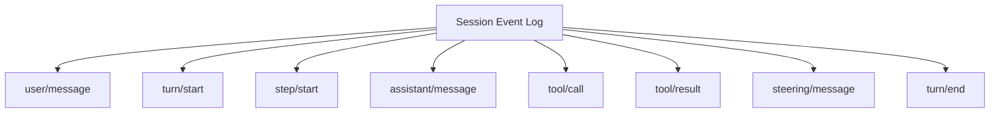
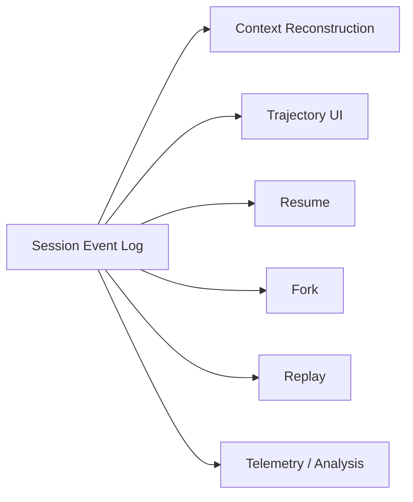
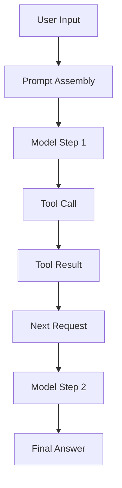
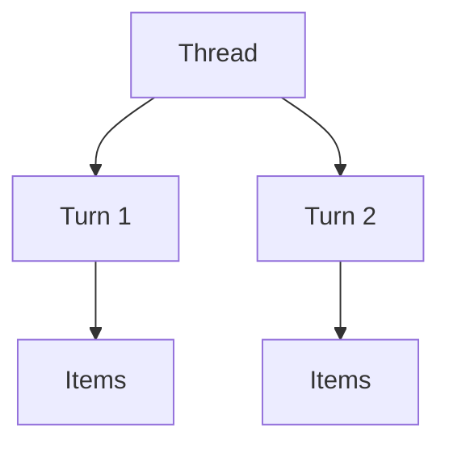
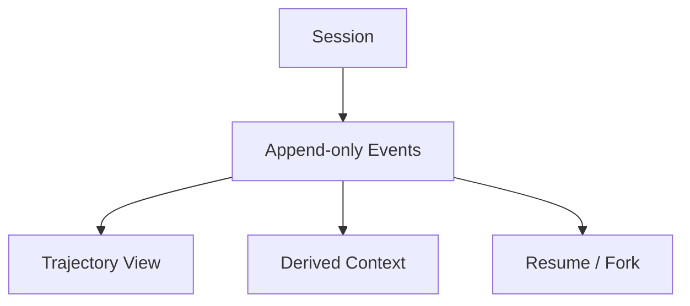
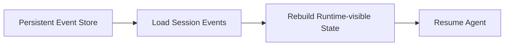
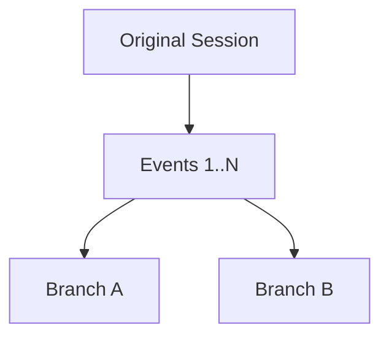
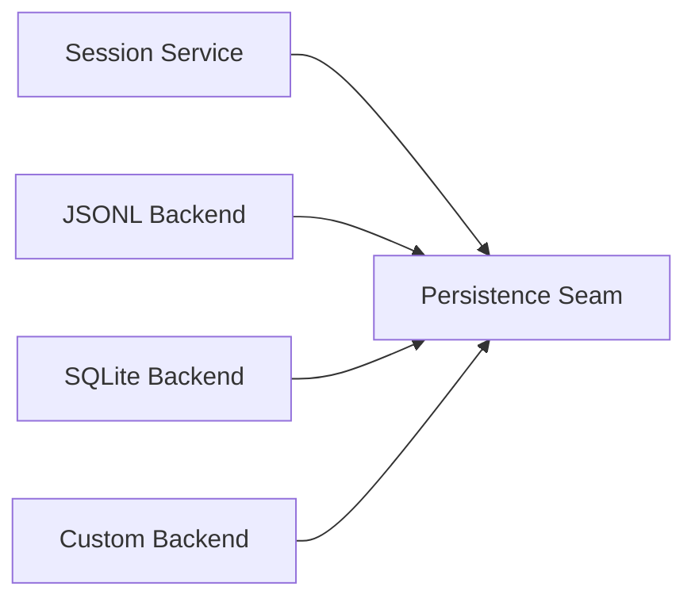

# Session、Events 與可追溯狀態

DeepSeek Harness 另一個很值得研究的地方，是它把 **append-only SessionEvent log** 放在 Runtime 的中心。

先用一句話理解：

> **不是「把聊天記錄存起來」，而是把模型真正看過、做過、收到過的重要事實記成可重建的事件流。**

## Session 不是單純 messages[]

最小 chatbot 常把狀態寫成：

```ts
messages = [
  {role: 'user', content: '...'},
  {role: 'assistant', content: '...'},
]
```

但 Coding Agent 還有：

- reasoning / response chunks；
- tool calls；
- tool results；
- steering input；
- subagent activity；
- context injection；
- turn / step lifecycle；
- errors / continuation。

所以單純 `messages[]` 很快就不夠。

DeepSeek Harness 的方向是：



## Model-visible means logged

官方文件強調一個很重要的 invariant：**模型看得到的重要事實應可由 log 重建。**

這帶來一個直接好處：



也就是說，不需要每個功能各自維護一份「可能不一致的真相」。

## Event Sourcing 的直覺

一般 mutable state：

```text
目前狀態 = X
```

Event-sourced state：

```text
Event 1
Event 2
Event 3
...
→ fold / derive
→ 目前狀態 X
```

例如：

```text
session/created
turn/start
user/message
step/start
assistant/message
 tool/call
 tool/result
step/start
assistant/message
turn/end
```

你不只知道「最後長什麼樣」，還知道**怎麼走到這裡**。

## 為什麼這對 Agent 特別重要？

Coding Agent 的 debug 問題常是：

> 為什麼它突然做了這個決定？

如果只保存最後 assistant message，幾乎無法回答。

如果有完整 trajectory：



就能問：

- 當時模型看到什麼？
- 哪個 Tool Result 改變了決策？
- Context injection 從哪個 Plugin 來？
- Retry 前後有什麼不同？
- Fork 是從哪個 boundary 開始？

## Session、Turn、Step

DeepSeek 的粒度可以先理解成：

```text
Session
└─ Turn
   ├─ Step 1
   │  ├─ model request
   │  ├─ tool/call
   │  └─ tool/result
   ├─ Step 2
   │  ├─ model request
   │  └─ ...
   └─ turn/end
```

### Session

Durable trajectory / conversation 的整體邊界。

### Turn

一次 user objective / queued input 被處理到目前沒有 owed work 的工作單位。

### Step

一次 model request，以及這次 response 觸發的 tool actions。

這和 Codex 的 `Thread → Turn → Item` 不完全一樣，但用途高度相關。

## Codex 與 DeepSeek 的資料模型差異

Codex 對產品 client 暴露的心智模型非常清楚：



DeepSeek 更強調：



所以可以先把兩者理解成：

| | Codex | DeepSeek Harness |
|---|---|---|
| 對外主要心智模型 | Thread / Turn / Item | Session / Turn / Step + Events |
| 強項 | Client / UI domain model | Runtime traceability / replay |
| State 觀點 | Product lifecycle primitives | Event-sourced durable facts |

不是二選一的唯一正解，而是 abstraction 重點不同。

## Resume

如果 durable session 可以從 event log 重建，Resume 就不是「把最後一句文字塞回去」。

概念上：



## Fork

Fork 可以從既有 session 的某個 boundary 建立 child trajectory。



用途：

- 比較兩種修法；
- benchmark 不同 model；
- 保留相同 exploration 前綴；
- 研究不同 prompt / tool policy 對結果的影響。

## Replay 與 Trajectory

Event log 讓 UI 不只是顯示「聊天泡泡」。

可以做：

```text
filter by source
inspect model request
inspect tool call
inspect injection
inspect subagent event
trace turn boundary
```

這對 Harness developer 特別重要，因為你想 debug 的常常不是最終答案，而是 Runtime 行為。

## Persistence Backend

DeepSeek Harness 的 persistence abstraction 也符合 plugin-first 思維：storage 可以有不同 backend，例如 JSONL / SQLite 類型的 durable store。

重點仍然是：

> Consumer 不應把 Agent Runtime 綁死在某一種 storage implementation。



## Event Sourcing 的代價

這種設計也不是沒有成本：

- event schema versioning 更重要；
- log 可能快速膨脹；
- compaction / snapshot strategy 需要設計；
- plugin-specific event 必須有清楚 ownership；
- replay 不等於可以安全重做外部 side effect。

特別要區分：

```text
Replay state
≠
重新執行所有 Tool side effects
```

例如 `git push`、付款、production deploy，不能因為 replay log 就再做一次。

## 對自製 Harness 的啟發

即使你不使用 DeepSeek Harness，也很值得採用這個問題：

> **每一個 Model-visible fact，是否都能找到來源與 durable representation？**

如果答案是否定的，之後常會遇到：

- resume 後行為不同；
- debug 無法還原；
- UI 和 model context 不一致；
- fork 丟失重要狀態；
- telemetry 與實際 execution 對不上。

## 本章記住三件事

```text
1. Session 是 trajectory，不只是 messages[]。
2. Durable fact 應進 append-only event log。
3. Resume / Fork / Replay / Context reconstruction 可以共享同一份真相來源。
```

## 官方來源

- [Core subsystem](https://github.com/deepseek-ai/deepseek-harness/blob/master/docs/subsystems/core.md)
- [DeepSeek Harness Architecture](https://github.com/deepseek-ai/deepseek-harness/blob/master/docs/architecture.md)
- [DeepSeek Harness official page](https://deepseek.com/harness/en/)
