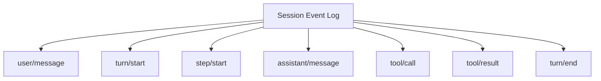
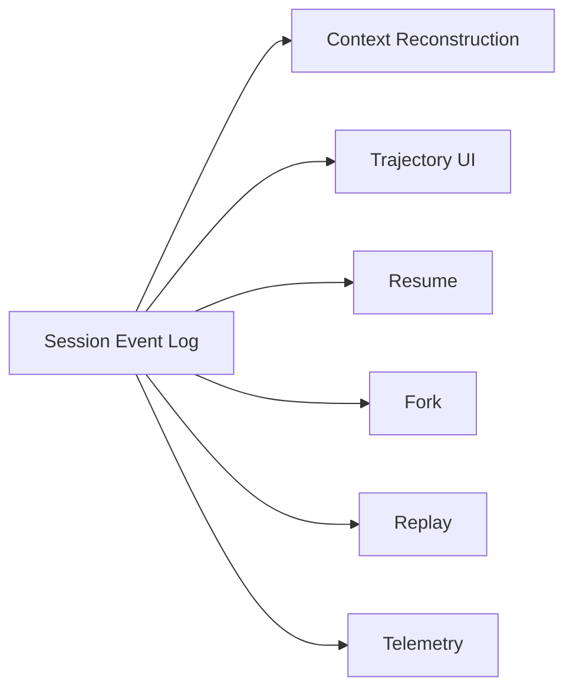
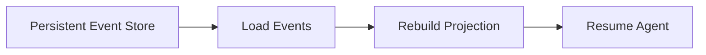
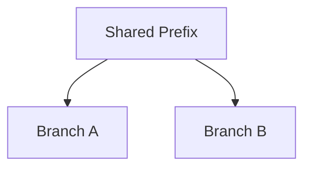
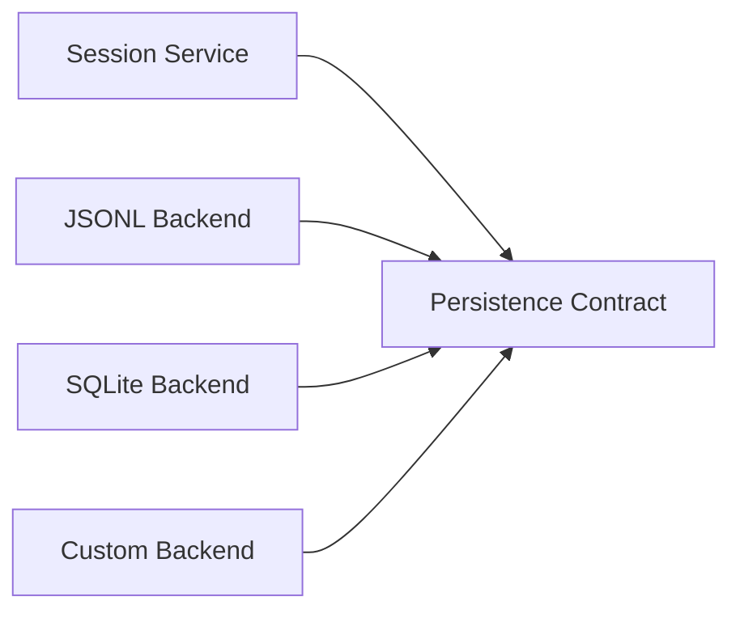

# Session、Events 與可追溯狀態

DeepSeek Harness 把 **append-only SessionEvent log** 放在 Runtime 的中心。這不是「把聊天存起來」，而是把會影響 trajectory 的 durable facts 記成可重建事件流。

## Session 不是單純 messages[]

Coding Agent 還有：

```text
turn / step lifecycle
assistant output
tool calls / results
steering input
approval audit
context injection
subagent activity
errors / continuation
```

所以 DeepSeek 把 durable trajectory 表成事件：



## Model-visible means logged

核心 invariant 可以理解成：

> **未來 Model decision 依賴的重要 durable fact，應能從 Session log 重建。**



這降低「UI、Resume、Model Context 各自維護一份真相」造成的不一致。

## Session / Turn / Step

```text
Session
└─ Turn
   ├─ Step 1
   │  ├─ model request
   │  ├─ tool/call
   │  └─ tool/result
   ├─ Step 2
   └─ turn/end
```

### Session

整段 durable trajectory 的邊界。

### Turn

一批 input 被 claim，到目前沒有 owed work 的工作單位。

### Step

一次 Model Request，加上該 response 產生的 Tool phase。

## Event Sourcing 的直覺

Mutable snapshot 只告訴你：

```text
目前狀態 = X
```

Event-sourced state 保存：

```text
Event 1 → Event 2 → Event 3 → ...
→ fold / projection
→ X
```

這對 Agent 特別重要，因為 debug 時真正想知道的常是：

```text
當時 Model 看到了什麼？
哪個 Tool Result 改變決策？
哪個 Plugin 注入 Context？
哪次 approval 放行？
哪個 Step 失敗或 retry？
```

## Live Event 與 Durable Event 要分開

不是所有 runtime event 都必須永久保存。

可以分：

```text
Session Events
→ durable facts

Agent Events
→ in-flight lifecycle / steering / status

Capability Events
→ tool / fs / telemetry boundary interception
```

這讓 UI 可以看到 live progress，但 persistent trajectory 仍維持較穩定 schema。

## Resume



Resume 不是「把最後一句訊息塞回 prompt」，而是從 durable facts 重建 runtime-visible state。

## Fork



Fork 很適合：

- 比較兩種修法；
- benchmark 不同 model / policy；
- 保留相同 exploration 前綴；
- 研究不同 plugin composition 對結果的影響。

## Replay 不等於重做 Side Effects

```text
Replay state / trajectory
≠
重新執行 git push / payment / deploy
```

Replay 的價值是重建、驗證、分析；外部 side effect 是否可重做仍需要 idempotency / simulation / explicit replay policy。

## Persistence Backend

Session service 可以依賴 persistence seam，而不是把 runtime 綁死在單一 backend。



## Compaction 與 Projection

Event log 可以保留較完整 durable history，但 Model context 不需要每次把全部 events 原樣送回去。

```text
Durable Events
→ Projection
→ Compaction / Pruning
→ Model-visible Messages
```

這再次說明：**State 不等於 Context。**

## 放進三套共同座標

這裡不做選型，只確認 abstraction 不同：

| Harness | Durable state 主軸 | 最有辨識度的地方 |
|---|---|---|
| Codex | Thread / Turn / Item | product activity / rich client semantics |
| DeepSeek Harness | SessionEvent log | replay / projection / invariant / audit |
| Pi | JSONL Entry Tree | branch-native lineage / tree navigation |

真正三方取捨放在比較章；DeepSeek 專章本身的重點仍是 event-sourced trajectory。

## Event Sourcing 的代價

- schema versioning 很重要；
- log 可能膨脹；
- compaction / snapshot 需要策略；
- plugin-specific event ownership 要清楚；
- replay correctness 需要 invariant / tests；
- durable event 不等於 Model message。

## 本章重點

1. **Session 是 trajectory，不只是 messages[]。**
2. **Turn / Step 提供 Agent Loop 的 durable lifecycle vocabulary。**
3. **Model-visible durable facts 應能由 log 重建。**
4. **Resume、Fork、Replay、UI projection 可以共享同一份 durable source of truth。**
5. **Replay state 與重新執行外部 side effect 必須分開。**

## 官方來源

- [Core subsystem](https://github.com/deepseek-ai/deepseek-harness/blob/master/docs/subsystems/core.md)
- [Session subsystem](https://github.com/deepseek-ai/deepseek-harness/blob/master/docs/subsystems/session.md)
- [DeepSeek Harness Architecture](https://github.com/deepseek-ai/deepseek-harness/blob/master/docs/architecture.md)
